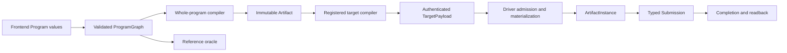

# Vyre architecture

Last verified: 2026-08-12

This guide describes Vyre 0.7.2 and the decided target structure it is
migrating to. Workspace membership, dependency edges, and operation counts
are owned by the generated artifacts: [crate graph](CRATE_GRAPH.md),
[crate ownership registry](CRATE_OWNERSHIP.toml), and
[operation schema](generated/OP_SCHEMA.json). This guide does not restate
those numbers; it explains how the pieces fit and where responsibilities
live.

## System shape

A frontend builds typed `Program` values and adapts them into a validated
`ProgramGraph`. The whole-program compiler selects a bounded legal
schedule and produces an immutable `Artifact`. A registered target
compiler attaches an authenticated `TargetPayload`; the matching driver
materializer admits that payload and creates an `ArtifactInstance`. Typed
bindings produce a `Submission`, then completion and readback. The
reference interpreter is an oracle, not a silent fallback for a requested
target.



The current release evidence selects CUDA as the preferred backend on
NVIDIA systems. WGPU is the portable GPU route. SPIR-V is a registered
dispatch route. Metal is active on supported Apple targets. See
`release/evidence/backends/backend-matrix.json` for the live probe rows.

## Workspace boundaries

| Boundary | Current owner | Responsibility |
| --- | --- | --- |
| Public facade | `vyre` | Canonical graph compilation, artifact sessions, scan products, feature-gated target selection. |
| Stable contracts | `vyre-spec` | Frozen cross-engine analysis, soundness, and interchange schemas. |
| IR, registry, optimizer | `vyre-foundation` | `Program`, `ProgramGraph`, validation, serialization, semantic operation identity, diagnostics, backend-neutral optimization passes. |
| Hardware operations | `vyre-intrinsics` | Category C operation builders. Folding into `vyre-primitives`; see the target structure below. |
| Reusable operations | `vyre-primitives` | Shared composition builders. Becoming Category C only; see below. |
| Library compositions | `vyre-libs` | Product-facing Category A compositions. Becoming the single Category A home; see below. |
| Compiler self-use | `vyre-self-substrate` | GPU execution of compiler passes plus scheduling solvers. Narrowing to the pass engine; see below. |
| Whole-program compiler | `vyre-megakernel` | Bounded legal whole-graph schedules, immutable artifacts, target payloads. |
| Backend contracts | `vyre-driver` | Backend-neutral target compiler, materializer, device, binding, submission, completion, capability contracts. |
| Concrete backends | `vyre-driver-cuda`, `vyre-driver-wgpu`, `vyre-driver-spirv`, `vyre-driver-metal`, `vyre-driver-reference` | Target compilers, materializers, devices; admit authenticated payloads; submit typed work. |
| Runtime | `vyre-runtime` | Compilation orchestration, admission, artifact sessions, recovery, persistence, residency, scheduling, readback. |
| Scan product | `vyre-scan` | Scan database framing, sessions, paging, residency, execution, readback. |
| Artifact packaging | `vyre-aot` | Package validated artifacts without owning artifact identity or live dispatch. |
| Frontends | `vyre-frontend-c`, `vyre-frontend-rust` | Lower source-language subsets into backend-neutral `Program` or `ProgramGraph` values. |
| Conformance | `vyre-conform`, `vyre-conform-spec` | Execute canonical artifact routes; own frozen conformance schemas. |

Domain logic does not import a CLI, transport, or concrete backend.
Shared crates use neutral target and artifact terms. Concrete backend API
and shader dialect details stay in the concrete driver or emitter that
owns them.

## Operation categories

Every registered operation is one of two categories. There is no third.

- **Category A: composition.** A backend-neutral `fn(...) -> Program`
  built from lower-tier operations over existing `Expr`/`Node` variants.
  It adds no concrete target lowering. Regions preserve composition
  provenance: the outer region keeps the Cat-A generator, each child
  keeps its primitive generator and a `source_region` naming the parent.
- **Category C: hardware intrinsic.** An operation requiring a dedicated
  hardware contract: a dedicated emitter arm AND a dedicated
  reference-interpreter eval arm. Its registration supplies the neutral
  builder and deterministic fixtures; each supported target supplies a
  keyed lowering facet. Missing facets fail closed.
- **Category B is banned.** Vyre does not execute a general operation
  bytecode interpreter on the host or inside a persistent kernel. A
  program remains typed IR until verified lowering. Raw `Program`
  execution exists only in explicitly named reference, parity, and
  conformance oracle seams.

`vyre-foundation::operation::OperationRegistry` is the semantic operation
authority. One registration owns the operation ID, version, tier,
signature, neutral builder, fixtures, laws, tolerance, derived effects,
and capability keys. `generated/OP_SCHEMA.json` and the catalog are
projections, not second identities. `docs/lego-block-rule.md` owns the
composition policy: discovery before invention, the two-caller
criterion, Gate 1, and the promotion patch contract.

Run these checks after changing an operation:

```text
cargo_full run --bin xtask -- operation-schema --check
cargo_full run --bin xtask -- list-ops --check
cargo_full run --bin xtask -- catalog --check
```

## Target operation crate structure

Decided 2026-08-12. Migration runs after the dedup campaign in
`DEDUP_PLAN.md`; until it lands, the boundary table above describes the
current tree.

Two operation crates, one per category. Nothing else registers
operations.

- `vyre-primitives` owns Category C: strict hardware intrinsics only.
  It absorbs `vyre-intrinsics`; the name then means what it says. An op
  that does not require both a dedicated emitter arm and a dedicated
  interpreter arm does not belong here.
- `vyre-libs` owns every Category A composition: today's Tier 3 product
  ops, today's Tier 2.5 primitive domains, and the generic compositions
  currently parked in `vyre-self-substrate`. Public, feature-gated per
  domain, maximally deduplicated. Sharing a helper becomes a `pub`
  change inside one crate, not a cross-crate migration; the two-caller
  criterion in `docs/lego-block-rule.md` gates making a helper public.
- Category B stays banned.

Optimization semantics live only in `vyre-foundation` and run on CPU.
Compile time on CPU is the default; vyre optimizes for the runtime of
user programs, not its own compile time. GPU execution of optimizer
passes is an execution strategy for graphs too large for CPU passes,
never a second implementation of a pass: the pass semantics are
foundation's, the GPU engine replays them.

`vyre-self-substrate` narrows to exactly that GPU pass engine
(`optimizer/`: the pass dispatcher, resident pipeline, and
`*_via_encoded` execution) and loses everything else:

- `scheduling/` solvers move to the stage owners that call them per
  `megakernel-wiring.md`: compile-time selection in `vyre-megakernel`,
  resident lifecycle selection in `vyre-runtime`'s planner.
- Generic GPU ops (`graph/` resident CSR variants, `data/` pipelines,
  generic `math/` solvers) move to `vyre-libs`.
- Dispatch and telemetry machinery moves to its consumers in
  `vyre-driver` and `vyre-runtime`.
- Research modules consumed only by their own tests are parked or
  deleted per the module audit in `DEDUP_PLAN.md`; they do not move to
  libs.

The dependency DAG: `vyre-foundation` (IR, registry, CPU optimizer) ←
`vyre-primitives` (hardware intrinsics) ← `vyre-libs` (compositions) ←
GPU pass engine ← compiler and drivers. Foundation still cannot consume
the operation crates; `vyre_foundation::pass_substrate` remains its
sanctioned local exception and is the one accepted duplication,
registered with `lego-audit`.

Registry impact: `OperationTier::Primitive` becomes
`OperationTier::Intrinsic`; every registration site and
`check-tier-deps`' tier table move with it.

## Whole-program artifact pipeline

1. Frontends and builders produce typed `Program` values.
2. `ProgramGraph` centralizes graph adaptation, typed value identity,
   constants, lifetimes, effects, and validation.
3. The megakernel compiler performs semantic optimization, explores
   legal whole-graph schedules under a recorded finite budget, and
   returns the best valid explored plan. It does not claim a
   mathematical global optimum.
4. `attach_target` invokes a registered pure target compiler. The
   shared selected-module boundary fuses each selected group and runs
   verified lowering once. Concrete target compilers consume that
   immutable product and return exact module bytes, workgroup and grid
   geometry, dynamic shared bytes, and descriptor-to-artifact binding
   projections for an explicit target profile.
5. The target payload authenticates the profile generation, selected
   node and stage identities, verified descriptor, module format and
   bytes, geometry, binding projection, and neutral artifact digest.
6. A concrete materializer admits authenticated target state without
   fusing, lowering, or re-inferring geometry and creates an
   `ArtifactInstance`.
7. Runtime builds a typed `BindingSet`, rejects zero invocation
   extents, submits work, waits for completion, and reads outputs by
   artifact value identity.
8. Recovery rematerializes authenticated artifact bytes. It does not
   lower or compile a raw `Program` during submission.

## Cross-program composition

`ProgramGraph` is the composition unit. It preserves typed IDs rather
than reconstructing values from names. Compiler requests carry external
facts and bounded search budgets, not caller-selected fusion or schedule
decisions. `vyre-lower` consumes the verified semantic product. Emitters
do not run private optimizers or accept unverified raw programs.

## Megakernel boundary

"Megakernel" names four stages with four owners. Do not collapse them.
The living matrix is [`megakernel-wiring.md`](megakernel-wiring.md).

1. Artifact compiler: `vyre-megakernel`.
2. Persistent runtime protocol: `vyre-runtime/src/megakernel/**`.
3. Backend-neutral wave policy: `vyre-driver/src/megakernel_execution.rs`
   and siblings.
4. IR pre-dispatch fusion oracles: `vyre-foundation/src/optimizer/megakernel/`.

## Optimization placement

Two layers.

- Layer 1 is semantic IR optimization in
  `vyre-foundation/src/optimizer/passes/`. It rewrites typed IR and
  benefits every backend. This is the canonical home of pass semantics.
- Layer 2 is target lowering strategy in the owning concrete driver. It
  changes instruction selection or scheduling without changing program
  semantics.

GPU pass execution (the narrowed self-substrate crate) is not a third
layer and not a second implementation: it replays Layer 1 semantics on
GPU for graphs too large for CPU passes.

Shared launch planning, cache identity, and capability records live in
`vyre-driver`. Persistent queue scheduling lives in `vyre-runtime`. The
complete contract is in [`optimization/README.md`](optimization/README.md)
and [`OPTIMIZATION_ARCHITECTURE.md`](OPTIMIZATION_ARCHITECTURE.md).

## Conformance and release evidence

A backend support claim requires an operation-matrix row and conformance
proof. The release-facing sources are:

- `docs/optimization/OP_MATRIX.toml` for operation and backend support.
- `release/evidence/conformance/conformance-matrix.json` for
  per-operation proof rows.
- `release/evidence/backends/backend-matrix.json` for executable backend
  probes.
- `docs/generated/OP_SCHEMA.json` for the joined operation contract.
- `release/release-train.toml` for the active version and release train.

Generated evidence is refreshed through its owning command. Editing a
digest, count, fingerprint, or support status by hand is not a valid
architecture change.

## Historical rationale

Historical plans and snapshots (including `docs/archive/` and the git
history of deleted pre-0.7 documents) explain why earlier designs were
considered. They do not assign current ownership or support status. When
a historical file conflicts with this guide, the generated crate graph,
ownership registry, operation schema, backend evidence, and optimization
control plane take precedence.
