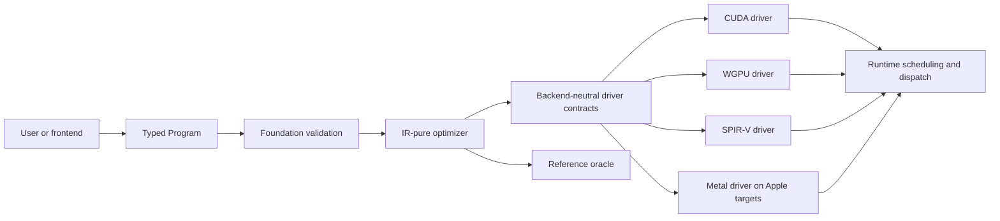
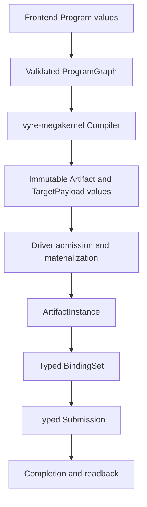

# Vyre architecture

Last verified: 2026-08-04

This guide describes Vyre 0.7.2. Use it with the generated
[crate graph](CRATE_GRAPH.md), the [crate ownership registry](CRATE_OWNERSHIP.toml),
and the generated [operation schema](generated/OP_SCHEMA.json). Those artifacts
own workspace membership, production dependency edges, crate boundaries, and
operation counts. This guide explains how the pieces fit together.

## System shape

A user builds a typed `Program`. Vyre validates and optimizes that program,
selects an eligible backend, lowers it through that backend's concrete driver,
and dispatches it. The reference interpreter is an oracle. It is not a silent
fallback for a requested GPU backend.



The current release evidence selects CUDA as the preferred backend on NVIDIA
systems. WGPU is the portable GPU route. SPIR-V is a registered dispatch route.
Metal is active on supported Apple targets. The current Linux evidence host does
not register Metal as a Linux dispatch backend. See
`release/evidence/backends/backend-matrix.json` for the live probe rows.

## Workspace boundaries

Workspace package and shipped-target counts come from Cargo metadata and are
reported in [`INDEX.md`](INDEX.md). Do not maintain a second crate list.
[`CRATE_GRAPH.md`](CRATE_GRAPH.md) is generated from every workspace manifest
and [`CRATE_OWNERSHIP.toml`](CRATE_OWNERSHIP.toml).

| Boundary | Current owner | Responsibility |
| --- | --- | --- |
| Public facade | `vyre` | Expose canonical graph compilation, artifact sessions, scan products, and feature-gated target selection without owning another compiler. |
| Stable contracts | `vyre-spec` | Own frozen cross-engine analysis, soundness, and interchange schemas. |
| IR, registry, and optimizer | `vyre-foundation` | Own `Program`, `ProgramGraph`, validation, serialization, semantic operation identity, diagnostics, and backend-neutral optimization. |
| Hardware operations | `vyre-intrinsics` | Register hardware-mapped operation builders in the foundation registry. |
| Reusable operations | `vyre-primitives` | Register Tier 2.5 builders shared across higher layers. |
| Library compositions | `vyre-libs` | Register product-facing Category A compositions. |
| Whole-program compiler | `vyre-megakernel` | Select bounded legal whole-graph schedules and produce immutable artifacts plus target payloads. |
| Backend contracts | `vyre-driver` | Own backend-neutral target compiler, materializer, device, binding, submission, completion, and capability contracts. |
| Concrete backends | `vyre-driver-cuda`, `vyre-driver-wgpu`, `vyre-driver-spirv`, `vyre-driver-metal`, `vyre-driver-reference` | Register target compilers, materializers, and devices; admit authenticated payloads; submit typed work. |
| Runtime | `vyre-runtime` | Orchestrate compilation, admission, artifact sessions, recovery, persistence, residency, scheduling, and readback. |
| Scan product | `vyre-scan` | Own scan database framing, sessions, paging, residency, execution, and readback. |
| Artifact packaging | `vyre-aot` | Package validated artifacts without owning artifact identity or live dispatch. |
| Frontends | `vyre-frontend-c`, `vyre-frontend-rust` | Lower source-language subsets into backend-neutral `Program` or `ProgramGraph` values. |
| Conformance | `vyre-conform`, `vyre-conform-spec` | Execute canonical artifact routes and own frozen conformance schemas. |

Domain logic does not import a CLI, transport, or concrete backend. Shared
crates use neutral target and artifact terms. Concrete backend API and shader
dialect details stay in the concrete driver or emitter that owns them.

## Operation placement and registration

`vyre-foundation::operation_registry` is the semantic operation authority. One
registration owns the operation ID, version, tier, signature, neutral builder,
fixtures, laws, tolerance, derived effects, and capability keys. Libraries,
primitives, and intrinsics contribute registrations. Target support and
intrinsic geometry are keyed facets of those registrations.

[`generated/OP_SCHEMA.json`](generated/OP_SCHEMA.json) and the generated catalog
are projections. Harness catalogs, conformance inventories, and backend
supported-operation sets derive from the same registry and do not own shadow
operation identities.

Run these checks after changing an operation:

```text
cargo_full run --bin xtask -- operation-schema --check
cargo_full run --bin xtask -- list-ops --check
cargo_full run --bin xtask -- catalog --check
```

### Category A

A Category A operation is a backend-neutral composition. It builds typed IR
from lower-tier operations and does not add concrete target lowering. Regions
preserve composition provenance, and `print-composition` shows the current
region chain.

### Category C

A Category C operation requires a dedicated hardware contract. Its intrinsic
registration supplies the neutral builder and deterministic fixture contract.
Each supported target supplies a keyed lowering facet. Missing facets fail
closed.

### Category B

Category B runtime interpretation is not a supported operation category. Vyre
does not execute a general operation bytecode interpreter on the host or inside
a persistent kernel. A program remains typed IR until verified lowering.

### Category B


## Whole-program artifact pipeline



1. Frontends and builders produce typed `Program` values.
2. `ProgramGraph` centralizes graph adaptation, typed value identity, constants,
   lifetimes, effects, and validation.
3. The megakernel compiler performs verified semantic optimization and lowering,
   explores legal whole-graph schedules under a recorded finite budget, and
   returns the best valid explored plan. It does not claim a mathematical global
   optimum.
4. `attach_target` invokes a registered pure target compiler and authenticates
   ordered target modules, ABI, entry identity, and default entry geometry.
5. A concrete materializer admits authenticated bytes and creates an
   `ArtifactInstance` associated with one materializer generation.
6. Runtime builds a typed `BindingSet`, rejects zero invocation extents, submits
   work, waits for completion, and reads outputs by artifact value identity.
7. Recovery rematerializes authenticated artifact bytes. It does not lower or
   compile a raw `Program` during submission.

Raw `Program` execution remains only in explicitly named reference, parity, and
conformance oracle seams. Production routes compile through artifacts.

## Cross-program composition

`ProgramGraph` is the composition unit. It preserves typed IDs rather than
reconstructing values from names. Compiler requests carry external facts and
bounded search budgets, not caller-selected fusion or schedule decisions.
`vyre-lower` consumes the verified semantic product. Emitters do not run private
optimizers or accept unverified raw programs.

## Megakernel boundary

"Megakernel" names four stages. Do not collapse them. The living matrix is
[`megakernel-wiring.md`](megakernel-wiring.md).

### Artifact compiler

`vyre-megakernel` normalizes the complete validated graph, rejects illegal
fusion and schedule candidates with stable diagnostics, explores legal
schedules under `SearchBudget`, and records the selected plan and bounded work
in an immutable `Artifact`. Registered target compilers produce authenticated
`TargetPayload` module bundles. The compiler does not own admission, resident
execution, device topology, or submission.

`vyre-aot` packages artifact envelopes. `vyre-runtime` owns compile-to-materialize
orchestration and decoded-envelope admission.

### Persistent runtime

`vyre-runtime` owns artifact sessions, queue protocol, descriptors, resident
execution, readback, recovery, policy, telemetry, IO helpers, checkpoints, and
model residency. Concrete drivers execute admitted artifact instances. They do
not fork the runtime protocol or compile raw programs during submission.

### Driver wave policy and IR fusion

- `vyre-driver::{megakernel_execution, megakernel_barrier, megakernel_frontier}`
  own backend-neutral wave topology and memory admission from telemetry.
- `vyre-foundation/src/optimizer/megakernel/` owns IR pre-dispatch fusion
  oracles for the optimizer. That is not the runtime planner.

### Superseded interpreter design

The older bytecode-interpreter design in
[`rfcs/0005-persistent-megakernel.md`](rfcs/0005-persistent-megakernel.md) is
superseded. The current path preserves typed program contracts and does not add
a general VIR interpreter inside the kernel.

## Optimization placement

Vyre has two optimization layers.

- Layer 1 is semantic IR optimization in
  `vyre-foundation/src/optimizer/passes/`. It rewrites typed IR and benefits
  every backend.
- Layer 2 is target lowering strategy in the owning concrete driver. It changes
  instruction selection or scheduling without changing program semantics.

Shared launch planning, cache identity, and capability records live in
`vyre-driver`. Persistent queue scheduling lives in `vyre-runtime`. The complete
contract is in [`optimization/README.md`](optimization/README.md) and
[`OPTIMIZATION_ARCHITECTURE.md`](OPTIMIZATION_ARCHITECTURE.md).

## Conformance and release evidence

A backend support claim requires an operation-matrix row and conformance proof.
The release-facing sources are:

- `docs/optimization/OP_MATRIX.toml` for operation and backend support.
- `release/evidence/conformance/conformance-matrix.json` for per-operation proof
  rows.
- `release/evidence/backends/backend-matrix.json` for executable backend probes.
- `docs/generated/OP_SCHEMA.json` for the joined operation contract.
- `release/release-train.toml` for the active version and release train.

Generated evidence must be refreshed through its owning command. Editing a
digest, count, fingerprint, or support status by hand is not a valid
architecture change.

## Historical rationale

Historical plans and snapshots explain why earlier designs were considered.
They do not assign current ownership or support status. When a historical file
conflicts with this guide, the generated crate graph, ownership registry,
operation schema, backend evidence, and optimization control plane take
precedence.
