# Vyre Crate Graph

This file is generated by `xtask crate-ownership --write` from
the workspace manifests and `docs/CRATE_OWNERSHIP.toml`. Edit those authorities
together, then regenerate this file.

## Layer ranks

A production dependency is legal only when the consumer's layer outranks the
dependency's layer. Two layers share a rank when neither depends on the other.

| Rank | Layer | Purpose |
| --- | --- | --- |
| `0` | `foundation` | Typed IR, logical domains, specification records, diagnostics, and the derive macros that generate them. |
| `0` | `standalone-tooling` | Source-structure gates that read the tree and depend on no compiler crate. |
| `1` | `lowering` | One verified selected-module representation between semantic IR and target emission. |
| `1` | `primitives` | Intrinsic operations, each with its own emitter arm in every backend and its own reference arm. |
| `2` | `compiler-boundary` | Schedule search, artifact identity, and authenticated target-payload construction. |
| `2` | `emitter` | Target text and binary emission for one dialect each. |
| `2` | `semantics` | The independent semantic oracle. Never a production execution route. |
| `3` | `libraries` | Domain-neutral compositions built from existing IR. |
| `4` | `backend-neutral` | The dispatch, binding, and capability contract every concrete backend implements. |
| `4` | `pass-engine` | Pass scheduling and rewrite application over semantic IR. |
| `5` | `concrete-backend` | One device family each: capability probing, module loading, and dispatch. |
| `5` | `packaging` | Ahead-of-time artifact packaging and load. |
| `5` | `runtime` | Submission, admission, tenancy, and lifecycle policy over a compiled artifact. |
| `5` | `test-tooling` | Shared verification fixtures and harness support, private to the workspace. |
| `6` | `facade` | The single curated consumer surface over the layers below it. |
| `6` | `registry-link` | Link anchors that pull registration submissions into a final binary. |
| `7` | `conformance` | Parity harnesses that join a production result to an independently produced oracle result. |
| `7` | `tooling` | Gates, benchmarks, and generators that read the whole workspace. |

## Workspace dependency graph

The workspace contains 57 crates. An arrow points from a crate to
an internal normal or build dependency. Development dependencies are excluded.

```mermaid
graph TD
  C0["structure-gate"]
  C1["vyre"]
  C2["vyre-alloc-probe"]
  C3["vyre-aot"]
  C4["vyre-bench"]
  C5["vyre-conform"]
  C6["vyre-conform-spec"]
  C7["vyre-debug"]
  C8["vyre-driver"]
  C9["vyre-driver-cuda"]
  C10["vyre-driver-metal"]
  C11["vyre-driver-reference"]
  C12["vyre-driver-spirv"]
  C13["vyre-driver-wgpu"]
  C14["vyre-emit-metal"]
  C15["vyre-emit-naga"]
  C16["vyre-emit-ptx"]
  C17["vyre-emit-spirv"]
  C18["vyre-foundation"]
  C19["vyre-libs"]
  C20["vyre-libs-analysis"]
  C21["vyre-libs-bitset"]
  C22["vyre-libs-builder"]
  C23["vyre-libs-decode"]
  C24["vyre-libs-device"]
  C25["vyre-libs-encoding"]
  C26["vyre-libs-fixpoint"]
  C27["vyre-libs-graph"]
  C28["vyre-libs-hash"]
  C29["vyre-libs-math"]
  C30["vyre-libs-nn"]
  C31["vyre-libs-parsing"]
  C32["vyre-libs-pattern"]
  C33["vyre-libs-reasoning"]
  C34["vyre-libs-reduce"]
  C35["vyre-libs-rule"]
  C36["vyre-libs-scheduling"]
  C37["vyre-libs-security"]
  C38["vyre-libs-solvers"]
  C39["vyre-libs-text"]
  C40["vyre-libs-vfs"]
  C41["vyre-libs-visual"]
  C42["vyre-lints"]
  C43["vyre-lower"]
  C44["vyre-macros"]
  C45["vyre-megakernel"]
  C46["vyre-pass-engine"]
  C47["vyre-primitives"]
  C48["vyre-reference"]
  C49["vyre-registry-link"]
  C50["vyre-runtime"]
  C51["vyre-safetensors"]
  C52["vyre-spec"]
  C53["vyre-test-support"]
  C54["xtask"]
  C55["xtask-evidence"]
  C56["xtask-registry"]
  C1 --> C8
  C1 --> C9
  C1 --> C13
  C1 --> C18
  C1 --> C45
  C1 --> C50
  C1 --> C52
  C3 --> C8
  C3 --> C18
  C3 --> C45
  C4 --> C1
  C4 --> C2
  C4 --> C8
  C4 --> C9
  C4 --> C13
  C4 --> C16
  C4 --> C18
  C4 --> C19
  C4 --> C43
  C4 --> C45
  C4 --> C46
  C4 --> C47
  C4 --> C48
  C4 --> C49
  C4 --> C50
  C4 --> C52
  C4 --> C54
  C5 --> C1
  C5 --> C6
  C5 --> C8
  C5 --> C9
  C5 --> C12
  C5 --> C13
  C5 --> C18
  C5 --> C19
  C5 --> C45
  C5 --> C47
  C5 --> C48
  C5 --> C49
  C5 --> C50
  C5 --> C52
  C6 --> C52
  C7 --> C1
  C7 --> C15
  C7 --> C18
  C7 --> C19
  C7 --> C43
  C8 --> C18
  C8 --> C19
  C8 --> C45
  C8 --> C52
  C9 --> C8
  C9 --> C16
  C9 --> C18
  C9 --> C43
  C9 --> C45
  C10 --> C8
  C10 --> C14
  C10 --> C18
  C10 --> C43
  C10 --> C45
  C11 --> C8
  C11 --> C18
  C11 --> C45
  C11 --> C48
  C12 --> C8
  C12 --> C17
  C12 --> C18
  C12 --> C43
  C12 --> C45
  C13 --> C8
  C13 --> C15
  C13 --> C18
  C13 --> C43
  C13 --> C45
  C13 --> C52
  C14 --> C15
  C14 --> C18
  C14 --> C43
  C15 --> C18
  C15 --> C43
  C16 --> C18
  C16 --> C43
  C17 --> C15
  C17 --> C18
  C17 --> C43
  C18 --> C44
  C18 --> C52
  C19 --> C18
  C19 --> C20
  C19 --> C21
  C19 --> C22
  C19 --> C23
  C19 --> C24
  C19 --> C25
  C19 --> C26
  C19 --> C27
  C19 --> C28
  C19 --> C29
  C19 --> C30
  C19 --> C31
  C19 --> C32
  C19 --> C33
  C19 --> C34
  C19 --> C35
  C19 --> C36
  C19 --> C37
  C19 --> C38
  C19 --> C39
  C19 --> C40
  C19 --> C41
  C19 --> C45
  C19 --> C47
  C19 --> C52
  C20 --> C18
  C20 --> C22
  C20 --> C24
  C20 --> C26
  C20 --> C27
  C20 --> C29
  C20 --> C45
  C20 --> C47
  C20 --> C52
  C21 --> C18
  C21 --> C22
  C21 --> C34
  C21 --> C45
  C21 --> C47
  C21 --> C52
  C22 --> C18
  C22 --> C45
  C22 --> C47
  C22 --> C52
  C23 --> C18
  C23 --> C22
  C23 --> C32
  C23 --> C39
  C23 --> C45
  C23 --> C47
  C23 --> C52
  C24 --> C18
  C24 --> C22
  C24 --> C45
  C24 --> C47
  C24 --> C52
  C25 --> C18
  C25 --> C21
  C25 --> C22
  C25 --> C24
  C25 --> C26
  C25 --> C27
  C25 --> C28
  C25 --> C29
  C25 --> C30
  C25 --> C31
  C25 --> C32
  C25 --> C34
  C25 --> C45
  C25 --> C47
  C25 --> C52
  C26 --> C18
  C26 --> C21
  C26 --> C22
  C26 --> C45
  C26 --> C47
  C26 --> C52
  C27 --> C18
  C27 --> C21
  C27 --> C22
  C27 --> C26
  C27 --> C28
  C27 --> C29
  C27 --> C34
  C27 --> C41
  C27 --> C45
  C27 --> C47
  C27 --> C52
  C28 --> C18
  C28 --> C22
  C28 --> C45
  C28 --> C47
  C28 --> C52
  C29 --> C18
  C29 --> C22
  C29 --> C26
  C29 --> C34
  C29 --> C45
  C29 --> C47
  C29 --> C52
  C30 --> C18
  C30 --> C22
  C30 --> C29
  C30 --> C34
  C30 --> C45
  C30 --> C47
  C30 --> C52
  C31 --> C18
  C31 --> C22
  C31 --> C28
  C31 --> C32
  C31 --> C34
  C31 --> C39
  C31 --> C45
  C31 --> C47
  C31 --> C52
  C32 --> C18
  C32 --> C21
  C32 --> C22
  C32 --> C28
  C32 --> C29
  C32 --> C45
  C32 --> C47
  C32 --> C52
  C33 --> C18
  C33 --> C20
  C33 --> C22
  C33 --> C27
  C33 --> C45
  C33 --> C47
  C33 --> C52
  C34 --> C18
  C34 --> C22
  C34 --> C45
  C34 --> C47
  C34 --> C52
  C35 --> C18
  C35 --> C22
  C35 --> C45
  C35 --> C47
  C35 --> C52
  C36 --> C18
  C36 --> C22
  C36 --> C24
  C36 --> C27
  C36 --> C29
  C36 --> C31
  C36 --> C45
  C36 --> C47
  C36 --> C52
  C37 --> C18
  C37 --> C21
  C37 --> C22
  C37 --> C27
  C37 --> C34
  C37 --> C45
  C37 --> C47
  C37 --> C52
  C38 --> C18
  C38 --> C21
  C38 --> C22
  C38 --> C24
  C38 --> C26
  C38 --> C27
  C38 --> C29
  C38 --> C45
  C38 --> C47
  C38 --> C52
  C39 --> C18
  C39 --> C22
  C39 --> C34
  C39 --> C45
  C39 --> C47
  C39 --> C52
  C40 --> C18
  C40 --> C22
  C40 --> C45
  C40 --> C47
  C40 --> C52
  C41 --> C18
  C41 --> C22
  C41 --> C29
  C41 --> C45
  C41 --> C47
  C41 --> C52
  C43 --> C18
  C43 --> C52
  C45 --> C18
  C45 --> C43
  C45 --> C52
  C46 --> C18
  C46 --> C19
  C46 --> C45
  C46 --> C47
  C47 --> C18
  C48 --> C18
  C48 --> C47
  C48 --> C52
  C49 --> C8
  C49 --> C9
  C49 --> C10
  C49 --> C12
  C49 --> C13
  C49 --> C18
  C49 --> C19
  C49 --> C22
  C49 --> C43
  C49 --> C45
  C49 --> C47
  C49 --> C52
  C50 --> C8
  C50 --> C18
  C50 --> C19
  C50 --> C45
  C53 --> C0
  C53 --> C8
  C53 --> C18
  C53 --> C45
  C53 --> C47
  C53 --> C48
  C53 --> C52
  C54 --> C0
  C55 --> C4
  C55 --> C8
  C55 --> C18
  C55 --> C49
  C55 --> C54
  C56 --> C0
  C56 --> C1
  C56 --> C8
  C56 --> C18
  C56 --> C19
  C56 --> C45
  C56 --> C47
  C56 --> C48
  C56 --> C49
  C56 --> C52
  C56 --> C54
```

## Dependency contracts

| Consumer | Dependency | Purpose | Features | Conditions | Kinds | Optional | Default features | Boundary | Owning seam |
| --- | --- | --- | --- | --- | --- | --- | --- | --- | --- |
| `vyre` | `vyre-driver` | backend-neutral target, materialization, submission, and completion contracts | None | `always` | `normal` | `false` | `true` | `private` | `backend-contract` |
| `vyre` | `vyre-driver-cuda` | native accelerator backend execution | None | `always` | `normal` | `true` | `true` | `private` | `cuda-driver` |
| `vyre` | `vyre-driver-wgpu` | portable backend execution | None | `always` | `normal` | `true` | `true` | `private` | `portable-driver` |
| `vyre` | `vyre-foundation` | typed IR, graph, diagnostics, validation, and semantic optimization contracts | None | `always` | `normal` | `false` | `true` | `private` | `foundation-ir` |
| `vyre` | `vyre-megakernel` | whole-graph compilation and immutable artifact contracts | None | `always` | `normal` | `false` | `true` | `private` | `megakernel-compiler` |
| `vyre` | `vyre-runtime` | artifact admission, residency, submission, recovery, and readback lifecycle | None | `always` | `normal` | `false` | `true` | `private` | `runtime` |
| `vyre` | `vyre-spec` | stable cross-engine schemas and operation definitions | None | `always` | `normal` | `false` | `true` | `private` | `specification` |
| `vyre-aot` | `vyre-driver` | backend-neutral target, materialization, submission, and completion contracts | None | `always` | `normal` | `false` | `true` | `public` | `backend-contract` |
| `vyre-aot` | `vyre-foundation` | typed IR, graph, diagnostics, validation, and semantic optimization contracts | None | `always` | `normal` | `false` | `true` | `public` | `foundation-ir` |
| `vyre-aot` | `vyre-megakernel` | whole-graph compilation and immutable artifact contracts | None | `always` | `normal` | `false` | `true` | `public` | `megakernel-compiler` |
| `vyre-bench` | `vyre` | public lifecycle facade | None | `always` | `normal` | `false` | `false` | `private` | `public-facade` |
| `vyre-bench` | `vyre-alloc-probe` | per-thread heap counters the runner installs as the global allocator | None | `always` | `normal` | `false` | `true` | `private` | `benchmarks` |
| `vyre-bench` | `vyre-driver` | backend-neutral target, materialization, submission, and completion contracts | `test-fixtures` | `always` | `normal` | `false` | `true` | `private` | `backend-contract` |
| `vyre-bench` | `vyre-driver-cuda` | native accelerator backend execution | None | `cfg(not(target_os = "macos"))` | `normal` | `false` | `true` | `private` | `cuda-driver` |
| `vyre-bench` | `vyre-driver-wgpu` | portable backend execution | None | `always` | `normal` | `false` | `true` | `private` | `portable-driver` |
| `vyre-bench` | `vyre-emit-ptx` | primary binary backend text emission | None | `always` | `normal` | `false` | `true` | `private` | `primary-binary-emitter` |
| `vyre-bench` | `vyre-foundation` | typed IR, graph, diagnostics, validation, and semantic optimization contracts | None | `always` | `normal` | `false` | `true` | `private` | `foundation-ir` |
| `vyre-bench` | `vyre-libs` | product operation builders | `bitset`, `graph`, `math-scan`, `nn-linear-4bit`, `predicate` | `always` | `normal` | `false` | `true` | `private` | `product-libraries` |
| `vyre-bench` | `vyre-lower` | verified backend-neutral representation lowering | None | `always` | `normal` | `false` | `true` | `private` | `lowering` |
| `vyre-bench` | `vyre-megakernel` | whole-graph compilation and immutable artifact contracts | None | `always` | `normal` | `false` | `true` | `private` | `megakernel-compiler` |
| `vyre-bench` | `vyre-pass-engine` | optimizer pass execution as dispatched Vyre Programs | None | `always` | `normal` | `false` | `true` | `private` | `pass-engine` |
| `vyre-bench` | `vyre-primitives` | reusable semantic Program builders | `hardware` | `always` | `normal` | `false` | `false` | `private` | `primitive-library` |
| `vyre-bench` | `vyre-reference` | independent semantic oracle execution | None | `always` | `normal` | `false` | `true` | `private` | `reference-semantics` |
| `vyre-bench` | `vyre-registry-link` | linked inventory registry sources and the per-source floor | `cuda`, `metal`, `spirv`, `wgpu` | `always` | `normal` | `false` | `false` | `private` | `registry-link` |
| `vyre-bench` | `vyre-runtime` | artifact admission, residency, submission, recovery, and readback lifecycle | None | `always` | `normal` | `false` | `true` | `private` | `runtime` |
| `vyre-bench` | `vyre-spec` | stable cross-engine schemas and operation definitions | None | `always` | `normal` | `false` | `true` | `private` | `specification` |
| `vyre-bench` | `xtask` | the one producer of the source fingerprint a recorded artifact names its tree with | None | `always` | `normal` | `false` | `true` | `private` | `release-tooling` |
| `vyre-conform` | `vyre` | public lifecycle facade | None | `always` | `normal` | `false` | `false` | `private` | `public-facade` |
| `vyre-conform` | `vyre-conform-spec` | versioned conformance schemas | None | `always` | `normal` | `false` | `true` | `private` | `conformance` |
| `vyre-conform` | `vyre-driver` | backend-neutral target, materialization, submission, and completion contracts | None | `always` | `normal` | `false` | `true` | `private` | `backend-contract` |
| `vyre-conform` | `vyre-driver-cuda` | native accelerator backend execution | None | `always` | `normal` | `true` | `true` | `private` | `cuda-driver` |
| `vyre-conform` | `vyre-driver-spirv` | SPIR-V backend execution | None | `always` | `normal` | `true` | `true` | `private` | `spirv-driver` |
| `vyre-conform` | `vyre-driver-wgpu` | portable backend execution | None | `always` | `normal` | `true` | `true` | `private` | `portable-driver` |
| `vyre-conform` | `vyre-foundation` | typed IR, graph, diagnostics, validation, and semantic optimization contracts | None | `always` | `normal` | `false` | `true` | `private` | `foundation-ir` |
| `vyre-conform` | `vyre-libs` | product operation builders | `full` | `always` | `normal` | `false` | `true` | `private` | `product-libraries` |
| `vyre-conform` | `vyre-megakernel` | whole-graph compilation and immutable artifact contracts | None | `always` | `normal` | `false` | `true` | `private` | `megakernel-compiler` |
| `vyre-conform` | `vyre-primitives` | reusable semantic Program builders | `hardware` | `always` | `normal` | `false` | `false` | `private` | `primitive-library` |
| `vyre-conform` | `vyre-reference` | independent semantic oracle execution | None | `always` | `normal` | `false` | `true` | `private` | `reference-semantics` |
| `vyre-conform` | `vyre-registry-link` | linked inventory registry sources and the per-source floor | `operations` | `always` | `normal` | `false` | `false` | `private` | `registry-link` |
| `vyre-conform` | `vyre-runtime` | artifact admission, residency, submission, recovery, and readback lifecycle | None | `always` | `normal` | `false` | `true` | `private` | `runtime` |
| `vyre-conform` | `vyre-spec` | stable cross-engine schemas and operation definitions | None | `always` | `normal` | `false` | `true` | `private` | `specification` |
| `vyre-conform-spec` | `vyre-spec` | stable cross-engine schemas and operation definitions | None | `always` | `normal` | `false` | `true` | `private` | `specification` |
| `vyre-debug` | `vyre` | public lifecycle facade | None | `always` | `normal` | `false` | `false` | `private` | `public-facade` |
| `vyre-debug` | `vyre-emit-naga` | primary text and related binary emission | None | `always` | `normal` | `false` | `true` | `public` | `primary-text-emitter` |
| `vyre-debug` | `vyre-foundation` | typed IR, graph, diagnostics, validation, and semantic optimization contracts | None | `always` | `normal` | `false` | `true` | `public` | `foundation-ir` |
| `vyre-debug` | `vyre-libs` | product operation builders | `python-parser` | `always` | `normal` | `false` | `true` | `private` | `product-libraries` |
| `vyre-debug` | `vyre-lower` | verified backend-neutral representation lowering | None | `always` | `normal` | `false` | `true` | `public` | `lowering` |
| `vyre-driver` | `vyre-foundation` | typed IR, graph, diagnostics, validation, and semantic optimization contracts | None | `always` | `normal` | `false` | `true` | `public` | `foundation-ir` |
| `vyre-driver` | `vyre-libs` | composition library the driver adapters plan against | None | `always` | `normal` | `true` | `true` | `private` | `product-libraries` |
| `vyre-driver` | `vyre-megakernel` | whole-graph compilation and immutable artifact contracts | None | `always` | `normal` | `false` | `true` | `public` | `megakernel-compiler` |
| `vyre-driver` | `vyre-spec` | stable cross-engine schemas and operation definitions | None | `always` | `normal` | `false` | `true` | `public` | `specification` |
| `vyre-driver-cuda` | `vyre-driver` | backend-neutral target, materialization, submission, and completion contracts | None | `always` | `normal` | `false` | `true` | `public` | `backend-contract` |
| `vyre-driver-cuda` | `vyre-emit-ptx` | primary binary backend text emission | None | `always` | `normal` | `false` | `true` | `private` | `primary-binary-emitter` |
| `vyre-driver-cuda` | `vyre-foundation` | typed IR, graph, diagnostics, validation, and semantic optimization contracts | None | `always` | `normal` | `false` | `true` | `public` | `foundation-ir` |
| `vyre-driver-cuda` | `vyre-lower` | verified backend-neutral representation lowering | None | `always` | `normal` | `false` | `true` | `private` | `lowering` |
| `vyre-driver-cuda` | `vyre-megakernel` | whole-graph compilation and immutable artifact contracts | None | `always` | `normal` | `false` | `true` | `private` | `megakernel-compiler` |
| `vyre-driver-metal` | `vyre-driver` | backend-neutral target, materialization, submission, and completion contracts | None | `always` | `normal` | `false` | `true` | `public` | `backend-contract` |
| `vyre-driver-metal` | `vyre-emit-metal` | native Apple source emission | None | `always` | `normal` | `false` | `true` | `private` | `metal-emitter` |
| `vyre-driver-metal` | `vyre-foundation` | typed IR, graph, diagnostics, validation, and semantic optimization contracts | None | `always` | `normal` | `false` | `true` | `private` | `foundation-ir` |
| `vyre-driver-metal` | `vyre-lower` | verified backend-neutral representation lowering | None | `always` | `normal` | `false` | `true` | `private` | `lowering` |
| `vyre-driver-metal` | `vyre-megakernel` | whole-graph compilation and immutable artifact contracts | None | `always` | `normal` | `false` | `true` | `private` | `megakernel-compiler` |
| `vyre-driver-reference` | `vyre-driver` | backend-neutral target, materialization, submission, and completion contracts | None | `always` | `normal` | `false` | `true` | `public` | `backend-contract` |
| `vyre-driver-reference` | `vyre-foundation` | typed IR, graph, diagnostics, validation, and semantic optimization contracts | None | `always` | `normal` | `false` | `true` | `public` | `foundation-ir` |
| `vyre-driver-reference` | `vyre-megakernel` | the admitted artifact and target payload the reference target materializes | None | `always` | `normal` | `false` | `true` | `public` | `megakernel-compiler` |
| `vyre-driver-reference` | `vyre-reference` | independent semantic oracle execution | None | `always` | `normal` | `false` | `true` | `private` | `reference-semantics` |
| `vyre-driver-spirv` | `vyre-driver` | backend-neutral target, materialization, submission, and completion contracts | None | `always` | `normal` | `false` | `true` | `public` | `backend-contract` |
| `vyre-driver-spirv` | `vyre-emit-spirv` | SPIR-V emission | None | `always` | `normal` | `false` | `true` | `private` | `spirv-emitter` |
| `vyre-driver-spirv` | `vyre-foundation` | typed IR, graph, diagnostics, validation, and semantic optimization contracts | None | `always` | `normal` | `false` | `true` | `public` | `foundation-ir` |
| `vyre-driver-spirv` | `vyre-lower` | verified backend-neutral representation lowering | None | `always` | `normal` | `false` | `true` | `private` | `lowering` |
| `vyre-driver-spirv` | `vyre-megakernel` | whole-graph compilation and immutable artifact contracts | None | `always` | `normal` | `false` | `true` | `private` | `megakernel-compiler` |
| `vyre-driver-wgpu` | `vyre-driver` | backend-neutral target, materialization, submission, and completion contracts | None | `always` | `normal` | `false` | `true` | `public` | `backend-contract` |
| `vyre-driver-wgpu` | `vyre-emit-naga` | primary text and related binary emission | None | `always` | `normal` | `false` | `true` | `private` | `primary-text-emitter` |
| `vyre-driver-wgpu` | `vyre-foundation` | typed IR, graph, diagnostics, validation, and semantic optimization contracts | None | `always` | `normal` | `false` | `true` | `public` | `foundation-ir` |
| `vyre-driver-wgpu` | `vyre-lower` | verified backend-neutral representation lowering | None | `always` | `normal` | `false` | `true` | `private` | `lowering` |
| `vyre-driver-wgpu` | `vyre-megakernel` | whole-graph compilation and immutable artifact contracts | None | `always` | `normal` | `false` | `true` | `private` | `megakernel-compiler` |
| `vyre-driver-wgpu` | `vyre-spec` | stable cross-engine schemas and operation definitions | None | `always` | `normal` | `false` | `true` | `public` | `specification` |
| `vyre-emit-metal` | `vyre-emit-naga` | primary text and related binary emission | None | `always` | `normal` | `false` | `true` | `private` | `primary-text-emitter` |
| `vyre-emit-metal` | `vyre-foundation` | typed IR, graph, diagnostics, validation, and semantic optimization contracts | None | `always` | `normal` | `false` | `true` | `private` | `foundation-ir` |
| `vyre-emit-metal` | `vyre-lower` | verified backend-neutral representation lowering | None | `always` | `normal` | `false` | `true` | `public` | `lowering` |
| `vyre-emit-naga` | `vyre-foundation` | typed IR, graph, diagnostics, validation, and semantic optimization contracts, and the source digest the build script stamps | None | `always` | `build`, `normal` | `false` | `true` | `public` | `foundation-ir` |
| `vyre-emit-naga` | `vyre-lower` | verified backend-neutral representation lowering | None | `always` | `normal` | `false` | `true` | `public` | `lowering` |
| `vyre-emit-ptx` | `vyre-foundation` | typed IR, graph, diagnostics, validation, and semantic optimization contracts, and the source digest the build script stamps | None | `always` | `build`, `normal` | `false` | `true` | `private` | `foundation-ir` |
| `vyre-emit-ptx` | `vyre-lower` | verified backend-neutral representation lowering | None | `always` | `normal` | `false` | `true` | `public` | `lowering` |
| `vyre-emit-spirv` | `vyre-emit-naga` | primary text and related binary emission | None | `always` | `normal` | `false` | `true` | `public` | `primary-text-emitter` |
| `vyre-emit-spirv` | `vyre-foundation` | diagnostic projection for emitter errors | None | `always` | `normal` | `false` | `true` | `public` | `foundation-ir` |
| `vyre-emit-spirv` | `vyre-lower` | verified backend-neutral representation lowering | None | `always` | `normal` | `false` | `true` | `public` | `lowering` |
| `vyre-foundation` | `vyre-macros` | compile-time registration generation | None | `always` | `normal` | `false` | `true` | `private` | `registration-macros` |
| `vyre-foundation` | `vyre-spec` | stable cross-engine schemas and operation definitions | None | `always` | `normal` | `false` | `true` | `public` | `specification` |
| `vyre-libs` | `vyre-foundation` | typed IR, graph, diagnostics, validation, and semantic optimization contracts | `serde` | `always` | `normal` | `false` | `true` | `public` | `foundation-ir` |
| `vyre-libs` | `vyre-libs-analysis` | compiler-internal static analysis, cost model, and dataflow fixpoint compositions | None | `always` | `normal` | `true` | `true` | `public` | `product-libraries` |
| `vyre-libs` | `vyre-libs-bitset` | packed bitset word operations and logical bitwise compositions | None | `always` | `normal` | `true` | `true` | `public` | `product-libraries` |
| `vyre-libs` | `vyre-libs-builder` | shared IR composition infrastructure and registration link anchors | None | `always` | `normal` | `false` | `true` | `public` | `product-libraries` |
| `vyre-libs` | `vyre-libs-decode` | Base64, hex, DEFLATE, and encodex decoding compositions | None | `always` | `normal` | `true` | `true` | `public` | `product-libraries` |
| `vyre-libs` | `vyre-libs-device` | compiler-internal device boundary and resident layout compositions | None | `always` | `normal` | `true` | `true` | `public` | `product-libraries` |
| `vyre-libs` | `vyre-libs-encoding` | compiler-internal provenance, matroid, and fingerprint encoding compositions | None | `always` | `normal` | `true` | `true` | `public` | `product-libraries` |
| `vyre-libs` | `vyre-libs-fixpoint` | deterministic fixpoint iteration and grid synchronization compositions | None | `always` | `normal` | `true` | `true` | `public` | `product-libraries` |
| `vyre-libs` | `vyre-libs-graph` | graph traversal, dominator, and topological sorting compositions | None | `always` | `normal` | `true` | `true` | `public` | `product-libraries` |
| `vyre-libs` | `vyre-libs-hash` | hash and checksum compositions | None | `always` | `normal` | `true` | `true` | `public` | `product-libraries` |
| `vyre-libs` | `vyre-libs-math` | linear algebra, scan, and geometric algebra compositions | None | `always` | `normal` | `true` | `true` | `public` | `product-libraries` |
| `vyre-libs` | `vyre-libs-nn` | neural activation, attention, and mixture-of-experts compositions | None | `always` | `normal` | `true` | `true` | `public` | `product-libraries` |
| `vyre-libs` | `vyre-libs-parsing` | lexer driver and LR(1) table walker compositions | None | `always` | `normal` | `true` | `true` | `public` | `product-libraries` |
| `vyre-libs` | `vyre-libs-pattern` | substring, DFA, NFA, and regular expression scanning compositions | None | `always` | `normal` | `true` | `true` | `public` | `product-libraries` |
| `vyre-libs` | `vyre-libs-reasoning` | compiler-internal logic, causal reasoning, and knowledge compilation compositions | None | `always` | `normal` | `true` | `true` | `public` | `product-libraries` |
| `vyre-libs` | `vyre-libs-reduce` | workgroup reduction tree and prefix scan compositions | None | `always` | `normal` | `true` | `true` | `public` | `product-libraries` |
| `vyre-libs` | `vyre-libs-rule` | detection rule condition operator and formula compositions | None | `always` | `normal` | `true` | `true` | `public` | `product-libraries` |
| `vyre-libs` | `vyre-libs-scheduling` | compiler-internal scheduling, fusion, and batching compositions | None | `always` | `normal` | `true` | `true` | `public` | `product-libraries` |
| `vyre-libs` | `vyre-libs-security` | security taint analysis and label resolver compositions | None | `always` | `normal` | `true` | `true` | `public` | `product-libraries` |
| `vyre-libs` | `vyre-libs-solvers` | compiler-internal numerical solver and autotuning compositions | None | `always` | `normal` | `true` | `true` | `public` | `product-libraries` |
| `vyre-libs` | `vyre-libs-text` | text classification, UTF-8 validation, and line indexing compositions | None | `always` | `normal` | `true` | `true` | `public` | `product-libraries` |
| `vyre-libs` | `vyre-libs-vfs` | virtual filesystem asynchronous block load compositions | None | `always` | `normal` | `true` | `true` | `public` | `product-libraries` |
| `vyre-libs` | `vyre-libs-visual` | visual rendering and compositing effect compositions | None | `always` | `normal` | `true` | `true` | `public` | `product-libraries` |
| `vyre-libs` | `vyre-megakernel` | the compiler-owned semantic compile-and-execute seam every composition reaches a device through | None | `always` | `normal` | `false` | `true` | `public` | `megakernel-compiler` |
| `vyre-libs` | `vyre-primitives` | the wire format, guarded IR construction, the launch-geometry helper, the marker types, and the intrinsic registrations | `inventory-registry` | `always` | `normal` | `false` | `false` | `public` | `primitive-library` |
| `vyre-libs` | `vyre-spec` | stable cross-engine schemas and operation definitions | None | `always` | `normal` | `false` | `true` | `public` | `specification` |
| `vyre-libs-analysis` | `vyre-foundation` | typed IR, graph, diagnostics, validation, and semantic optimization contracts | `serde` | `always` | `normal` | `false` | `true` | `public` | `foundation-ir` |
| `vyre-libs-analysis` | `vyre-libs-builder` | shared IR composition infrastructure, child region skeletons, operands, and link anchors | None | `always` | `normal` | `false` | `true` | `public` | `product-libraries` |
| `vyre-libs-analysis` | `vyre-libs-device` | compiler-internal device boundary contracts, memory ownership, and resident graph layout | None | `always` | `normal` | `false` | `true` | `public` | `product-libraries` |
| `vyre-libs-analysis` | `vyre-libs-fixpoint` | deterministic fixpoint iteration kernels and grid synchronization barriers | None | `always` | `normal` | `false` | `true` | `public` | `product-libraries` |
| `vyre-libs-analysis` | `vyre-libs-graph` | graph algorithms, CSR traversal, AST walks, dominator trees, and topological sort | `analysis` | `always` | `normal` | `false` | `true` | `public` | `product-libraries` |
| `vyre-libs-analysis` | `vyre-libs-math` | linear algebra, matrix operations, scans, broadcasting, algebra, and succinct data structures | None | `always` | `normal` | `false` | `true` | `public` | `product-libraries` |
| `vyre-libs-analysis` | `vyre-megakernel` | the compiler-owned semantic compile-and-execute seam every composition reaches a device through | None | `always` | `normal` | `false` | `true` | `public` | `megakernel-compiler` |
| `vyre-libs-analysis` | `vyre-primitives` | the wire format, guarded IR construction, the launch-geometry helper, the marker types, and the intrinsic registrations | `inventory-registry` | `always` | `normal` | `false` | `false` | `public` | `primitive-library` |
| `vyre-libs-analysis` | `vyre-spec` | stable cross-engine schemas and operation definitions | None | `always` | `normal` | `false` | `true` | `public` | `specification` |
| `vyre-libs-bitset` | `vyre-foundation` | typed IR, graph, diagnostics, validation, and semantic optimization contracts | `serde` | `always` | `normal` | `false` | `true` | `public` | `foundation-ir` |
| `vyre-libs-bitset` | `vyre-libs-builder` | shared IR composition infrastructure, child region skeletons, operands, and link anchors | None | `always` | `normal` | `false` | `true` | `public` | `product-libraries` |
| `vyre-libs-bitset` | `vyre-libs-reduce` | workgroup reduction trees, atomic scalar reductions, and prefix scans | None | `always` | `normal` | `false` | `true` | `public` | `product-libraries` |
| `vyre-libs-bitset` | `vyre-megakernel` | the compiler-owned semantic compile-and-execute seam every composition reaches a device through | None | `always` | `normal` | `false` | `true` | `public` | `megakernel-compiler` |
| `vyre-libs-bitset` | `vyre-primitives` | the wire format, guarded IR construction, the launch-geometry helper, the marker types, and the intrinsic registrations | `inventory-registry` | `always` | `normal` | `false` | `false` | `public` | `primitive-library` |
| `vyre-libs-bitset` | `vyre-spec` | stable cross-engine schemas and operation definitions | None | `always` | `normal` | `false` | `true` | `public` | `specification` |
| `vyre-libs-builder` | `vyre-foundation` | typed IR, graph, diagnostics, validation, and semantic optimization contracts | `serde` | `always` | `normal` | `false` | `true` | `public` | `foundation-ir` |
| `vyre-libs-builder` | `vyre-megakernel` | the compiler-owned semantic compile-and-execute seam every composition reaches a device through | None | `always` | `normal` | `false` | `true` | `public` | `megakernel-compiler` |
| `vyre-libs-builder` | `vyre-primitives` | the wire format, guarded IR construction, the launch-geometry helper, the marker types, and the intrinsic registrations | `inventory-registry` | `always` | `normal` | `false` | `false` | `public` | `primitive-library` |
| `vyre-libs-builder` | `vyre-spec` | stable cross-engine schemas and operation definitions | None | `always` | `normal` | `false` | `true` | `public` | `specification` |
| `vyre-libs-decode` | `vyre-foundation` | typed IR, graph, diagnostics, validation, and semantic optimization contracts | `serde` | `always` | `normal` | `false` | `true` | `public` | `foundation-ir` |
| `vyre-libs-decode` | `vyre-libs-builder` | shared IR composition infrastructure, child region skeletons, operands, and link anchors | None | `always` | `normal` | `false` | `true` | `public` | `product-libraries` |
| `vyre-libs-decode` | `vyre-libs-pattern` | substring matching, DFA, NFA, regex scanning pipelines, and bracket matching | None | `always` | `normal` | `false` | `true` | `public` | `product-libraries` |
| `vyre-libs-decode` | `vyre-libs-text` | text processing, byte classification, UTF-8 validation, and line indexing | None | `always` | `normal` | `false` | `true` | `public` | `product-libraries` |
| `vyre-libs-decode` | `vyre-megakernel` | the compiler-owned semantic compile-and-execute seam every composition reaches a device through | None | `always` | `normal` | `false` | `true` | `public` | `megakernel-compiler` |
| `vyre-libs-decode` | `vyre-primitives` | the wire format, guarded IR construction, the launch-geometry helper, the marker types, and the intrinsic registrations | `inventory-registry` | `always` | `normal` | `false` | `false` | `public` | `primitive-library` |
| `vyre-libs-decode` | `vyre-spec` | stable cross-engine schemas and operation definitions | None | `always` | `normal` | `false` | `true` | `public` | `specification` |
| `vyre-libs-device` | `vyre-foundation` | typed IR, graph, diagnostics, validation, and semantic optimization contracts | `serde` | `always` | `normal` | `false` | `true` | `public` | `foundation-ir` |
| `vyre-libs-device` | `vyre-libs-builder` | shared IR composition infrastructure, child region skeletons, operands, and link anchors | None | `always` | `normal` | `false` | `true` | `public` | `product-libraries` |
| `vyre-libs-device` | `vyre-megakernel` | the compiler-owned semantic compile-and-execute seam every composition reaches a device through | None | `always` | `normal` | `false` | `true` | `public` | `megakernel-compiler` |
| `vyre-libs-device` | `vyre-primitives` | the wire format, guarded IR construction, the launch-geometry helper, the marker types, and the intrinsic registrations | `inventory-registry` | `always` | `normal` | `false` | `false` | `public` | `primitive-library` |
| `vyre-libs-device` | `vyre-spec` | stable cross-engine schemas and operation definitions | None | `always` | `normal` | `false` | `true` | `public` | `specification` |
| `vyre-libs-encoding` | `vyre-foundation` | typed IR, graph, diagnostics, validation, and semantic optimization contracts | `serde` | `always` | `normal` | `false` | `true` | `public` | `foundation-ir` |
| `vyre-libs-encoding` | `vyre-libs-bitset` | packed u32 bitset operations, word utilities, and logical bitwise compositions | None | `always` | `normal` | `false` | `true` | `public` | `product-libraries` |
| `vyre-libs-encoding` | `vyre-libs-builder` | shared IR composition infrastructure, child region skeletons, operands, and link anchors | None | `always` | `normal` | `false` | `true` | `public` | `product-libraries` |
| `vyre-libs-encoding` | `vyre-libs-device` | compiler-internal device boundary contracts, memory ownership, and resident graph layout | None | `always` | `normal` | `false` | `true` | `public` | `product-libraries` |
| `vyre-libs-encoding` | `vyre-libs-fixpoint` | deterministic fixpoint iteration kernels and grid synchronization barriers | None | `always` | `normal` | `false` | `true` | `public` | `product-libraries` |
| `vyre-libs-encoding` | `vyre-libs-graph` | graph algorithms, CSR traversal, AST walks, dominator trees, and topological sort | `graph` | `always` | `normal` | `false` | `true` | `public` | `product-libraries` |
| `vyre-libs-encoding` | `vyre-libs-hash` | hash and checksum compositions including FNV-1a, CRC-32, Adler-32, and BLAKE3 | None | `always` | `normal` | `false` | `true` | `public` | `product-libraries` |
| `vyre-libs-encoding` | `vyre-libs-math` | linear algebra, matrix operations, scans, broadcasting, algebra, and succinct data structures | `math-kernels` | `always` | `normal` | `false` | `true` | `public` | `product-libraries` |
| `vyre-libs-encoding` | `vyre-libs-nn` | neural network activations, linear, normalization, attention, MoE, and LLM inference | None | `always` | `normal` | `false` | `true` | `public` | `product-libraries` |
| `vyre-libs-encoding` | `vyre-libs-parsing` | lexer drivers, LR(1) table walkers, and language-specific AST construction kernels | None | `always` | `normal` | `false` | `true` | `public` | `product-libraries` |
| `vyre-libs-encoding` | `vyre-libs-pattern` | substring matching, DFA, NFA, regex scanning pipelines, and bracket matching | None | `always` | `normal` | `false` | `true` | `public` | `product-libraries` |
| `vyre-libs-encoding` | `vyre-libs-reduce` | workgroup reduction trees, atomic scalar reductions, and prefix scans | None | `always` | `normal` | `false` | `true` | `public` | `product-libraries` |
| `vyre-libs-encoding` | `vyre-megakernel` | the compiler-owned semantic compile-and-execute seam every composition reaches a device through | None | `always` | `normal` | `false` | `true` | `public` | `megakernel-compiler` |
| `vyre-libs-encoding` | `vyre-primitives` | the wire format, guarded IR construction, the launch-geometry helper, the marker types, and the intrinsic registrations | `inventory-registry` | `always` | `normal` | `false` | `false` | `public` | `primitive-library` |
| `vyre-libs-encoding` | `vyre-spec` | stable cross-engine schemas and operation definitions | None | `always` | `normal` | `false` | `true` | `public` | `specification` |
| `vyre-libs-fixpoint` | `vyre-foundation` | typed IR, graph, diagnostics, validation, and semantic optimization contracts | `serde` | `always` | `normal` | `false` | `true` | `public` | `foundation-ir` |
| `vyre-libs-fixpoint` | `vyre-libs-bitset` | packed u32 bitset operations, word utilities, and logical bitwise compositions | None | `always` | `normal` | `false` | `true` | `public` | `product-libraries` |
| `vyre-libs-fixpoint` | `vyre-libs-builder` | shared IR composition infrastructure, child region skeletons, operands, and link anchors | None | `always` | `normal` | `false` | `true` | `public` | `product-libraries` |
| `vyre-libs-fixpoint` | `vyre-megakernel` | the compiler-owned semantic compile-and-execute seam every composition reaches a device through | None | `always` | `normal` | `false` | `true` | `public` | `megakernel-compiler` |
| `vyre-libs-fixpoint` | `vyre-primitives` | the wire format, guarded IR construction, the launch-geometry helper, the marker types, and the intrinsic registrations | `inventory-registry` | `always` | `normal` | `false` | `false` | `public` | `primitive-library` |
| `vyre-libs-fixpoint` | `vyre-spec` | stable cross-engine schemas and operation definitions | None | `always` | `normal` | `false` | `true` | `public` | `specification` |
| `vyre-libs-graph` | `vyre-foundation` | typed IR, graph, diagnostics, validation, and semantic optimization contracts | `serde` | `always` | `normal` | `false` | `true` | `public` | `foundation-ir` |
| `vyre-libs-graph` | `vyre-libs-bitset` | packed u32 bitset operations, word utilities, and logical bitwise compositions | None | `always` | `normal` | `false` | `true` | `public` | `product-libraries` |
| `vyre-libs-graph` | `vyre-libs-builder` | shared IR composition infrastructure, child region skeletons, operands, and link anchors | None | `always` | `normal` | `false` | `true` | `public` | `product-libraries` |
| `vyre-libs-graph` | `vyre-libs-fixpoint` | deterministic fixpoint iteration kernels and grid synchronization barriers | None | `always` | `normal` | `false` | `true` | `public` | `product-libraries` |
| `vyre-libs-graph` | `vyre-libs-hash` | hash and checksum compositions including FNV-1a, CRC-32, Adler-32, and BLAKE3 | None | `always` | `normal` | `false` | `true` | `public` | `product-libraries` |
| `vyre-libs-graph` | `vyre-libs-math` | linear algebra, matrix operations, scans, broadcasting, algebra, and succinct data structures | None | `always` | `normal` | `false` | `true` | `public` | `product-libraries` |
| `vyre-libs-graph` | `vyre-libs-reduce` | workgroup reduction trees, atomic scalar reductions, and prefix scans | None | `always` | `normal` | `false` | `true` | `public` | `product-libraries` |
| `vyre-libs-graph` | `vyre-libs-visual` | interactive graphics compositions the visual dispatch path builds on | None | `always` | `normal` | `true` | `true` | `private` | `product-libraries` |
| `vyre-libs-graph` | `vyre-megakernel` | the compiler-owned semantic compile-and-execute seam every composition reaches a device through | None | `always` | `normal` | `false` | `true` | `public` | `megakernel-compiler` |
| `vyre-libs-graph` | `vyre-primitives` | the wire format, guarded IR construction, the launch-geometry helper, the marker types, and the intrinsic registrations | `inventory-registry` | `always` | `normal` | `false` | `false` | `public` | `primitive-library` |
| `vyre-libs-graph` | `vyre-spec` | stable cross-engine schemas and operation definitions | None | `always` | `normal` | `false` | `true` | `public` | `specification` |
| `vyre-libs-hash` | `vyre-foundation` | typed IR, graph, diagnostics, validation, and semantic optimization contracts | `serde` | `always` | `normal` | `false` | `true` | `public` | `foundation-ir` |
| `vyre-libs-hash` | `vyre-libs-builder` | shared IR composition infrastructure, child region skeletons, operands, and link anchors | None | `always` | `normal` | `false` | `true` | `public` | `product-libraries` |
| `vyre-libs-hash` | `vyre-megakernel` | the compiler-owned semantic compile-and-execute seam every composition reaches a device through | None | `always` | `normal` | `false` | `true` | `public` | `megakernel-compiler` |
| `vyre-libs-hash` | `vyre-primitives` | the wire format, guarded IR construction, the launch-geometry helper, the marker types, and the intrinsic registrations | `inventory-registry` | `always` | `normal` | `false` | `false` | `public` | `primitive-library` |
| `vyre-libs-hash` | `vyre-spec` | stable cross-engine schemas and operation definitions | None | `always` | `normal` | `false` | `true` | `public` | `specification` |
| `vyre-libs-math` | `vyre-foundation` | typed IR, graph, diagnostics, validation, and semantic optimization contracts | `serde` | `always` | `normal` | `false` | `true` | `public` | `foundation-ir` |
| `vyre-libs-math` | `vyre-libs-builder` | shared IR composition infrastructure, child region skeletons, operands, and link anchors | None | `always` | `normal` | `false` | `true` | `public` | `product-libraries` |
| `vyre-libs-math` | `vyre-libs-fixpoint` | deterministic fixpoint iteration kernels and grid synchronization barriers | None | `always` | `normal` | `false` | `true` | `public` | `product-libraries` |
| `vyre-libs-math` | `vyre-libs-reduce` | workgroup reduction trees, atomic scalar reductions, and prefix scans | None | `always` | `normal` | `false` | `true` | `public` | `product-libraries` |
| `vyre-libs-math` | `vyre-megakernel` | the compiler-owned semantic compile-and-execute seam every composition reaches a device through | None | `always` | `normal` | `false` | `true` | `public` | `megakernel-compiler` |
| `vyre-libs-math` | `vyre-primitives` | the wire format, guarded IR construction, the launch-geometry helper, the marker types, and the intrinsic registrations | `inventory-registry` | `always` | `normal` | `false` | `false` | `public` | `primitive-library` |
| `vyre-libs-math` | `vyre-spec` | stable cross-engine schemas and operation definitions | None | `always` | `normal` | `false` | `true` | `public` | `specification` |
| `vyre-libs-nn` | `vyre-foundation` | typed IR, graph, diagnostics, validation, and semantic optimization contracts | `serde` | `always` | `normal` | `false` | `true` | `public` | `foundation-ir` |
| `vyre-libs-nn` | `vyre-libs-builder` | shared IR composition infrastructure, child region skeletons, operands, and link anchors | None | `always` | `normal` | `false` | `true` | `public` | `product-libraries` |
| `vyre-libs-nn` | `vyre-libs-math` | linear algebra, matrix operations, scans, broadcasting, algebra, and succinct data structures | None | `always` | `normal` | `false` | `true` | `public` | `product-libraries` |
| `vyre-libs-nn` | `vyre-libs-reduce` | workgroup reduction trees, atomic scalar reductions, and prefix scans | None | `always` | `normal` | `false` | `true` | `public` | `product-libraries` |
| `vyre-libs-nn` | `vyre-megakernel` | the compiler-owned semantic compile-and-execute seam every composition reaches a device through | None | `always` | `normal` | `false` | `true` | `public` | `megakernel-compiler` |
| `vyre-libs-nn` | `vyre-primitives` | the wire format, guarded IR construction, the launch-geometry helper, the marker types, and the intrinsic registrations | `inventory-registry` | `always` | `normal` | `false` | `false` | `public` | `primitive-library` |
| `vyre-libs-nn` | `vyre-spec` | stable cross-engine schemas and operation definitions | None | `always` | `normal` | `false` | `true` | `public` | `specification` |
| `vyre-libs-parsing` | `vyre-foundation` | typed IR, graph, diagnostics, validation, and semantic optimization contracts | `serde` | `always` | `normal` | `false` | `true` | `public` | `foundation-ir` |
| `vyre-libs-parsing` | `vyre-libs-builder` | shared IR composition infrastructure, child region skeletons, operands, and link anchors | None | `always` | `normal` | `false` | `true` | `public` | `product-libraries` |
| `vyre-libs-parsing` | `vyre-libs-hash` | hash and checksum compositions including FNV-1a, CRC-32, Adler-32, and BLAKE3 | None | `always` | `normal` | `false` | `true` | `public` | `product-libraries` |
| `vyre-libs-parsing` | `vyre-libs-pattern` | substring matching, DFA, NFA, regex scanning pipelines, and bracket matching | None | `always` | `normal` | `false` | `true` | `public` | `product-libraries` |
| `vyre-libs-parsing` | `vyre-libs-reduce` | workgroup reduction trees, atomic scalar reductions, and prefix scans | None | `always` | `normal` | `false` | `true` | `public` | `product-libraries` |
| `vyre-libs-parsing` | `vyre-libs-text` | text processing, byte classification, UTF-8 validation, and line indexing | None | `always` | `normal` | `false` | `true` | `public` | `product-libraries` |
| `vyre-libs-parsing` | `vyre-megakernel` | the compiler-owned semantic compile-and-execute seam every composition reaches a device through | None | `always` | `normal` | `false` | `true` | `public` | `megakernel-compiler` |
| `vyre-libs-parsing` | `vyre-primitives` | the wire format, guarded IR construction, the launch-geometry helper, the marker types, and the intrinsic registrations | `inventory-registry` | `always` | `normal` | `false` | `false` | `public` | `primitive-library` |
| `vyre-libs-parsing` | `vyre-spec` | stable cross-engine schemas and operation definitions | None | `always` | `normal` | `false` | `true` | `public` | `specification` |
| `vyre-libs-pattern` | `vyre-foundation` | typed IR, graph, diagnostics, validation, and semantic optimization contracts | `serde` | `always` | `normal` | `false` | `true` | `public` | `foundation-ir` |
| `vyre-libs-pattern` | `vyre-libs-bitset` | packed u32 bitset operations, word utilities, and logical bitwise compositions | None | `always` | `normal` | `false` | `true` | `public` | `product-libraries` |
| `vyre-libs-pattern` | `vyre-libs-builder` | shared IR composition infrastructure, child region skeletons, operands, and link anchors | None | `always` | `normal` | `false` | `true` | `public` | `product-libraries` |
| `vyre-libs-pattern` | `vyre-libs-hash` | checksum compositions the scanning pipeline reuses | None | `always` | `normal` | `false` | `true` | `private` | `product-libraries` |
| `vyre-libs-pattern` | `vyre-libs-math` | linear algebra, matrix operations, scans, broadcasting, algebra, and succinct data structures | None | `always` | `normal` | `false` | `true` | `public` | `product-libraries` |
| `vyre-libs-pattern` | `vyre-megakernel` | the compiler-owned semantic compile-and-execute seam every composition reaches a device through | None | `always` | `normal` | `false` | `true` | `public` | `megakernel-compiler` |
| `vyre-libs-pattern` | `vyre-primitives` | the wire format, guarded IR construction, the launch-geometry helper, the marker types, and the intrinsic registrations | `inventory-registry` | `always` | `normal` | `false` | `false` | `public` | `primitive-library` |
| `vyre-libs-pattern` | `vyre-spec` | stable cross-engine schemas and operation definitions | None | `always` | `normal` | `false` | `true` | `public` | `specification` |
| `vyre-libs-reasoning` | `vyre-foundation` | typed IR, graph, diagnostics, validation, and semantic optimization contracts | `serde` | `always` | `normal` | `false` | `true` | `public` | `foundation-ir` |
| `vyre-libs-reasoning` | `vyre-libs-analysis` | compiler-internal static analysis, cost models, dataflow fixpoint, and diagnostics | None | `always` | `normal` | `false` | `true` | `public` | `product-libraries` |
| `vyre-libs-reasoning` | `vyre-libs-builder` | shared IR composition infrastructure, child region skeletons, operands, and link anchors | None | `always` | `normal` | `false` | `true` | `public` | `product-libraries` |
| `vyre-libs-reasoning` | `vyre-libs-graph` | graph algorithms, CSR traversal, AST walks, dominator trees, and topological sort | `reasoning` | `always` | `normal` | `false` | `true` | `public` | `product-libraries` |
| `vyre-libs-reasoning` | `vyre-megakernel` | the compiler-owned semantic compile-and-execute seam every composition reaches a device through | None | `always` | `normal` | `false` | `true` | `public` | `megakernel-compiler` |
| `vyre-libs-reasoning` | `vyre-primitives` | the wire format, guarded IR construction, the launch-geometry helper, the marker types, and the intrinsic registrations | `inventory-registry` | `always` | `normal` | `false` | `false` | `public` | `primitive-library` |
| `vyre-libs-reasoning` | `vyre-spec` | stable cross-engine schemas and operation definitions | None | `always` | `normal` | `false` | `true` | `public` | `specification` |
| `vyre-libs-reduce` | `vyre-foundation` | typed IR, graph, diagnostics, validation, and semantic optimization contracts | `serde` | `always` | `normal` | `false` | `true` | `public` | `foundation-ir` |
| `vyre-libs-reduce` | `vyre-libs-builder` | shared IR composition infrastructure, child region skeletons, operands, and link anchors | None | `always` | `normal` | `false` | `true` | `public` | `product-libraries` |
| `vyre-libs-reduce` | `vyre-megakernel` | the compiler-owned semantic compile-and-execute seam every composition reaches a device through | None | `always` | `normal` | `false` | `true` | `public` | `megakernel-compiler` |
| `vyre-libs-reduce` | `vyre-primitives` | the wire format, guarded IR construction, the launch-geometry helper, the marker types, and the intrinsic registrations | `inventory-registry` | `always` | `normal` | `false` | `false` | `public` | `primitive-library` |
| `vyre-libs-reduce` | `vyre-spec` | stable cross-engine schemas and operation definitions | None | `always` | `normal` | `false` | `true` | `public` | `specification` |
| `vyre-libs-rule` | `vyre-foundation` | typed IR, graph, diagnostics, validation, and semantic optimization contracts | `serde` | `always` | `normal` | `false` | `true` | `public` | `foundation-ir` |
| `vyre-libs-rule` | `vyre-libs-builder` | shared IR composition infrastructure, child region skeletons, operands, and link anchors | None | `always` | `normal` | `false` | `true` | `public` | `product-libraries` |
| `vyre-libs-rule` | `vyre-megakernel` | the compiler-owned semantic compile-and-execute seam every composition reaches a device through | None | `always` | `normal` | `false` | `true` | `public` | `megakernel-compiler` |
| `vyre-libs-rule` | `vyre-primitives` | the wire format, guarded IR construction, the launch-geometry helper, the marker types, and the intrinsic registrations | `inventory-registry` | `always` | `normal` | `false` | `false` | `public` | `primitive-library` |
| `vyre-libs-rule` | `vyre-spec` | stable cross-engine schemas and operation definitions | None | `always` | `normal` | `false` | `true` | `public` | `specification` |
| `vyre-libs-scheduling` | `vyre-foundation` | typed IR, graph, diagnostics, validation, and semantic optimization contracts | `serde` | `always` | `normal` | `false` | `true` | `public` | `foundation-ir` |
| `vyre-libs-scheduling` | `vyre-libs-builder` | shared IR composition infrastructure, child region skeletons, operands, and link anchors | None | `always` | `normal` | `false` | `true` | `public` | `product-libraries` |
| `vyre-libs-scheduling` | `vyre-libs-device` | compiler-internal device boundary contracts, memory ownership, and resident graph layout | None | `always` | `normal` | `false` | `true` | `public` | `product-libraries` |
| `vyre-libs-scheduling` | `vyre-libs-graph` | graph algorithms, CSR traversal, AST walks, dominator trees, and topological sort | None | `always` | `normal` | `false` | `true` | `public` | `product-libraries` |
| `vyre-libs-scheduling` | `vyre-libs-math` | linear algebra, matrix operations, scans, broadcasting, algebra, and succinct data structures | None | `always` | `normal` | `false` | `true` | `public` | `product-libraries` |
| `vyre-libs-scheduling` | `vyre-libs-parsing` | lexer drivers, LR(1) table walkers, and language-specific AST construction kernels | None | `always` | `normal` | `false` | `true` | `public` | `product-libraries` |
| `vyre-libs-scheduling` | `vyre-megakernel` | the compiler-owned semantic compile-and-execute seam every composition reaches a device through | None | `always` | `normal` | `false` | `true` | `public` | `megakernel-compiler` |
| `vyre-libs-scheduling` | `vyre-primitives` | the wire format, guarded IR construction, the launch-geometry helper, the marker types, and the intrinsic registrations | `inventory-registry` | `always` | `normal` | `false` | `false` | `public` | `primitive-library` |
| `vyre-libs-scheduling` | `vyre-spec` | stable cross-engine schemas and operation definitions | None | `always` | `normal` | `false` | `true` | `public` | `specification` |
| `vyre-libs-security` | `vyre-foundation` | typed IR, graph, diagnostics, validation, and semantic optimization contracts | `serde` | `always` | `normal` | `false` | `true` | `public` | `foundation-ir` |
| `vyre-libs-security` | `vyre-libs-bitset` | packed u32 bitset operations, word utilities, and logical bitwise compositions | None | `always` | `normal` | `false` | `true` | `public` | `product-libraries` |
| `vyre-libs-security` | `vyre-libs-builder` | shared IR composition infrastructure, child region skeletons, operands, and link anchors | None | `always` | `normal` | `false` | `true` | `public` | `product-libraries` |
| `vyre-libs-security` | `vyre-libs-graph` | graph algorithms, CSR traversal, AST walks, dominator trees, and topological sort | None | `always` | `normal` | `false` | `true` | `public` | `product-libraries` |
| `vyre-libs-security` | `vyre-libs-reduce` | workgroup reduction trees, atomic scalar reductions, and prefix scans | None | `always` | `normal` | `false` | `true` | `public` | `product-libraries` |
| `vyre-libs-security` | `vyre-megakernel` | the compiler-owned semantic compile-and-execute seam every composition reaches a device through | None | `always` | `normal` | `false` | `true` | `public` | `megakernel-compiler` |
| `vyre-libs-security` | `vyre-primitives` | the wire format, guarded IR construction, the launch-geometry helper, the marker types, and the intrinsic registrations | `inventory-registry` | `always` | `normal` | `false` | `false` | `public` | `primitive-library` |
| `vyre-libs-security` | `vyre-spec` | stable cross-engine schemas and operation definitions | None | `always` | `normal` | `false` | `true` | `public` | `specification` |
| `vyre-libs-solvers` | `vyre-foundation` | typed IR, graph, diagnostics, validation, and semantic optimization contracts | `serde` | `always` | `normal` | `false` | `true` | `public` | `foundation-ir` |
| `vyre-libs-solvers` | `vyre-libs-bitset` | packed u32 bitset operations, word utilities, and logical bitwise compositions | `bitset` | `always` | `normal` | `false` | `true` | `public` | `product-libraries` |
| `vyre-libs-solvers` | `vyre-libs-builder` | shared IR composition infrastructure, child region skeletons, operands, and link anchors | None | `always` | `normal` | `false` | `true` | `public` | `product-libraries` |
| `vyre-libs-solvers` | `vyre-libs-device` | compiler-internal device boundary contracts, memory ownership, and resident graph layout | None | `always` | `normal` | `false` | `true` | `public` | `product-libraries` |
| `vyre-libs-solvers` | `vyre-libs-fixpoint` | deterministic fixpoint iteration kernels and grid synchronization barriers | `fixpoint` | `always` | `normal` | `false` | `true` | `public` | `product-libraries` |
| `vyre-libs-solvers` | `vyre-libs-graph` | graph algorithms, CSR traversal, AST walks, dominator trees, and topological sort | None | `always` | `normal` | `false` | `true` | `public` | `product-libraries` |
| `vyre-libs-solvers` | `vyre-libs-math` | linear algebra, matrix operations, scans, broadcasting, algebra, and succinct data structures | `math-kernels` | `always` | `normal` | `false` | `true` | `public` | `product-libraries` |
| `vyre-libs-solvers` | `vyre-megakernel` | the compiler-owned semantic compile-and-execute seam every composition reaches a device through | None | `always` | `normal` | `false` | `true` | `public` | `megakernel-compiler` |
| `vyre-libs-solvers` | `vyre-primitives` | the wire format, guarded IR construction, the launch-geometry helper, the marker types, and the intrinsic registrations | `inventory-registry` | `always` | `normal` | `false` | `false` | `public` | `primitive-library` |
| `vyre-libs-solvers` | `vyre-spec` | stable cross-engine schemas and operation definitions | None | `always` | `normal` | `false` | `true` | `public` | `specification` |
| `vyre-libs-text` | `vyre-foundation` | typed IR, graph, diagnostics, validation, and semantic optimization contracts | `serde` | `always` | `normal` | `false` | `true` | `public` | `foundation-ir` |
| `vyre-libs-text` | `vyre-libs-builder` | shared IR composition infrastructure, child region skeletons, operands, and link anchors | None | `always` | `normal` | `false` | `true` | `public` | `product-libraries` |
| `vyre-libs-text` | `vyre-libs-reduce` | workgroup reduction trees, atomic scalar reductions, and prefix scans | None | `always` | `normal` | `false` | `true` | `public` | `product-libraries` |
| `vyre-libs-text` | `vyre-megakernel` | the compiler-owned semantic compile-and-execute seam every composition reaches a device through | None | `always` | `normal` | `false` | `true` | `public` | `megakernel-compiler` |
| `vyre-libs-text` | `vyre-primitives` | the wire format, guarded IR construction, the launch-geometry helper, the marker types, and the intrinsic registrations | `inventory-registry` | `always` | `normal` | `false` | `false` | `public` | `primitive-library` |
| `vyre-libs-text` | `vyre-spec` | stable cross-engine schemas and operation definitions | None | `always` | `normal` | `false` | `true` | `public` | `specification` |
| `vyre-libs-vfs` | `vyre-foundation` | typed IR, graph, diagnostics, validation, and semantic optimization contracts | `serde` | `always` | `normal` | `false` | `true` | `public` | `foundation-ir` |
| `vyre-libs-vfs` | `vyre-libs-builder` | shared IR composition infrastructure, child region skeletons, operands, and link anchors | None | `always` | `normal` | `false` | `true` | `public` | `product-libraries` |
| `vyre-libs-vfs` | `vyre-megakernel` | the compiler-owned semantic compile-and-execute seam every composition reaches a device through | None | `always` | `normal` | `false` | `true` | `public` | `megakernel-compiler` |
| `vyre-libs-vfs` | `vyre-primitives` | the wire format, guarded IR construction, the launch-geometry helper, the marker types, and the intrinsic registrations | `inventory-registry` | `always` | `normal` | `false` | `false` | `public` | `primitive-library` |
| `vyre-libs-vfs` | `vyre-spec` | stable cross-engine schemas and operation definitions | None | `always` | `normal` | `false` | `true` | `public` | `specification` |
| `vyre-libs-visual` | `vyre-foundation` | typed IR, graph, diagnostics, validation, and semantic optimization contracts | `serde` | `always` | `normal` | `false` | `true` | `public` | `foundation-ir` |
| `vyre-libs-visual` | `vyre-libs-builder` | shared IR composition infrastructure, child region skeletons, operands, and link anchors | None | `always` | `normal` | `false` | `true` | `public` | `product-libraries` |
| `vyre-libs-visual` | `vyre-libs-math` | linear algebra, matrix operations, scans, broadcasting, algebra, and succinct data structures | None | `always` | `normal` | `false` | `true` | `public` | `product-libraries` |
| `vyre-libs-visual` | `vyre-megakernel` | the compiler-owned semantic compile-and-execute seam every composition reaches a device through | None | `always` | `normal` | `false` | `true` | `public` | `megakernel-compiler` |
| `vyre-libs-visual` | `vyre-primitives` | the wire format, guarded IR construction, the launch-geometry helper, the marker types, and the intrinsic registrations | `inventory-registry` | `always` | `normal` | `false` | `false` | `public` | `primitive-library` |
| `vyre-libs-visual` | `vyre-spec` | stable cross-engine schemas and operation definitions | None | `always` | `normal` | `false` | `true` | `public` | `specification` |
| `vyre-lower` | `vyre-foundation` | typed IR plus validated backend-neutral selected schedule phases | None | `always` | `normal` | `false` | `true` | `public` | `foundation-ir` |
| `vyre-lower` | `vyre-spec` | the declared IR level a lowering stage registers itself for | None | `always` | `normal` | `false` | `true` | `public` | `specification` |
| `vyre-megakernel` | `vyre-foundation` | typed graph, logical-domain, neutral schedule IR and validation, diagnostics, and semantic optimization contracts | None | `always` | `normal` | `false` | `true` | `public` | `foundation-ir` |
| `vyre-megakernel` | `vyre-lower` | single verified selected-module representation lowering | None | `always` | `normal` | `false` | `true` | `private` | `lowering` |
| `vyre-megakernel` | `vyre-spec` | the declared IR level the target-payload stage registers itself for | None | `always` | `normal` | `false` | `true` | `public` | `specification` |
| `vyre-pass-engine` | `vyre-foundation` | typed IR, graph, diagnostics, validation, and semantic optimization contracts | None | `always` | `normal` | `false` | `true` | `public` | `foundation-ir` |
| `vyre-pass-engine` | `vyre-libs` | product operation builders | None | `always` | `normal` | `false` | `false` | `private` | `product-libraries` |
| `vyre-pass-engine` | `vyre-megakernel` | whole-graph compilation and immutable artifact contracts | None | `always` | `normal` | `false` | `true` | `private` | `megakernel-compiler` |
| `vyre-pass-engine` | `vyre-primitives` | reusable semantic Program builders | None | `always` | `normal` | `false` | `false` | `public` | `primitive-library` |
| `vyre-primitives` | `vyre-foundation` | typed IR, graph, diagnostics, validation, and semantic optimization contracts | None | `always` | `normal` | `true` | `true` | `private` | `foundation-ir` |
| `vyre-reference` | `vyre-foundation` | typed IR, graph, diagnostics, validation, and semantic optimization contracts | None | `always` | `normal` | `false` | `true` | `public` | `foundation-ir` |
| `vyre-reference` | `vyre-primitives` | the wire format, the marker types, and guarded IR construction | None | `always` | `normal` | `false` | `false` | `public` | `primitive-library` |
| `vyre-reference` | `vyre-spec` | stable cross-engine schemas and operation definitions | None | `always` | `normal` | `false` | `true` | `public` | `specification` |
| `vyre-registry-link` | `vyre-driver` | backend registry contracts | None | `always` | `normal` | `false` | `true` | `private` | `backend-contract` |
| `vyre-registry-link` | `vyre-driver-cuda` | native accelerator backend registration | None | `always` | `normal` | `true` | `true` | `private` | `cuda-driver` |
| `vyre-registry-link` | `vyre-driver-metal` | native Apple backend registration | None | `always` | `normal` | `true` | `true` | `private` | `metal-driver` |
| `vyre-registry-link` | `vyre-driver-spirv` | SPIR-V backend registration | None | `always` | `normal` | `true` | `true` | `private` | `spirv-driver` |
| `vyre-registry-link` | `vyre-driver-wgpu` | portable backend registration | None | `always` | `normal` | `true` | `true` | `private` | `portable-driver` |
| `vyre-registry-link` | `vyre-foundation` | operation registry contracts | None | `always` | `normal` | `false` | `true` | `private` | `foundation-ir` |
| `vyre-registry-link` | `vyre-libs` | product operation registrations | `full` | `always` | `normal` | `true` | `true` | `private` | `product-libraries` |
| `vyre-registry-link` | `vyre-libs-builder` | registration link anchors for composed operations | None | `always` | `normal` | `true` | `true` | `private` | `product-libraries` |
| `vyre-registry-link` | `vyre-lower` | the physical-kernel level-stage registry source | None | `always` | `normal` | `false` | `true` | `public` | `lowering` |
| `vyre-registry-link` | `vyre-megakernel` | the target-payload level-stage registry source | None | `always` | `normal` | `false` | `true` | `public` | `megakernel-compiler` |
| `vyre-registry-link` | `vyre-primitives` | primitive operation registrations | `hardware` | `always` | `normal` | `true` | `false` | `private` | `primitive-library` |
| `vyre-registry-link` | `vyre-spec` | stable cross-engine schemas and operation definitions | None | `always` | `normal` | `false` | `true` | `public` | `specification` |
| `vyre-runtime` | `vyre-driver` | backend-neutral target, materialization, submission, and completion contracts | None | `always` | `normal` | `false` | `true` | `public` | `backend-contract` |
| `vyre-runtime` | `vyre-foundation` | typed IR, graph, diagnostics, validation, and semantic optimization contracts | None | `always` | `normal` | `false` | `true` | `public` | `foundation-ir` |
| `vyre-runtime` | `vyre-libs` | composition trees the megakernel planner plans against | None | `always` | `normal` | `true` | `true` | `private` | `product-libraries` |
| `vyre-runtime` | `vyre-megakernel` | whole-graph compilation and immutable artifact contracts | None | `always` | `normal` | `false` | `true` | `public` | `megakernel-compiler` |
| `vyre-test-support` | `structure-gate` | resolve the checkout a gate reports on from the working directory at run time | None | `always` | `normal` | `false` | `true` | `private` | `release-tooling` |
| `vyre-test-support` | `vyre-driver` | the backend-neutral driver registry contract every backend fixture is stated against, behind the driver-contracts feature | None | `always` | `normal` | `true` | `true` | `private` | `backend-contract` |
| `vyre-test-support` | `vyre-foundation` | IR statement fixtures for the run-time variant enumeration, behind the ir-fixtures feature | None | `always` | `normal` | `true` | `true` | `private` | `foundation-ir` |
| `vyre-test-support` | `vyre-megakernel` | the semantic execution request every backend contract shares, behind the semantic-requests feature | None | `always` | `normal` | `true` | `true` | `private` | `megakernel-compiler` |
| `vyre-test-support` | `vyre-primitives` | wire encoding for fixture payload construction | None | `always` | `normal` | `true` | `false` | `private` | `primitive-library` |
| `vyre-test-support` | `vyre-reference` | reference interpreter oracle evaluation and canonical ULP distance calculation for the differential execution matrix, behind the ir-fixtures feature | None | `always` | `normal` | `true` | `true` | `private` | `reference-semantics` |
| `vyre-test-support` | `vyre-spec` | DataType and declared operation signatures for fixture tables, without gating a leaf crate behind ir-fixtures | None | `always` | `normal` | `false` | `true` | `private` | `specification` |
| `xtask` | `structure-gate` | resolve the checkout a gate reports on from the working directory at run time | None | `always` | `normal` | `false` | `true` | `private` | `release-tooling` |
| `xtask-evidence` | `vyre-bench` | benchmark workloads and evidence | None | `always` | `normal` | `false` | `true` | `private` | `benchmarks` |
| `xtask-evidence` | `vyre-driver` | backend-neutral target, materialization, submission, and completion contracts | None | `always` | `normal` | `false` | `true` | `private` | `backend-contract` |
| `xtask-evidence` | `vyre-foundation` | the release optimization family list the pass-family manifest is checked against | None | `always` | `normal` | `false` | `true` | `private` | `foundation-ir` |
| `xtask-evidence` | `vyre-registry-link` | linked inventory registry sources and the per-source floor | `cuda`, `metal`, `spirv`, `wgpu` | `always` | `normal` | `false` | `false` | `private` | `registry-link` |
| `xtask-evidence` | `xtask` | subcommand registry, bounded readers, and release manifests | None | `always` | `normal` | `false` | `true` | `private` | `release-tooling` |
| `xtask-registry` | `structure-gate` | read whether a directory carries Rust source, and which directory owns a domain | None | `always` | `normal` | `false` | `true` | `private` | `release-tooling` |
| `xtask-registry` | `vyre` | public lifecycle facade | None | `always` | `normal` | `false` | `false` | `private` | `public-facade` |
| `xtask-registry` | `vyre-driver` | backend-neutral target, materialization, submission, and completion contracts | None | `always` | `normal` | `false` | `true` | `private` | `backend-contract` |
| `xtask-registry` | `vyre-foundation` | typed IR, graph, diagnostics, validation, and semantic optimization contracts | None | `always` | `normal` | `false` | `true` | `private` | `foundation-ir` |
| `xtask-registry` | `vyre-libs` | product operation builders | `full`, `pattern-regex` | `always` | `normal` | `false` | `true` | `private` | `product-libraries` |
| `xtask-registry` | `vyre-megakernel` | neutral artifact compilation and target payload contracts | None | `always` | `normal` | `false` | `true` | `private` | `megakernel-compiler` |
| `xtask-registry` | `vyre-primitives` | reusable semantic Program builders | `hardware` | `always` | `normal` | `false` | `false` | `private` | `primitive-library` |
| `xtask-registry` | `vyre-reference` | independent semantic oracle execution | None | `always` | `normal` | `false` | `true` | `private` | `reference-semantics` |
| `xtask-registry` | `vyre-registry-link` | linked inventory registry sources and the per-source floor | `cuda`, `operations`, `spirv`, `wgpu` | `always` | `normal` | `false` | `false` | `private` | `registry-link` |
| `xtask-registry` | `vyre-spec` | stable cross-engine schemas and operation definitions | None | `always` | `normal` | `false` | `true` | `private` | `specification` |
| `xtask-registry` | `xtask` | subcommand registry, bounded readers, and release manifests | None | `always` | `normal` | `false` | `true` | `private` | `release-tooling` |

## Changing a dependency

Change the Cargo manifest and its complete `[[crate.dependency]]` record in
the same patch. The registry rejects undeclared packages, feature drift, target
condition drift, stale seams, and missing visibility declarations.
