# Vyre Crate Graph

This file is generated by `python3 scripts/crate_ownership.py --write` from
the workspace manifests and `docs/CRATE_OWNERSHIP.toml`. Edit the registry or
a manifest, then regenerate this file. `check-tier-deps` rejects drift.

## Current workspace

The workspace contains 37 crates. An arrow points from a crate to
an internal production dependency. Development dependencies are excluded because
they do not define the shipped dependency DAG.

```mermaid
graph TD
  C0["vyre"]
  C1["vyre-aot"]
  C2["vyre-bench"]
  C3["vyre-conform-enforce"]
  C4["vyre-conform-generate"]
  C5["vyre-conform-runner"]
  C6["vyre-conform-spec"]
  C7["vyre-debug"]
  C8["vyre-driver"]
  C9["vyre-driver-cuda"]
  C10["vyre-driver-metal"]
  C11["vyre-driver-reference"]
  C12["vyre-driver-spirv"]
  C13["vyre-driver-wgpu"]
  C14["vyre-emit-metal"]
  C15["vyre-emit-naga"]
  C16["vyre-emit-ptx"]
  C17["vyre-emit-spirv"]
  C18["vyre-foundation"]
  C19["vyre-frontend-c"]
  C20["vyre-frontend-rust"]
  C21["vyre-grammar-gen"]
  C22["vyre-harness"]
  C23["vyre-intrinsics"]
  C24["vyre-libs"]
  C25["vyre-lints"]
  C26["vyre-lower"]
  C27["vyre-macros"]
  C28["vyre-megakernel"]
  C29["vyre-primitives"]
  C30["vyre-reference"]
  C31["vyre-runtime"]
  C32["vyre-self-substrate"]
  C33["vyre-spec"]
  C34["vyre-test-harness"]
  C35["vyre-test-support"]
  C36["xtask"]
  C0 --> C8
  C0 --> C9
  C0 --> C13
  C0 --> C18
  C0 --> C26
  C1 --> C8
  C1 --> C18
  C1 --> C29
  C1 --> C33
  C2 --> C0
  C2 --> C8
  C2 --> C9
  C2 --> C10
  C2 --> C11
  C2 --> C12
  C2 --> C13
  C2 --> C16
  C2 --> C18
  C2 --> C19
  C2 --> C20
  C2 --> C23
  C2 --> C24
  C2 --> C26
  C2 --> C29
  C2 --> C30
  C2 --> C31
  C2 --> C33
  C3 --> C0
  C3 --> C4
  C3 --> C6
  C4 --> C6
  C5 --> C0
  C5 --> C6
  C5 --> C8
  C5 --> C9
  C5 --> C10
  C5 --> C11
  C5 --> C13
  C5 --> C18
  C5 --> C23
  C5 --> C24
  C5 --> C29
  C5 --> C30
  C5 --> C33
  C5 --> C34
  C6 --> C33
  C7 --> C0
  C7 --> C15
  C7 --> C18
  C7 --> C24
  C7 --> C26
  C7 --> C29
  C8 --> C18
  C8 --> C23
  C8 --> C27
  C8 --> C32
  C8 --> C33
  C9 --> C8
  C9 --> C16
  C9 --> C18
  C9 --> C26
  C9 --> C32
  C9 --> C33
  C10 --> C8
  C10 --> C14
  C10 --> C18
  C10 --> C26
  C11 --> C8
  C11 --> C18
  C11 --> C30
  C12 --> C8
  C12 --> C15
  C12 --> C18
  C12 --> C26
  C12 --> C33
  C13 --> C8
  C13 --> C15
  C13 --> C18
  C13 --> C26
  C13 --> C32
  C13 --> C33
  C14 --> C15
  C14 --> C18
  C14 --> C26
  C15 --> C18
  C15 --> C26
  C16 --> C18
  C16 --> C26
  C17 --> C15
  C17 --> C26
  C18 --> C27
  C18 --> C33
  C19 --> C18
  C20 --> C18
  C22 --> C0
  C22 --> C18
  C23 --> C18
  C23 --> C29
  C24 --> C18
  C24 --> C29
  C24 --> C33
  C26 --> C18
  C28 --> C18
  C29 --> C18
  C29 --> C33
  C30 --> C18
  C30 --> C29
  C30 --> C33
  C31 --> C8
  C31 --> C18
  C31 --> C32
  C32 --> C18
  C32 --> C29
  C34 --> C8
  C34 --> C18
  C34 --> C22
  C34 --> C24
  C34 --> C30
  C34 --> C32
  C36 --> C0
  C36 --> C2
  C36 --> C8
  C36 --> C9
  C36 --> C11
  C36 --> C12
  C36 --> C13
  C36 --> C14
  C36 --> C18
  C36 --> C19
  C36 --> C22
  C36 --> C23
  C36 --> C24
  C36 --> C25
  C36 --> C26
  C36 --> C29
  C36 --> C30
  C36 --> C33
```

## Current ownership and edges

| Crate | Path | Owner | Layer | Internal production dependencies |
| --- | --- | --- | --- | --- |
| `vyre` | `vyre-core` | `public-facade` | `facade` | `vyre-driver`, `vyre-driver-cuda`, `vyre-driver-wgpu`, `vyre-foundation`, `vyre-lower` |
| `vyre-aot` | `vyre-aot` | `aot-artifacts` | `packaging` | `vyre-driver`, `vyre-foundation`, `vyre-primitives`, `vyre-spec` |
| `vyre-bench` | `vyre-bench` | `benchmarks` | `tooling` | `vyre`, `vyre-driver`, `vyre-driver-cuda`, `vyre-driver-metal`, `vyre-driver-reference`, `vyre-driver-spirv`, `vyre-driver-wgpu`, `vyre-emit-ptx`, `vyre-foundation`, `vyre-frontend-c`, `vyre-frontend-rust`, `vyre-intrinsics`, `vyre-libs`, `vyre-lower`, `vyre-primitives`, `vyre-reference`, `vyre-runtime`, `vyre-spec` |
| `vyre-conform-enforce` | `conform/vyre-conform-enforce` | `conformance` | `conformance` | `vyre`, `vyre-conform-generate`, `vyre-conform-spec` |
| `vyre-conform-generate` | `conform/vyre-conform-generate` | `conformance` | `conformance` | `vyre-conform-spec` |
| `vyre-conform-runner` | `conform/vyre-conform-runner` | `conformance` | `conformance` | `vyre`, `vyre-conform-spec`, `vyre-driver`, `vyre-driver-cuda`, `vyre-driver-metal`, `vyre-driver-reference`, `vyre-driver-wgpu`, `vyre-foundation`, `vyre-intrinsics`, `vyre-libs`, `vyre-primitives`, `vyre-reference`, `vyre-spec`, `vyre-test-harness` |
| `vyre-conform-spec` | `conform/vyre-conform-spec` | `conformance` | `conformance` | `vyre-spec` |
| `vyre-debug` | `vyre-debug` | `debugging` | `tooling` | `vyre`, `vyre-emit-naga`, `vyre-foundation`, `vyre-libs`, `vyre-lower`, `vyre-primitives` |
| `vyre-driver` | `vyre-driver` | `backend-contract` | `backend-neutral` | `vyre-foundation`, `vyre-intrinsics`, `vyre-macros`, `vyre-self-substrate`, `vyre-spec` |
| `vyre-driver-cuda` | `vyre-driver-cuda` | `cuda-driver` | `concrete-backend` | `vyre-driver`, `vyre-emit-ptx`, `vyre-foundation`, `vyre-lower`, `vyre-self-substrate`, `vyre-spec` |
| `vyre-driver-metal` | `vyre-driver-metal` | `metal-driver` | `concrete-backend` | `vyre-driver`, `vyre-emit-metal`, `vyre-foundation`, `vyre-lower` |
| `vyre-driver-reference` | `vyre-driver-reference` | `reference-driver` | `concrete-backend` | `vyre-driver`, `vyre-foundation`, `vyre-reference` |
| `vyre-driver-spirv` | `vyre-driver-spirv` | `spirv-driver` | `concrete-backend` | `vyre-driver`, `vyre-emit-naga`, `vyre-foundation`, `vyre-lower`, `vyre-spec` |
| `vyre-driver-wgpu` | `vyre-driver-wgpu` | `portable-driver` | `concrete-backend` | `vyre-driver`, `vyre-emit-naga`, `vyre-foundation`, `vyre-lower`, `vyre-self-substrate`, `vyre-spec` |
| `vyre-emit-metal` | `vyre-emit-metal` | `metal-emitter` | `emitter` | `vyre-emit-naga`, `vyre-foundation`, `vyre-lower` |
| `vyre-emit-naga` | `vyre-emit-naga` | `primary-text-emitter` | `emitter` | `vyre-foundation`, `vyre-lower` |
| `vyre-emit-ptx` | `vyre-emit-ptx` | `primary-binary-emitter` | `emitter` | `vyre-foundation`, `vyre-lower` |
| `vyre-emit-spirv` | `vyre-emit-spirv` | `spirv-emitter` | `emitter` | `vyre-emit-naga`, `vyre-lower` |
| `vyre-foundation` | `vyre-foundation` | `foundation-ir` | `foundation` | `vyre-macros`, `vyre-spec` |
| `vyre-frontend-c` | `vyre-frontend-c` | `c-frontend` | `frontend` | `vyre-foundation` |
| `vyre-frontend-rust` | `vyre-frontend-rust` | `rust-frontend` | `frontend` | `vyre-foundation` |
| `vyre-grammar-gen` | `vyre-grammar-gen` | `grammar-generation` | `tooling` | None |
| `vyre-harness` | `vyre-harness` | `runtime-harness` | `tooling` | `vyre`, `vyre-foundation` |
| `vyre-intrinsics` | `vyre-intrinsics` | `hardware-intrinsics` | `intrinsics` | `vyre-foundation`, `vyre-primitives` |
| `vyre-libs` | `vyre-libs` | `product-libraries` | `libraries` | `vyre-foundation`, `vyre-primitives`, `vyre-spec` |
| `vyre-lints` | `vyre-lints` | `lint-policy` | `tooling` | None |
| `vyre-lower` | `vyre-lower` | `lowering` | `lowering` | `vyre-foundation` |
| `vyre-macros` | `vyre-macros` | `registration-macros` | `foundation` | None |
| `vyre-megakernel` | `vyre-megakernel` | `megakernel-compiler` | `compiler-boundary` | `vyre-foundation` |
| `vyre-primitives` | `vyre-primitives` | `primitive-library` | `primitives` | `vyre-foundation`, `vyre-spec` |
| `vyre-reference` | `vyre-reference` | `reference-semantics` | `semantics` | `vyre-foundation`, `vyre-primitives`, `vyre-spec` |
| `vyre-runtime` | `vyre-runtime` | `runtime` | `runtime` | `vyre-driver`, `vyre-foundation`, `vyre-self-substrate` |
| `vyre-self-substrate` | `vyre-self-substrate` | `self-substrate` | `scheduler` | `vyre-foundation`, `vyre-primitives` |
| `vyre-spec` | `vyre-spec` | `specification` | `foundation` | None |
| `vyre-test-harness` | `conform/vyre-test-harness` | `conformance` | `test-tooling` | `vyre-driver`, `vyre-foundation`, `vyre-harness`, `vyre-libs`, `vyre-reference`, `vyre-self-substrate` |
| `vyre-test-support` | `vyre-test-support` | `test-support` | `test-tooling` | None |
| `xtask` | `xtask` | `release-tooling` | `tooling` | `vyre`, `vyre-bench`, `vyre-driver`, `vyre-driver-cuda`, `vyre-driver-reference`, `vyre-driver-spirv`, `vyre-driver-wgpu`, `vyre-emit-metal`, `vyre-foundation`, `vyre-frontend-c`, `vyre-harness`, `vyre-intrinsics`, `vyre-libs`, `vyre-lints`, `vyre-lower`, `vyre-primitives`, `vyre-reference`, `vyre-spec` |

## Planned compiler boundary

The entries in this section are plans, not workspace members. The generator
fails if a planned entry is presented as current before its manifest exists.

## Cross-crate promotion patch contract

When you change a production dependency, update the manifest and
`docs/CRATE_OWNERSHIP.toml` in the same patch. Regenerate both ownership
documents. Add an import-path migration test when a public path moves.
`check-tier-deps` rejects undeclared edges, and `lego-audit` rejects
cross-tier composition that bypasses the canonical owner.
