# Vyre Crate Graph

This file is generated by `xtask crate-ownership --write` from
the workspace manifests and `docs/CRATE_OWNERSHIP.toml`. Edit those authorities
together, then regenerate this file.

## Layer ranks

A production dependency is legal only when the consumer's layer outranks the
dependency's layer. Two layers share a rank when neither depends on the other.
A layer that admits a closed set of consumer layers names them; one that admits
every layer the rank rule allows names none.

| Rank | Layer | Admitted consumer layers | Purpose |
| --- | --- | --- | --- |
| `0` | `foundation` | every outranking layer | Typed IR, logical domains, specification records, diagnostics, and the derive macros that generate them. |
| `0` | `standalone-tooling` | `test-tooling`, `tooling` | Source-structure gates that read the tree and depend on no compiler crate. |
| `1` | `lowering` | every outranking layer | One verified selected-module representation between semantic IR and target emission. |
| `1` | `primitives` | every outranking layer | Intrinsic operations, each with its own emitter arm in every backend and its own reference arm. |
| `2` | `compiler-boundary` | every outranking layer | Schedule search, artifact identity, and authenticated target-payload construction. |
| `2` | `emitter` | every outranking layer | Target text and binary emission for one dialect each. |
| `2` | `semantics` | every outranking layer | The independent semantic oracle. Never a production execution route. |
| `3` | `libraries` | `backend-neutral`, `conformance`, `libraries`, `pass-engine`, `registry-link`, `runtime`, `tooling` | Domain-neutral compositions built from existing IR. |
| `4` | `backend-neutral` | every outranking layer | The dispatch, binding, and capability contract every concrete backend implements. |
| `4` | `pass-engine` | every outranking layer | Pass scheduling and rewrite application over semantic IR. |
| `5` | `concrete-backend` | every outranking layer | One device family each: capability probing, module loading, and dispatch. |
| `5` | `packaging` | every outranking layer | Ahead-of-time artifact packaging and load. |
| `5` | `runtime` | every outranking layer | Submission, admission, tenancy, and lifecycle policy over a compiled artifact. |
| `5` | `test-tooling` | None | Shared verification fixtures and harness support, private to the workspace. |
| `6` | `facade` | every outranking layer | The single curated consumer surface over the layers below it. |
| `6` | `registry-link` | every outranking layer | Link anchors that pull registration submissions into a final binary. |
| `7` | `conformance` | every outranking layer | Parity harnesses that join a production result to an independently produced oracle result. |
| `7` | `tooling` | every outranking layer | Gates, benchmarks, and generators that read the whole workspace. |

## Workspace dependency graph

The workspace contains 57 crates and 328 internal production edges, resolved
under the union of every feature. An arrow points from a crate to an internal
normal or build dependency. Development dependencies are excluded.

```mermaid
graph TD
  C0["structure-gate"]
  C1["vyre"]
  C2["vyre-alloc-probe"]
  C3["vyre-aot"]
  C4["vyre-bench"]
  C5["vyre-conform"]
  C6["vyre-conform-spec"]
  C7["vyre-debug"]
  C8["vyre-driver"]
  C9["vyre-driver-cuda"]
  C10["vyre-driver-metal"]
  C11["vyre-driver-reference"]
  C12["vyre-driver-spirv"]
  C13["vyre-driver-wgpu"]
  C14["vyre-emit-metal"]
  C15["vyre-emit-naga"]
  C16["vyre-emit-ptx"]
  C17["vyre-emit-spirv"]
  C18["vyre-foundation"]
  C19["vyre-libs"]
  C20["vyre-libs-analysis"]
  C21["vyre-libs-bitset"]
  C22["vyre-libs-builder"]
  C23["vyre-libs-decode"]
  C24["vyre-libs-device"]
  C25["vyre-libs-encoding"]
  C26["vyre-libs-fixpoint"]
  C27["vyre-libs-graph"]
  C28["vyre-libs-hash"]
  C29["vyre-libs-math"]
  C30["vyre-libs-nn"]
  C31["vyre-libs-parsing"]
  C32["vyre-libs-pattern"]
  C33["vyre-libs-reasoning"]
  C34["vyre-libs-reduce"]
  C35["vyre-libs-rule"]
  C36["vyre-libs-scheduling"]
  C37["vyre-libs-security"]
  C38["vyre-libs-solvers"]
  C39["vyre-libs-text"]
  C40["vyre-libs-vfs"]
  C41["vyre-libs-visual"]
  C42["vyre-lints"]
  C43["vyre-lower"]
  C44["vyre-macros"]
  C45["vyre-megakernel"]
  C46["vyre-pass-engine"]
  C47["vyre-primitives"]
  C48["vyre-reference"]
  C49["vyre-registry-link"]
  C50["vyre-runtime"]
  C51["vyre-safetensors"]
  C52["vyre-spec"]
  C53["vyre-test-support"]
  C54["xtask"]
  C55["xtask-evidence"]
  C56["xtask-registry"]
  C1 --> C8
  C1 --> C9
  C1 --> C13
  C1 --> C18
  C1 --> C45
  C1 --> C50
  C1 --> C52
  C3 --> C8
  C3 --> C18
  C3 --> C45
  C4 --> C1
  C4 --> C2
  C4 --> C8
  C4 --> C9
  C4 --> C13
  C4 --> C16
  C4 --> C18
  C4 --> C19
  C4 --> C43
  C4 --> C45
  C4 --> C46
  C4 --> C47
  C4 --> C48
  C4 --> C49
  C4 --> C50
  C4 --> C52
  C4 --> C54
  C5 --> C1
  C5 --> C6
  C5 --> C8
  C5 --> C9
  C5 --> C12
  C5 --> C13
  C5 --> C18
  C5 --> C19
  C5 --> C45
  C5 --> C47
  C5 --> C48
  C5 --> C49
  C5 --> C50
  C5 --> C52
  C6 --> C52
  C7 --> C1
  C7 --> C15
  C7 --> C18
  C7 --> C19
  C7 --> C43
  C8 --> C18
  C8 --> C19
  C8 --> C45
  C8 --> C52
  C9 --> C8
  C9 --> C16
  C9 --> C18
  C9 --> C43
  C9 --> C45
  C10 --> C8
  C10 --> C14
  C10 --> C18
  C10 --> C43
  C10 --> C45
  C11 --> C8
  C11 --> C18
  C11 --> C45
  C11 --> C48
  C12 --> C8
  C12 --> C17
  C12 --> C18
  C12 --> C43
  C12 --> C45
  C13 --> C8
  C13 --> C15
  C13 --> C18
  C13 --> C43
  C13 --> C45
  C13 --> C52
  C14 --> C15
  C14 --> C18
  C14 --> C43
  C15 --> C18
  C15 --> C43
  C16 --> C18
  C16 --> C43
  C17 --> C15
  C17 --> C18
  C17 --> C43
  C18 --> C44
  C18 --> C52
  C19 --> C18
  C19 --> C20
  C19 --> C21
  C19 --> C22
  C19 --> C23
  C19 --> C24
  C19 --> C25
  C19 --> C26
  C19 --> C27
  C19 --> C28
  C19 --> C29
  C19 --> C30
  C19 --> C31
  C19 --> C32
  C19 --> C33
  C19 --> C34
  C19 --> C35
  C19 --> C36
  C19 --> C37
  C19 --> C38
  C19 --> C39
  C19 --> C40
  C19 --> C41
  C19 --> C45
  C19 --> C47
  C19 --> C52
  C20 --> C18
  C20 --> C22
  C20 --> C24
  C20 --> C26
  C20 --> C27
  C20 --> C29
  C20 --> C45
  C20 --> C47
  C20 --> C52
  C21 --> C18
  C21 --> C22
  C21 --> C34
  C21 --> C45
  C21 --> C47
  C21 --> C52
  C22 --> C18
  C22 --> C45
  C22 --> C47
  C22 --> C52
  C23 --> C18
  C23 --> C22
  C23 --> C32
  C23 --> C39
  C23 --> C45
  C23 --> C47
  C23 --> C52
  C24 --> C18
  C24 --> C22
  C24 --> C45
  C24 --> C47
  C24 --> C52
  C25 --> C18
  C25 --> C21
  C25 --> C22
  C25 --> C24
  C25 --> C26
  C25 --> C27
  C25 --> C28
  C25 --> C29
  C25 --> C30
  C25 --> C31
  C25 --> C32
  C25 --> C34
  C25 --> C45
  C25 --> C47
  C25 --> C52
  C26 --> C18
  C26 --> C21
  C26 --> C22
  C26 --> C45
  C26 --> C47
  C26 --> C52
  C27 --> C18
  C27 --> C21
  C27 --> C22
  C27 --> C26
  C27 --> C28
  C27 --> C29
  C27 --> C34
  C27 --> C41
  C27 --> C45
  C27 --> C47
  C27 --> C52
  C28 --> C18
  C28 --> C22
  C28 --> C45
  C28 --> C47
  C28 --> C52
  C29 --> C18
  C29 --> C22
  C29 --> C26
  C29 --> C34
  C29 --> C45
  C29 --> C47
  C29 --> C52
  C30 --> C18
  C30 --> C22
  C30 --> C29
  C30 --> C34
  C30 --> C45
  C30 --> C47
  C30 --> C52
  C31 --> C18
  C31 --> C22
  C31 --> C28
  C31 --> C32
  C31 --> C34
  C31 --> C39
  C31 --> C45
  C31 --> C47
  C31 --> C52
  C32 --> C18
  C32 --> C21
  C32 --> C22
  C32 --> C28
  C32 --> C29
  C32 --> C45
  C32 --> C47
  C32 --> C52
  C33 --> C18
  C33 --> C20
  C33 --> C22
  C33 --> C27
  C33 --> C45
  C33 --> C47
  C33 --> C52
  C34 --> C18
  C34 --> C22
  C34 --> C45
  C34 --> C47
  C34 --> C52
  C35 --> C18
  C35 --> C22
  C35 --> C45
  C35 --> C47
  C35 --> C52
  C36 --> C18
  C36 --> C22
  C36 --> C24
  C36 --> C27
  C36 --> C29
  C36 --> C31
  C36 --> C45
  C36 --> C47
  C36 --> C52
  C37 --> C18
  C37 --> C21
  C37 --> C22
  C37 --> C27
  C37 --> C34
  C37 --> C45
  C37 --> C47
  C37 --> C52
  C38 --> C18
  C38 --> C21
  C38 --> C22
  C38 --> C24
  C38 --> C26
  C38 --> C27
  C38 --> C29
  C38 --> C45
  C38 --> C47
  C38 --> C52
  C39 --> C18
  C39 --> C22
  C39 --> C34
  C39 --> C45
  C39 --> C47
  C39 --> C52
  C40 --> C18
  C40 --> C22
  C40 --> C45
  C40 --> C47
  C40 --> C52
  C41 --> C18
  C41 --> C22
  C41 --> C29
  C41 --> C45
  C41 --> C47
  C41 --> C52
  C43 --> C18
  C43 --> C52
  C45 --> C18
  C45 --> C43
  C45 --> C52
  C46 --> C18
  C46 --> C19
  C46 --> C45
  C46 --> C47
  C47 --> C18
  C48 --> C18
  C48 --> C47
  C48 --> C52
  C49 --> C8
  C49 --> C9
  C49 --> C10
  C49 --> C12
  C49 --> C13
  C49 --> C18
  C49 --> C19
  C49 --> C22
  C49 --> C43
  C49 --> C45
  C49 --> C47
  C49 --> C52
  C50 --> C8
  C50 --> C18
  C50 --> C19
  C50 --> C45
  C50 --> C52
  C53 --> C0
  C53 --> C8
  C53 --> C18
  C53 --> C45
  C53 --> C47
  C53 --> C48
  C53 --> C52
  C54 --> C0
  C55 --> C4
  C55 --> C8
  C55 --> C18
  C55 --> C49
  C55 --> C54
  C56 --> C0
  C56 --> C1
  C56 --> C8
  C56 --> C18
  C56 --> C19
  C56 --> C45
  C56 --> C47
  C56 --> C48
  C56 --> C49
  C56 --> C52
  C56 --> C54
```

## Resolved production edges

| Consumer | Dependency | Seam crossed | Kinds | Conditions | Destination features | Optional | Default features | Activated by |
| --- | --- | --- | --- | --- | --- | --- | --- | --- |
| `vyre` | `vyre-driver` | `backend-contract` | `normal` | `always` | None | `false` | `true` | None |
| `vyre` | `vyre-driver-cuda` | `cuda-driver` | `normal` | `always` | None | `true` | `true` | `cuda` |
| `vyre` | `vyre-driver-wgpu` | `portable-driver` | `normal` | `always` | None | `true` | `true` | `wgpu` |
| `vyre` | `vyre-foundation` | `foundation-ir` | `normal` | `always` | None | `false` | `true` | None |
| `vyre` | `vyre-megakernel` | `megakernel-compiler` | `normal` | `always` | None | `false` | `true` | None |
| `vyre` | `vyre-runtime` | `runtime` | `normal` | `always` | None | `false` | `true` | None |
| `vyre` | `vyre-spec` | `specification` | `normal` | `always` | None | `false` | `true` | None |
| `vyre-aot` | `vyre-driver` | `backend-contract` | `normal` | `always` | None | `false` | `true` | None |
| `vyre-aot` | `vyre-foundation` | `foundation-ir` | `normal` | `always` | None | `false` | `true` | None |
| `vyre-aot` | `vyre-megakernel` | `megakernel-compiler` | `normal` | `always` | None | `false` | `true` | None |
| `vyre-bench` | `vyre` | `public-facade` | `normal` | `always` | None | `false` | `false` | None |
| `vyre-bench` | `vyre-alloc-probe` | `allocation-probe` | `normal` | `always` | None | `false` | `true` | None |
| `vyre-bench` | `vyre-driver` | `backend-contract` | `normal` | `always` | `test-fixtures` | `false` | `true` | None |
| `vyre-bench` | `vyre-driver-cuda` | `cuda-driver` | `normal` | `cfg(not(target_os = "macos"))` | None | `false` | `true` | None |
| `vyre-bench` | `vyre-driver-wgpu` | `portable-driver` | `normal` | `always` | None | `false` | `true` | None |
| `vyre-bench` | `vyre-emit-ptx` | `primary-binary-emitter` | `normal` | `always` | None | `false` | `true` | None |
| `vyre-bench` | `vyre-foundation` | `foundation-ir` | `normal` | `always` | None | `false` | `true` | None |
| `vyre-bench` | `vyre-libs` | `semantic-library` | `normal` | `always` | `bitset`, `graph`, `math-scan`, `nn-linear-4bit`, `predicate` | `false` | `true` | None |
| `vyre-bench` | `vyre-lower` | `lowering` | `normal` | `always` | None | `false` | `true` | None |
| `vyre-bench` | `vyre-megakernel` | `megakernel-compiler` | `normal` | `always` | None | `false` | `true` | None |
| `vyre-bench` | `vyre-pass-engine` | `pass-engine` | `normal` | `always` | None | `false` | `true` | None |
| `vyre-bench` | `vyre-primitives` | `primitive-library` | `normal` | `always` | `hardware` | `false` | `false` | None |
| `vyre-bench` | `vyre-reference` | `reference-semantics` | `normal` | `always` | None | `false` | `true` | None |
| `vyre-bench` | `vyre-registry-link` | `registry-link` | `normal` | `always` | `cuda`, `metal`, `spirv`, `wgpu` | `false` | `false` | None |
| `vyre-bench` | `vyre-runtime` | `runtime` | `normal` | `always` | None | `false` | `true` | None |
| `vyre-bench` | `vyre-spec` | `specification` | `normal` | `always` | None | `false` | `true` | None |
| `vyre-bench` | `xtask` | `gate-registry` | `normal` | `always` | None | `false` | `true` | None |
| `vyre-conform` | `vyre` | `public-facade` | `normal` | `always` | None | `false` | `false` | None |
| `vyre-conform` | `vyre-conform-spec` | `conformance-schema` | `normal` | `always` | None | `false` | `true` | None |
| `vyre-conform` | `vyre-driver` | `backend-contract` | `normal` | `always` | None | `false` | `true` | None |
| `vyre-conform` | `vyre-driver-cuda` | `cuda-driver` | `normal` | `always` | None | `true` | `true` | `default`, `device-tests`, `gpu` |
| `vyre-conform` | `vyre-driver-spirv` | `spirv-driver` | `normal` | `always` | None | `true` | `true` | `default`, `device-tests`, `gpu` |
| `vyre-conform` | `vyre-driver-wgpu` | `portable-driver` | `normal` | `always` | None | `true` | `true` | `default`, `device-tests`, `gpu` |
| `vyre-conform` | `vyre-foundation` | `foundation-ir` | `normal` | `always` | None | `false` | `true` | None |
| `vyre-conform` | `vyre-libs` | `semantic-library` | `normal` | `always` | `full` | `false` | `true` | None |
| `vyre-conform` | `vyre-megakernel` | `megakernel-compiler` | `normal` | `always` | None | `false` | `true` | None |
| `vyre-conform` | `vyre-primitives` | `primitive-library` | `normal` | `always` | `hardware` | `false` | `false` | None |
| `vyre-conform` | `vyre-reference` | `reference-semantics` | `normal` | `always` | None | `false` | `true` | None |
| `vyre-conform` | `vyre-registry-link` | `registry-link` | `normal` | `always` | `cuda`, `metal`, `operations`, `spirv`, `wgpu` | `false` | `false` | None |
| `vyre-conform` | `vyre-runtime` | `runtime` | `normal` | `always` | None | `false` | `true` | None |
| `vyre-conform` | `vyre-spec` | `specification` | `normal` | `always` | None | `false` | `true` | None |
| `vyre-conform-spec` | `vyre-spec` | `specification` | `normal` | `always` | None | `false` | `true` | None |
| `vyre-debug` | `vyre` | `public-facade` | `normal` | `always` | None | `false` | `false` | None |
| `vyre-debug` | `vyre-emit-naga` | `primary-text-emitter` | `normal` | `always` | None | `false` | `true` | None |
| `vyre-debug` | `vyre-foundation` | `foundation-ir` | `normal` | `always` | None | `false` | `true` | None |
| `vyre-debug` | `vyre-libs` | `semantic-library` | `normal` | `always` | `python-parser` | `false` | `true` | None |
| `vyre-debug` | `vyre-lower` | `lowering` | `normal` | `always` | None | `false` | `true` | None |
| `vyre-driver` | `vyre-foundation` | `foundation-ir` | `normal` | `always` | None | `false` | `true` | None |
| `vyre-driver` | `vyre-libs` | `semantic-library` | `normal` | `always` | `analysis`, `encoding`, `reasoning`, `telemetry` | `true` | `true` | `libs-compositions` |
| `vyre-driver` | `vyre-megakernel` | `megakernel-compiler` | `normal` | `always` | None | `false` | `true` | None |
| `vyre-driver` | `vyre-spec` | `specification` | `normal` | `always` | None | `false` | `true` | None |
| `vyre-driver-cuda` | `vyre-driver` | `backend-contract` | `normal` | `always` | None | `false` | `true` | None |
| `vyre-driver-cuda` | `vyre-emit-ptx` | `primary-binary-emitter` | `normal` | `always` | None | `false` | `true` | None |
| `vyre-driver-cuda` | `vyre-foundation` | `foundation-ir` | `normal` | `always` | None | `false` | `true` | None |
| `vyre-driver-cuda` | `vyre-lower` | `lowering` | `normal` | `always` | None | `false` | `true` | None |
| `vyre-driver-cuda` | `vyre-megakernel` | `megakernel-compiler` | `normal` | `always` | None | `false` | `true` | None |
| `vyre-driver-metal` | `vyre-driver` | `backend-contract` | `normal` | `always` | None | `false` | `true` | None |
| `vyre-driver-metal` | `vyre-emit-metal` | `metal-emitter` | `normal` | `always` | None | `false` | `true` | None |
| `vyre-driver-metal` | `vyre-foundation` | `foundation-ir` | `normal` | `always` | None | `false` | `true` | None |
| `vyre-driver-metal` | `vyre-lower` | `lowering` | `normal` | `always` | None | `false` | `true` | None |
| `vyre-driver-metal` | `vyre-megakernel` | `megakernel-compiler` | `normal` | `always` | None | `false` | `true` | None |
| `vyre-driver-reference` | `vyre-driver` | `backend-contract` | `normal` | `always` | None | `false` | `true` | None |
| `vyre-driver-reference` | `vyre-foundation` | `foundation-ir` | `normal` | `always` | None | `false` | `true` | None |
| `vyre-driver-reference` | `vyre-megakernel` | `megakernel-compiler` | `normal` | `always` | None | `false` | `true` | None |
| `vyre-driver-reference` | `vyre-reference` | `reference-semantics` | `normal` | `always` | None | `false` | `true` | None |
| `vyre-driver-spirv` | `vyre-driver` | `backend-contract` | `normal` | `always` | None | `false` | `true` | None |
| `vyre-driver-spirv` | `vyre-emit-spirv` | `spirv-emitter` | `normal` | `always` | None | `false` | `true` | None |
| `vyre-driver-spirv` | `vyre-foundation` | `foundation-ir` | `normal` | `always` | None | `false` | `true` | None |
| `vyre-driver-spirv` | `vyre-lower` | `lowering` | `normal` | `always` | None | `false` | `true` | None |
| `vyre-driver-spirv` | `vyre-megakernel` | `megakernel-compiler` | `normal` | `always` | None | `false` | `true` | None |
| `vyre-driver-wgpu` | `vyre-driver` | `backend-contract` | `normal` | `always` | None | `false` | `true` | None |
| `vyre-driver-wgpu` | `vyre-emit-naga` | `primary-text-emitter` | `normal` | `always` | None | `false` | `true` | None |
| `vyre-driver-wgpu` | `vyre-foundation` | `foundation-ir` | `normal` | `always` | None | `false` | `true` | None |
| `vyre-driver-wgpu` | `vyre-lower` | `lowering` | `normal` | `always` | None | `false` | `true` | None |
| `vyre-driver-wgpu` | `vyre-megakernel` | `megakernel-compiler` | `normal` | `always` | None | `false` | `true` | None |
| `vyre-driver-wgpu` | `vyre-spec` | `specification` | `normal` | `always` | None | `false` | `true` | None |
| `vyre-emit-metal` | `vyre-emit-naga` | `primary-text-emitter` | `normal` | `always` | None | `false` | `true` | None |
| `vyre-emit-metal` | `vyre-foundation` | `foundation-ir` | `normal` | `always` | None | `false` | `true` | None |
| `vyre-emit-metal` | `vyre-lower` | `lowering` | `normal` | `always` | None | `false` | `true` | None |
| `vyre-emit-naga` | `vyre-foundation` | `foundation-ir` | `build`, `normal` | `always` | None | `false` | `true` | None |
| `vyre-emit-naga` | `vyre-lower` | `lowering` | `normal` | `always` | None | `false` | `true` | None |
| `vyre-emit-ptx` | `vyre-foundation` | `foundation-ir` | `build`, `normal` | `always` | None | `false` | `true` | None |
| `vyre-emit-ptx` | `vyre-lower` | `lowering` | `normal` | `always` | None | `false` | `true` | None |
| `vyre-emit-spirv` | `vyre-emit-naga` | `primary-text-emitter` | `normal` | `always` | None | `false` | `true` | None |
| `vyre-emit-spirv` | `vyre-foundation` | `foundation-ir` | `normal` | `always` | None | `false` | `true` | None |
| `vyre-emit-spirv` | `vyre-lower` | `lowering` | `normal` | `always` | None | `false` | `true` | None |
| `vyre-foundation` | `vyre-macros` | `registration-macros` | `normal` | `always` | None | `false` | `true` | None |
| `vyre-foundation` | `vyre-spec` | `specification` | `normal` | `always` | None | `false` | `true` | None |
| `vyre-libs` | `vyre-foundation` | `foundation-ir` | `normal` | `always` | `serde` | `false` | `true` | None |
| `vyre-libs` | `vyre-libs-analysis` | `libs-analysis` | `normal` | `always` | `analysis` | `true` | `true` | `analysis`, `full`, `reasoning` |
| `vyre-libs` | `vyre-libs-bitset` | `libs-bitset` | `normal` | `always` | `bitset`, `logical` | `true` | `true` | `analysis`, `bitset`, `encoding`, `fixpoint`, `full`, `graph`, `graph-dispatch`, `interactive-graphics`, `label`, `logical`, `math`, `math-succinct`, `nfa`, `pattern-nfa`, `pattern-regex`, `predicate`, `reasoning`, `scheduling`, `security`, `solvers`, `topology` |
| `vyre-libs` | `vyre-libs-builder` | `libs-builder` | `normal` | `always` | `builder`, `builder-ops`, `cat-a-builder-options`, `telemetry` | `false` | `true` | None |
| `vyre-libs` | `vyre-libs-decode` | `libs-decode` | `normal` | `always` | `decode` | `true` | `true` | `decode`, `default`, `full` |
| `vyre-libs` | `vyre-libs-device` | `libs-device` | `normal` | `always` | `device` | `true` | `true` | `analysis`, `device`, `encoding`, `full`, `graph-dispatch`, `reasoning`, `scheduling`, `solvers` |
| `vyre-libs` | `vyre-libs-encoding` | `libs-encoding` | `normal` | `always` | `encoding` | `true` | `true` | `encoding`, `full` |
| `vyre-libs` | `vyre-libs-fixpoint` | `libs-fixpoint` | `normal` | `always` | `fixpoint` | `true` | `true` | `analysis`, `encoding`, `fixpoint`, `full`, `graph`, `graph-dispatch`, `interactive-graphics`, `math`, `math-succinct`, `predicate`, `reasoning`, `scheduling`, `security`, `solvers`, `topology` |
| `vyre-libs` | `vyre-libs-graph` | `libs-graph` | `normal` | `always` | `graph`, `graph-dispatch`, `interactive-graphics`, `topology` | `true` | `true` | `analysis`, `encoding`, `full`, `graph`, `graph-dispatch`, `interactive-graphics`, `math`, `math-succinct`, `predicate`, `reasoning`, `scheduling`, `security`, `solvers`, `topology` |
| `vyre-libs` | `vyre-libs-hash` | `libs-hash` | `normal` | `always` | `crypto-blake3`, `hash` | `true` | `true` | `analysis`, `crypto`, `crypto-blake3`, `decode`, `default`, `encoding`, `full`, `graph`, `graph-dispatch`, `hash`, `interactive-graphics`, `math`, `math-succinct`, `nfa`, `parsing`, `parsing-kernels`, `pattern`, `pattern-dfa`, `pattern-kernels`, `pattern-nfa`, `pattern-regex`, `pattern-substring`, `predicate`, `python-parser`, `reasoning`, `scheduling`, `security`, `solvers`, `topology` |
| `vyre-libs` | `vyre-libs-math` | `libs-math` | `normal` | `always` | `geom`, `math-algebra`, `math-broadcast`, `math-dialect`, `math-kernels`, `math-linalg`, `math-scan`, `math-succinct`, `opt`, `representation` | `true` | `true` | `analysis`, `default`, `encoding`, `full`, `geom`, `graph`, `graph-dispatch`, `interactive-graphics`, `llm`, `math`, `math-algebra`, `math-broadcast`, `math-dialect`, `math-kernels`, `math-linalg`, `math-scan`, `math-succinct`, `nn`, `nn-activation`, `nn-attention`, `nn-inference`, `nn-kernels`, `nn-linear`, `nn-linear-4bit`, `nn-moe`, `nn-norm`, `opt`, `predicate`, `reasoning`, `representation`, `scheduling`, `security`, `solvers`, `topology`, `visual` |
| `vyre-libs` | `vyre-libs-nn` | `libs-nn` | `normal` | `always` | `llm`, `nn-activation`, `nn-attention`, `nn-inference`, `nn-kernels`, `nn-linear`, `nn-linear-4bit`, `nn-moe`, `nn-norm` | `true` | `true` | `default`, `encoding`, `full`, `llm`, `nn`, `nn-activation`, `nn-attention`, `nn-inference`, `nn-kernels`, `nn-linear`, `nn-linear-4bit`, `nn-moe`, `nn-norm` |
| `vyre-libs` | `vyre-libs-parsing` | `libs-parsing` | `normal` | `always` | `go-parser`, `parsing`, `parsing-kernels`, `python-parser` | `true` | `true` | `encoding`, `full`, `go-parser`, `parsing`, `parsing-kernels`, `python-parser`, `scheduling` |
| `vyre-libs` | `vyre-libs-pattern` | `libs-pattern` | `normal` | `always` | `nfa`, `pattern-dfa`, `pattern-kernels`, `pattern-nfa`, `pattern-regex`, `pattern-substring` | `true` | `true` | `decode`, `default`, `encoding`, `full`, `nfa`, `parsing`, `parsing-kernels`, `pattern`, `pattern-dfa`, `pattern-kernels`, `pattern-nfa`, `pattern-regex`, `pattern-substring`, `python-parser`, `scheduling` |
| `vyre-libs` | `vyre-libs-reasoning` | `libs-reasoning` | `normal` | `always` | `reasoning` | `true` | `true` | `full`, `reasoning` |
| `vyre-libs` | `vyre-libs-reduce` | `libs-reduce` | `normal` | `always` | `reduce` | `true` | `true` | `analysis`, `bitset`, `decode`, `default`, `encoding`, `fixpoint`, `full`, `geom`, `go-parser`, `graph`, `graph-dispatch`, `interactive-graphics`, `label`, `llm`, `logical`, `math`, `math-algebra`, `math-broadcast`, `math-dialect`, `math-kernels`, `math-linalg`, `math-scan`, `math-succinct`, `nfa`, `nn`, `nn-activation`, `nn-attention`, `nn-inference`, `nn-kernels`, `nn-linear`, `nn-linear-4bit`, `nn-moe`, `nn-norm`, `opt`, `parsing`, `parsing-kernels`, `pattern`, `pattern-dfa`, `pattern-nfa`, `pattern-regex`, `pattern-substring`, `predicate`, `python-parser`, `reasoning`, `reduce`, `scheduling`, `security`, `solvers`, `text`, `topology`, `visual` |
| `vyre-libs` | `vyre-libs-rule` | `libs-rule` | `normal` | `always` | `rule` | `true` | `true` | `full`, `rule` |
| `vyre-libs` | `vyre-libs-scheduling` | `libs-scheduling` | `normal` | `always` | `scheduling` | `true` | `true` | `full`, `scheduling` |
| `vyre-libs` | `vyre-libs-security` | `libs-security` | `normal` | `always` | `label`, `predicate`, `security` | `true` | `true` | `full`, `label`, `predicate`, `security` |
| `vyre-libs` | `vyre-libs-solvers` | `libs-solvers` | `normal` | `always` | `solvers` | `true` | `true` | `full`, `solvers` |
| `vyre-libs` | `vyre-libs-text` | `libs-text` | `normal` | `always` | `text` | `true` | `true` | `decode`, `default`, `encoding`, `full`, `parsing`, `parsing-kernels`, `pattern`, `pattern-dfa`, `pattern-nfa`, `pattern-regex`, `pattern-substring`, `python-parser`, `scheduling`, `text` |
| `vyre-libs` | `vyre-libs-vfs` | `libs-vfs` | `normal` | `always` | `vfs` | `true` | `true` | `full`, `vfs` |
| `vyre-libs` | `vyre-libs-visual` | `libs-visual` | `normal` | `always` | `visual` | `true` | `true` | `full`, `interactive-graphics`, `visual` |
| `vyre-libs` | `vyre-megakernel` | `megakernel-compiler` | `normal` | `always` | None | `false` | `true` | None |
| `vyre-libs` | `vyre-primitives` | `primitive-library` | `normal` | `always` | `inventory-registry` | `false` | `false` | None |
| `vyre-libs` | `vyre-spec` | `specification` | `normal` | `always` | None | `false` | `true` | None |
| `vyre-libs-analysis` | `vyre-foundation` | `foundation-ir` | `normal` | `always` | `serde` | `false` | `true` | None |
| `vyre-libs-analysis` | `vyre-libs-builder` | `libs-builder` | `normal` | `always` | None | `false` | `true` | None |
| `vyre-libs-analysis` | `vyre-libs-device` | `libs-device` | `normal` | `always` | None | `false` | `true` | None |
| `vyre-libs-analysis` | `vyre-libs-fixpoint` | `libs-fixpoint` | `normal` | `always` | None | `false` | `true` | None |
| `vyre-libs-analysis` | `vyre-libs-graph` | `libs-graph` | `normal` | `always` | `dense-reachability` | `false` | `true` | None |
| `vyre-libs-analysis` | `vyre-libs-math` | `libs-math` | `normal` | `always` | None | `false` | `true` | None |
| `vyre-libs-analysis` | `vyre-megakernel` | `megakernel-compiler` | `normal` | `always` | None | `false` | `true` | None |
| `vyre-libs-analysis` | `vyre-primitives` | `primitive-library` | `normal` | `always` | `inventory-registry` | `false` | `false` | None |
| `vyre-libs-analysis` | `vyre-spec` | `specification` | `normal` | `always` | None | `false` | `true` | None |
| `vyre-libs-bitset` | `vyre-foundation` | `foundation-ir` | `normal` | `always` | `serde` | `false` | `true` | None |
| `vyre-libs-bitset` | `vyre-libs-builder` | `libs-builder` | `normal` | `always` | None | `false` | `true` | None |
| `vyre-libs-bitset` | `vyre-libs-reduce` | `libs-reduce` | `normal` | `always` | None | `false` | `true` | None |
| `vyre-libs-bitset` | `vyre-megakernel` | `megakernel-compiler` | `normal` | `always` | None | `false` | `true` | None |
| `vyre-libs-bitset` | `vyre-primitives` | `primitive-library` | `normal` | `always` | `inventory-registry` | `false` | `false` | None |
| `vyre-libs-bitset` | `vyre-spec` | `specification` | `normal` | `always` | None | `false` | `true` | None |
| `vyre-libs-builder` | `vyre-foundation` | `foundation-ir` | `normal` | `always` | `serde` | `false` | `true` | None |
| `vyre-libs-builder` | `vyre-megakernel` | `megakernel-compiler` | `normal` | `always` | None | `false` | `true` | None |
| `vyre-libs-builder` | `vyre-primitives` | `primitive-library` | `normal` | `always` | `inventory-registry` | `false` | `false` | None |
| `vyre-libs-builder` | `vyre-spec` | `specification` | `normal` | `always` | None | `false` | `true` | None |
| `vyre-libs-decode` | `vyre-foundation` | `foundation-ir` | `normal` | `always` | `serde` | `false` | `true` | None |
| `vyre-libs-decode` | `vyre-libs-builder` | `libs-builder` | `normal` | `always` | None | `false` | `true` | None |
| `vyre-libs-decode` | `vyre-libs-pattern` | `libs-pattern` | `normal` | `always` | None | `false` | `true` | None |
| `vyre-libs-decode` | `vyre-libs-text` | `libs-text` | `normal` | `always` | None | `false` | `true` | None |
| `vyre-libs-decode` | `vyre-megakernel` | `megakernel-compiler` | `normal` | `always` | None | `false` | `true` | None |
| `vyre-libs-decode` | `vyre-primitives` | `primitive-library` | `normal` | `always` | `inventory-registry` | `false` | `false` | None |
| `vyre-libs-decode` | `vyre-spec` | `specification` | `normal` | `always` | None | `false` | `true` | None |
| `vyre-libs-device` | `vyre-foundation` | `foundation-ir` | `normal` | `always` | `serde` | `false` | `true` | None |
| `vyre-libs-device` | `vyre-libs-builder` | `libs-builder` | `normal` | `always` | None | `false` | `true` | None |
| `vyre-libs-device` | `vyre-megakernel` | `megakernel-compiler` | `normal` | `always` | None | `false` | `true` | None |
| `vyre-libs-device` | `vyre-primitives` | `primitive-library` | `normal` | `always` | `inventory-registry` | `false` | `false` | None |
| `vyre-libs-device` | `vyre-spec` | `specification` | `normal` | `always` | None | `false` | `true` | None |
| `vyre-libs-encoding` | `vyre-foundation` | `foundation-ir` | `normal` | `always` | `serde` | `false` | `true` | None |
| `vyre-libs-encoding` | `vyre-libs-bitset` | `libs-bitset` | `normal` | `always` | None | `false` | `true` | None |
| `vyre-libs-encoding` | `vyre-libs-builder` | `libs-builder` | `normal` | `always` | None | `false` | `true` | None |
| `vyre-libs-encoding` | `vyre-libs-device` | `libs-device` | `normal` | `always` | None | `false` | `true` | None |
| `vyre-libs-encoding` | `vyre-libs-fixpoint` | `libs-fixpoint` | `normal` | `always` | None | `false` | `true` | None |
| `vyre-libs-encoding` | `vyre-libs-graph` | `libs-graph` | `normal` | `always` | `graph` | `false` | `true` | None |
| `vyre-libs-encoding` | `vyre-libs-hash` | `libs-hash` | `normal` | `always` | None | `false` | `true` | None |
| `vyre-libs-encoding` | `vyre-libs-math` | `libs-math` | `normal` | `always` | `math-kernels` | `false` | `true` | None |
| `vyre-libs-encoding` | `vyre-libs-nn` | `libs-nn` | `normal` | `always` | `nn-attention` | `false` | `true` | None |
| `vyre-libs-encoding` | `vyre-libs-parsing` | `libs-parsing` | `normal` | `always` | None | `false` | `true` | None |
| `vyre-libs-encoding` | `vyre-libs-pattern` | `libs-pattern` | `normal` | `always` | None | `false` | `true` | None |
| `vyre-libs-encoding` | `vyre-libs-reduce` | `libs-reduce` | `normal` | `always` | None | `false` | `true` | None |
| `vyre-libs-encoding` | `vyre-megakernel` | `megakernel-compiler` | `normal` | `always` | None | `false` | `true` | None |
| `vyre-libs-encoding` | `vyre-primitives` | `primitive-library` | `normal` | `always` | `inventory-registry` | `false` | `false` | None |
| `vyre-libs-encoding` | `vyre-spec` | `specification` | `normal` | `always` | None | `false` | `true` | None |
| `vyre-libs-fixpoint` | `vyre-foundation` | `foundation-ir` | `normal` | `always` | `serde` | `false` | `true` | None |
| `vyre-libs-fixpoint` | `vyre-libs-bitset` | `libs-bitset` | `normal` | `always` | None | `false` | `true` | None |
| `vyre-libs-fixpoint` | `vyre-libs-builder` | `libs-builder` | `normal` | `always` | None | `false` | `true` | None |
| `vyre-libs-fixpoint` | `vyre-megakernel` | `megakernel-compiler` | `normal` | `always` | None | `false` | `true` | None |
| `vyre-libs-fixpoint` | `vyre-primitives` | `primitive-library` | `normal` | `always` | `inventory-registry` | `false` | `false` | None |
| `vyre-libs-fixpoint` | `vyre-spec` | `specification` | `normal` | `always` | None | `false` | `true` | None |
| `vyre-libs-graph` | `vyre-foundation` | `foundation-ir` | `normal` | `always` | `serde` | `false` | `true` | None |
| `vyre-libs-graph` | `vyre-libs-bitset` | `libs-bitset` | `normal` | `always` | None | `false` | `true` | None |
| `vyre-libs-graph` | `vyre-libs-builder` | `libs-builder` | `normal` | `always` | None | `false` | `true` | None |
| `vyre-libs-graph` | `vyre-libs-fixpoint` | `libs-fixpoint` | `normal` | `always` | None | `false` | `true` | None |
| `vyre-libs-graph` | `vyre-libs-hash` | `libs-hash` | `normal` | `always` | None | `false` | `true` | None |
| `vyre-libs-graph` | `vyre-libs-math` | `libs-math` | `normal` | `always` | None | `false` | `true` | None |
| `vyre-libs-graph` | `vyre-libs-reduce` | `libs-reduce` | `normal` | `always` | None | `false` | `true` | None |
| `vyre-libs-graph` | `vyre-libs-visual` | `libs-visual` | `normal` | `always` | `visual` | `true` | `true` | `interactive-graphics` |
| `vyre-libs-graph` | `vyre-megakernel` | `megakernel-compiler` | `normal` | `always` | None | `false` | `true` | None |
| `vyre-libs-graph` | `vyre-primitives` | `primitive-library` | `normal` | `always` | `inventory-registry` | `false` | `false` | None |
| `vyre-libs-graph` | `vyre-spec` | `specification` | `normal` | `always` | None | `false` | `true` | None |
| `vyre-libs-hash` | `vyre-foundation` | `foundation-ir` | `normal` | `always` | `serde` | `false` | `true` | None |
| `vyre-libs-hash` | `vyre-libs-builder` | `libs-builder` | `normal` | `always` | None | `false` | `true` | None |
| `vyre-libs-hash` | `vyre-megakernel` | `megakernel-compiler` | `normal` | `always` | None | `false` | `true` | None |
| `vyre-libs-hash` | `vyre-primitives` | `primitive-library` | `normal` | `always` | `inventory-registry` | `false` | `false` | None |
| `vyre-libs-hash` | `vyre-spec` | `specification` | `normal` | `always` | None | `false` | `true` | None |
| `vyre-libs-math` | `vyre-foundation` | `foundation-ir` | `normal` | `always` | `serde` | `false` | `true` | None |
| `vyre-libs-math` | `vyre-libs-builder` | `libs-builder` | `normal` | `always` | None | `false` | `true` | None |
| `vyre-libs-math` | `vyre-libs-fixpoint` | `libs-fixpoint` | `normal` | `always` | None | `false` | `true` | None |
| `vyre-libs-math` | `vyre-libs-reduce` | `libs-reduce` | `normal` | `always` | None | `false` | `true` | None |
| `vyre-libs-math` | `vyre-megakernel` | `megakernel-compiler` | `normal` | `always` | None | `false` | `true` | None |
| `vyre-libs-math` | `vyre-primitives` | `primitive-library` | `normal` | `always` | `inventory-registry` | `false` | `false` | None |
| `vyre-libs-math` | `vyre-spec` | `specification` | `normal` | `always` | None | `false` | `true` | None |
| `vyre-libs-nn` | `vyre-foundation` | `foundation-ir` | `normal` | `always` | `serde` | `false` | `true` | None |
| `vyre-libs-nn` | `vyre-libs-builder` | `libs-builder` | `normal` | `always` | None | `false` | `true` | None |
| `vyre-libs-nn` | `vyre-libs-math` | `libs-math` | `normal` | `always` | None | `false` | `true` | None |
| `vyre-libs-nn` | `vyre-libs-reduce` | `libs-reduce` | `normal` | `always` | None | `false` | `true` | None |
| `vyre-libs-nn` | `vyre-megakernel` | `megakernel-compiler` | `normal` | `always` | None | `false` | `true` | None |
| `vyre-libs-nn` | `vyre-primitives` | `primitive-library` | `normal` | `always` | `inventory-registry` | `false` | `false` | None |
| `vyre-libs-nn` | `vyre-spec` | `specification` | `normal` | `always` | None | `false` | `true` | None |
| `vyre-libs-parsing` | `vyre-foundation` | `foundation-ir` | `normal` | `always` | `serde` | `false` | `true` | None |
| `vyre-libs-parsing` | `vyre-libs-builder` | `libs-builder` | `normal` | `always` | None | `false` | `true` | None |
| `vyre-libs-parsing` | `vyre-libs-hash` | `libs-hash` | `normal` | `always` | None | `false` | `true` | None |
| `vyre-libs-parsing` | `vyre-libs-pattern` | `libs-pattern` | `normal` | `always` | None | `false` | `true` | None |
| `vyre-libs-parsing` | `vyre-libs-reduce` | `libs-reduce` | `normal` | `always` | None | `false` | `true` | None |
| `vyre-libs-parsing` | `vyre-libs-text` | `libs-text` | `normal` | `always` | None | `false` | `true` | None |
| `vyre-libs-parsing` | `vyre-megakernel` | `megakernel-compiler` | `normal` | `always` | None | `false` | `true` | None |
| `vyre-libs-parsing` | `vyre-primitives` | `primitive-library` | `normal` | `always` | `inventory-registry` | `false` | `false` | None |
| `vyre-libs-parsing` | `vyre-spec` | `specification` | `normal` | `always` | None | `false` | `true` | None |
| `vyre-libs-pattern` | `vyre-foundation` | `foundation-ir` | `normal` | `always` | `serde` | `false` | `true` | None |
| `vyre-libs-pattern` | `vyre-libs-bitset` | `libs-bitset` | `normal` | `always` | None | `false` | `true` | None |
| `vyre-libs-pattern` | `vyre-libs-builder` | `libs-builder` | `normal` | `always` | None | `false` | `true` | None |
| `vyre-libs-pattern` | `vyre-libs-hash` | `libs-hash` | `normal` | `always` | None | `false` | `true` | None |
| `vyre-libs-pattern` | `vyre-libs-math` | `libs-math` | `normal` | `always` | None | `false` | `true` | None |
| `vyre-libs-pattern` | `vyre-megakernel` | `megakernel-compiler` | `normal` | `always` | None | `false` | `true` | None |
| `vyre-libs-pattern` | `vyre-primitives` | `primitive-library` | `normal` | `always` | `inventory-registry` | `false` | `false` | None |
| `vyre-libs-pattern` | `vyre-spec` | `specification` | `normal` | `always` | None | `false` | `true` | None |
| `vyre-libs-reasoning` | `vyre-foundation` | `foundation-ir` | `normal` | `always` | `serde` | `false` | `true` | None |
| `vyre-libs-reasoning` | `vyre-libs-analysis` | `libs-analysis` | `normal` | `always` | None | `false` | `true` | None |
| `vyre-libs-reasoning` | `vyre-libs-builder` | `libs-builder` | `normal` | `always` | None | `false` | `true` | None |
| `vyre-libs-reasoning` | `vyre-libs-graph` | `libs-graph` | `normal` | `always` | `impact-mask` | `false` | `true` | None |
| `vyre-libs-reasoning` | `vyre-megakernel` | `megakernel-compiler` | `normal` | `always` | None | `false` | `true` | None |
| `vyre-libs-reasoning` | `vyre-primitives` | `primitive-library` | `normal` | `always` | `inventory-registry` | `false` | `false` | None |
| `vyre-libs-reasoning` | `vyre-spec` | `specification` | `normal` | `always` | None | `false` | `true` | None |
| `vyre-libs-reduce` | `vyre-foundation` | `foundation-ir` | `normal` | `always` | `serde` | `false` | `true` | None |
| `vyre-libs-reduce` | `vyre-libs-builder` | `libs-builder` | `normal` | `always` | None | `false` | `true` | None |
| `vyre-libs-reduce` | `vyre-megakernel` | `megakernel-compiler` | `normal` | `always` | None | `false` | `true` | None |
| `vyre-libs-reduce` | `vyre-primitives` | `primitive-library` | `normal` | `always` | `inventory-registry` | `false` | `false` | None |
| `vyre-libs-reduce` | `vyre-spec` | `specification` | `normal` | `always` | None | `false` | `true` | None |
| `vyre-libs-rule` | `vyre-foundation` | `foundation-ir` | `normal` | `always` | `serde` | `false` | `true` | None |
| `vyre-libs-rule` | `vyre-libs-builder` | `libs-builder` | `normal` | `always` | None | `false` | `true` | None |
| `vyre-libs-rule` | `vyre-megakernel` | `megakernel-compiler` | `normal` | `always` | None | `false` | `true` | None |
| `vyre-libs-rule` | `vyre-primitives` | `primitive-library` | `normal` | `always` | `inventory-registry` | `false` | `false` | None |
| `vyre-libs-rule` | `vyre-spec` | `specification` | `normal` | `always` | None | `false` | `true` | None |
| `vyre-libs-scheduling` | `vyre-foundation` | `foundation-ir` | `normal` | `always` | `serde` | `false` | `true` | None |
| `vyre-libs-scheduling` | `vyre-libs-builder` | `libs-builder` | `normal` | `always` | None | `false` | `true` | None |
| `vyre-libs-scheduling` | `vyre-libs-device` | `libs-device` | `normal` | `always` | None | `false` | `true` | None |
| `vyre-libs-scheduling` | `vyre-libs-graph` | `libs-graph` | `normal` | `always` | None | `false` | `true` | None |
| `vyre-libs-scheduling` | `vyre-libs-math` | `libs-math` | `normal` | `always` | None | `false` | `true` | None |
| `vyre-libs-scheduling` | `vyre-libs-parsing` | `libs-parsing` | `normal` | `always` | None | `false` | `true` | None |
| `vyre-libs-scheduling` | `vyre-megakernel` | `megakernel-compiler` | `normal` | `always` | None | `false` | `true` | None |
| `vyre-libs-scheduling` | `vyre-primitives` | `primitive-library` | `normal` | `always` | `inventory-registry` | `false` | `false` | None |
| `vyre-libs-scheduling` | `vyre-spec` | `specification` | `normal` | `always` | None | `false` | `true` | None |
| `vyre-libs-security` | `vyre-foundation` | `foundation-ir` | `normal` | `always` | `serde` | `false` | `true` | None |
| `vyre-libs-security` | `vyre-libs-bitset` | `libs-bitset` | `normal` | `always` | None | `false` | `true` | None |
| `vyre-libs-security` | `vyre-libs-builder` | `libs-builder` | `normal` | `always` | None | `false` | `true` | None |
| `vyre-libs-security` | `vyre-libs-graph` | `libs-graph` | `normal` | `always` | None | `false` | `true` | None |
| `vyre-libs-security` | `vyre-libs-reduce` | `libs-reduce` | `normal` | `always` | None | `false` | `true` | None |
| `vyre-libs-security` | `vyre-megakernel` | `megakernel-compiler` | `normal` | `always` | None | `false` | `true` | None |
| `vyre-libs-security` | `vyre-primitives` | `primitive-library` | `normal` | `always` | `inventory-registry` | `false` | `false` | None |
| `vyre-libs-security` | `vyre-spec` | `specification` | `normal` | `always` | None | `false` | `true` | None |
| `vyre-libs-solvers` | `vyre-foundation` | `foundation-ir` | `normal` | `always` | `serde` | `false` | `true` | None |
| `vyre-libs-solvers` | `vyre-libs-bitset` | `libs-bitset` | `normal` | `always` | `bitset` | `false` | `true` | None |
| `vyre-libs-solvers` | `vyre-libs-builder` | `libs-builder` | `normal` | `always` | None | `false` | `true` | None |
| `vyre-libs-solvers` | `vyre-libs-device` | `libs-device` | `normal` | `always` | None | `false` | `true` | None |
| `vyre-libs-solvers` | `vyre-libs-fixpoint` | `libs-fixpoint` | `normal` | `always` | `fixpoint` | `false` | `true` | None |
| `vyre-libs-solvers` | `vyre-libs-graph` | `libs-graph` | `normal` | `always` | None | `false` | `true` | None |
| `vyre-libs-solvers` | `vyre-libs-math` | `libs-math` | `normal` | `always` | `math-kernels` | `false` | `true` | None |
| `vyre-libs-solvers` | `vyre-megakernel` | `megakernel-compiler` | `normal` | `always` | None | `false` | `true` | None |
| `vyre-libs-solvers` | `vyre-primitives` | `primitive-library` | `normal` | `always` | `inventory-registry` | `false` | `false` | None |
| `vyre-libs-solvers` | `vyre-spec` | `specification` | `normal` | `always` | None | `false` | `true` | None |
| `vyre-libs-text` | `vyre-foundation` | `foundation-ir` | `normal` | `always` | `serde` | `false` | `true` | None |
| `vyre-libs-text` | `vyre-libs-builder` | `libs-builder` | `normal` | `always` | None | `false` | `true` | None |
| `vyre-libs-text` | `vyre-libs-reduce` | `libs-reduce` | `normal` | `always` | None | `false` | `true` | None |
| `vyre-libs-text` | `vyre-megakernel` | `megakernel-compiler` | `normal` | `always` | None | `false` | `true` | None |
| `vyre-libs-text` | `vyre-primitives` | `primitive-library` | `normal` | `always` | `inventory-registry` | `false` | `false` | None |
| `vyre-libs-text` | `vyre-spec` | `specification` | `normal` | `always` | None | `false` | `true` | None |
| `vyre-libs-vfs` | `vyre-foundation` | `foundation-ir` | `normal` | `always` | `serde` | `false` | `true` | None |
| `vyre-libs-vfs` | `vyre-libs-builder` | `libs-builder` | `normal` | `always` | None | `false` | `true` | None |
| `vyre-libs-vfs` | `vyre-megakernel` | `megakernel-compiler` | `normal` | `always` | None | `false` | `true` | None |
| `vyre-libs-vfs` | `vyre-primitives` | `primitive-library` | `normal` | `always` | `inventory-registry` | `false` | `false` | None |
| `vyre-libs-vfs` | `vyre-spec` | `specification` | `normal` | `always` | None | `false` | `true` | None |
| `vyre-libs-visual` | `vyre-foundation` | `foundation-ir` | `normal` | `always` | `serde` | `false` | `true` | None |
| `vyre-libs-visual` | `vyre-libs-builder` | `libs-builder` | `normal` | `always` | None | `false` | `true` | None |
| `vyre-libs-visual` | `vyre-libs-math` | `libs-math` | `normal` | `always` | None | `false` | `true` | None |
| `vyre-libs-visual` | `vyre-megakernel` | `megakernel-compiler` | `normal` | `always` | None | `false` | `true` | None |
| `vyre-libs-visual` | `vyre-primitives` | `primitive-library` | `normal` | `always` | `inventory-registry` | `false` | `false` | None |
| `vyre-libs-visual` | `vyre-spec` | `specification` | `normal` | `always` | None | `false` | `true` | None |
| `vyre-lower` | `vyre-foundation` | `foundation-ir` | `normal` | `always` | None | `false` | `true` | None |
| `vyre-lower` | `vyre-spec` | `specification` | `normal` | `always` | None | `false` | `true` | None |
| `vyre-megakernel` | `vyre-foundation` | `foundation-ir` | `normal` | `always` | None | `false` | `true` | None |
| `vyre-megakernel` | `vyre-lower` | `lowering` | `normal` | `always` | None | `false` | `true` | None |
| `vyre-megakernel` | `vyre-spec` | `specification` | `normal` | `always` | None | `false` | `true` | None |
| `vyre-pass-engine` | `vyre-foundation` | `foundation-ir` | `normal` | `always` | None | `false` | `true` | None |
| `vyre-pass-engine` | `vyre-libs` | `semantic-library` | `normal` | `always` | `analysis`, `encoding`, `graph`, `graph-dispatch`, `reasoning`, `scheduling`, `solvers`, `telemetry` | `false` | `false` | None |
| `vyre-pass-engine` | `vyre-megakernel` | `megakernel-compiler` | `normal` | `always` | None | `false` | `true` | None |
| `vyre-pass-engine` | `vyre-primitives` | `primitive-library` | `normal` | `always` | None | `false` | `false` | None |
| `vyre-primitives` | `vyre-foundation` | `foundation-ir` | `normal` | `always` | None | `true` | `true` | `hardware`, `inventory-registry`, `vyre-foundation` |
| `vyre-reference` | `vyre-foundation` | `foundation-ir` | `normal` | `always` | None | `false` | `true` | None |
| `vyre-reference` | `vyre-primitives` | `primitive-library` | `normal` | `always` | None | `false` | `false` | None |
| `vyre-reference` | `vyre-spec` | `specification` | `normal` | `always` | None | `false` | `true` | None |
| `vyre-registry-link` | `vyre-driver` | `backend-contract` | `normal` | `always` | None | `false` | `true` | None |
| `vyre-registry-link` | `vyre-driver-cuda` | `cuda-driver` | `normal` | `always` | None | `true` | `true` | `cuda`, `default` |
| `vyre-registry-link` | `vyre-driver-metal` | `metal-driver` | `normal` | `always` | None | `true` | `true` | `default`, `metal` |
| `vyre-registry-link` | `vyre-driver-spirv` | `spirv-driver` | `normal` | `always` | None | `true` | `true` | `default`, `spirv` |
| `vyre-registry-link` | `vyre-driver-wgpu` | `portable-driver` | `normal` | `always` | None | `true` | `true` | `default`, `wgpu` |
| `vyre-registry-link` | `vyre-foundation` | `foundation-ir` | `normal` | `always` | None | `false` | `true` | None |
| `vyre-registry-link` | `vyre-libs` | `semantic-library` | `normal` | `always` | `full` | `true` | `true` | `default`, `operations` |
| `vyre-registry-link` | `vyre-libs-builder` | `libs-builder` | `normal` | `always` | None | `true` | `true` | `default`, `operations` |
| `vyre-registry-link` | `vyre-lower` | `lowering` | `normal` | `always` | None | `false` | `true` | None |
| `vyre-registry-link` | `vyre-megakernel` | `megakernel-compiler` | `normal` | `always` | None | `false` | `true` | None |
| `vyre-registry-link` | `vyre-primitives` | `primitive-library` | `normal` | `always` | `hardware` | `true` | `false` | `default`, `operations` |
| `vyre-registry-link` | `vyre-spec` | `specification` | `normal` | `always` | None | `false` | `true` | None |
| `vyre-runtime` | `vyre-driver` | `backend-contract` | `normal` | `always` | None | `false` | `true` | None |
| `vyre-runtime` | `vyre-foundation` | `foundation-ir` | `normal` | `always` | None | `false` | `true` | None |
| `vyre-runtime` | `vyre-libs` | `semantic-library` | `normal` | `always` | `analysis`, `encoding`, `math`, `solvers` | `true` | `true` | `libs-compositions` |
| `vyre-runtime` | `vyre-megakernel` | `megakernel-compiler` | `normal` | `always` | None | `false` | `true` | None |
| `vyre-runtime` | `vyre-spec` | `specification` | `normal` | `always` | None | `false` | `true` | None |
| `vyre-test-support` | `structure-gate` | `source-structure` | `normal` | `always` | None | `false` | `true` | None |
| `vyre-test-support` | `vyre-driver` | `backend-contract` | `normal` | `always` | None | `true` | `true` | `driver-artifact-contracts`, `driver-contracts` |
| `vyre-test-support` | `vyre-foundation` | `foundation-ir` | `normal` | `always` | None | `true` | `true` | `driver-artifact-contracts`, `ir-fixtures`, `semantic-requests` |
| `vyre-test-support` | `vyre-megakernel` | `megakernel-compiler` | `normal` | `always` | None | `true` | `true` | `driver-artifact-contracts`, `semantic-requests` |
| `vyre-test-support` | `vyre-primitives` | `primitive-library` | `normal` | `always` | None | `true` | `false` | `driver-artifact-contracts`, `ir-fixtures`, `semantic-requests` |
| `vyre-test-support` | `vyre-reference` | `reference-semantics` | `normal` | `always` | None | `true` | `true` | `driver-artifact-contracts`, `ir-fixtures`, `semantic-requests` |
| `vyre-test-support` | `vyre-spec` | `specification` | `normal` | `always` | None | `false` | `true` | None |
| `xtask` | `structure-gate` | `source-structure` | `normal` | `always` | None | `false` | `true` | None |
| `xtask-evidence` | `vyre-bench` | `workload-benchmarks` | `normal` | `always` | None | `false` | `true` | None |
| `xtask-evidence` | `vyre-driver` | `backend-contract` | `normal` | `always` | None | `false` | `true` | None |
| `xtask-evidence` | `vyre-foundation` | `foundation-ir` | `normal` | `always` | None | `false` | `true` | None |
| `xtask-evidence` | `vyre-registry-link` | `registry-link` | `normal` | `always` | `cuda`, `metal`, `spirv`, `wgpu` | `false` | `false` | None |
| `xtask-evidence` | `xtask` | `gate-registry` | `normal` | `always` | None | `false` | `true` | None |
| `xtask-registry` | `structure-gate` | `source-structure` | `normal` | `always` | None | `false` | `true` | None |
| `xtask-registry` | `vyre` | `public-facade` | `normal` | `always` | None | `false` | `false` | None |
| `xtask-registry` | `vyre-driver` | `backend-contract` | `normal` | `always` | None | `false` | `true` | None |
| `xtask-registry` | `vyre-foundation` | `foundation-ir` | `normal` | `always` | None | `false` | `true` | None |
| `xtask-registry` | `vyre-libs` | `semantic-library` | `normal` | `always` | `full`, `pattern-regex` | `false` | `true` | None |
| `xtask-registry` | `vyre-megakernel` | `megakernel-compiler` | `normal` | `always` | None | `false` | `true` | None |
| `xtask-registry` | `vyre-primitives` | `primitive-library` | `normal` | `always` | `hardware` | `false` | `false` | None |
| `xtask-registry` | `vyre-reference` | `reference-semantics` | `normal` | `always` | None | `false` | `true` | None |
| `xtask-registry` | `vyre-registry-link` | `registry-link` | `normal` | `always` | `cuda`, `operations`, `spirv`, `wgpu` | `false` | `false` | None |
| `xtask-registry` | `vyre-spec` | `specification` | `normal` | `always` | None | `false` | `true` | None |
| `xtask-registry` | `xtask` | `gate-registry` | `normal` | `always` | None | `false` | `true` | None |

## Changing a dependency

Change the Cargo manifest. The architecture manifest needs an edit only when the
edge crosses a seam the destination's layer does not admit, when the curated
surface starts carrying a new seam, or when a member is added or moved.
