# Vyre Crate Graph

This file is generated by `python3 scripts/crate_ownership.py --write` from
the workspace manifests and `docs/CRATE_OWNERSHIP.toml`. Edit those authorities
together, then regenerate this file.

## Workspace dependency graph

The workspace contains 34 crates. An arrow points from a crate to
an internal normal or build dependency. Development dependencies are excluded.

```mermaid
graph TD
  C0["structure-gate"]
  C1["vyre"]
  C2["vyre-aot"]
  C3["vyre-bench"]
  C4["vyre-conform"]
  C5["vyre-conform-spec"]
  C6["vyre-debug"]
  C7["vyre-driver"]
  C8["vyre-driver-cuda"]
  C9["vyre-driver-metal"]
  C10["vyre-driver-reference"]
  C11["vyre-driver-spirv"]
  C12["vyre-driver-wgpu"]
  C13["vyre-emit-metal"]
  C14["vyre-emit-naga"]
  C15["vyre-emit-ptx"]
  C16["vyre-emit-spirv"]
  C17["vyre-foundation"]
  C18["vyre-libs"]
  C19["vyre-lints"]
  C20["vyre-lower"]
  C21["vyre-macros"]
  C22["vyre-megakernel"]
  C23["vyre-pass-engine"]
  C24["vyre-primitives"]
  C25["vyre-reference"]
  C26["vyre-registry-link"]
  C27["vyre-runtime"]
  C28["vyre-safetensors"]
  C29["vyre-spec"]
  C30["vyre-test-support"]
  C31["xtask"]
  C32["xtask-evidence"]
  C33["xtask-registry"]
  C1 --> C7
  C1 --> C8
  C1 --> C12
  C1 --> C17
  C1 --> C22
  C1 --> C27
  C1 --> C29
  C2 --> C7
  C2 --> C17
  C2 --> C22
  C2 --> C24
  C2 --> C29
  C3 --> C1
  C3 --> C7
  C3 --> C8
  C3 --> C10
  C3 --> C12
  C3 --> C15
  C3 --> C17
  C3 --> C18
  C3 --> C20
  C3 --> C24
  C3 --> C25
  C3 --> C26
  C3 --> C27
  C3 --> C29
  C3 --> C31
  C4 --> C1
  C4 --> C5
  C4 --> C7
  C4 --> C8
  C4 --> C12
  C4 --> C17
  C4 --> C18
  C4 --> C22
  C4 --> C24
  C4 --> C25
  C4 --> C26
  C4 --> C27
  C4 --> C29
  C5 --> C29
  C6 --> C1
  C6 --> C14
  C6 --> C17
  C6 --> C18
  C6 --> C20
  C6 --> C24
  C7 --> C17
  C7 --> C18
  C7 --> C22
  C7 --> C29
  C8 --> C7
  C8 --> C15
  C8 --> C17
  C8 --> C18
  C8 --> C20
  C8 --> C22
  C8 --> C23
  C8 --> C29
  C9 --> C7
  C9 --> C13
  C9 --> C17
  C9 --> C20
  C9 --> C22
  C10 --> C7
  C10 --> C17
  C10 --> C25
  C11 --> C7
  C11 --> C16
  C11 --> C17
  C11 --> C20
  C11 --> C22
  C11 --> C29
  C12 --> C7
  C12 --> C14
  C12 --> C17
  C12 --> C18
  C12 --> C20
  C12 --> C22
  C12 --> C23
  C12 --> C29
  C13 --> C14
  C13 --> C17
  C13 --> C20
  C14 --> C17
  C14 --> C20
  C15 --> C17
  C15 --> C20
  C16 --> C14
  C16 --> C20
  C17 --> C21
  C17 --> C29
  C18 --> C17
  C18 --> C24
  C18 --> C29
  C20 --> C17
  C22 --> C17
  C22 --> C20
  C23 --> C17
  C23 --> C18
  C23 --> C24
  C24 --> C17
  C24 --> C29
  C25 --> C17
  C25 --> C18
  C25 --> C24
  C25 --> C29
  C26 --> C7
  C26 --> C8
  C26 --> C9
  C26 --> C10
  C26 --> C11
  C26 --> C12
  C26 --> C17
  C26 --> C18
  C26 --> C24
  C27 --> C7
  C27 --> C17
  C27 --> C18
  C27 --> C22
  C27 --> C24
  C30 --> C0
  C30 --> C17
  C30 --> C29
  C31 --> C0
  C32 --> C3
  C32 --> C7
  C32 --> C17
  C32 --> C26
  C32 --> C31
  C33 --> C1
  C33 --> C7
  C33 --> C17
  C33 --> C18
  C33 --> C22
  C33 --> C24
  C33 --> C25
  C33 --> C26
  C33 --> C29
  C33 --> C31
```

## Dependency contracts

| Consumer | Dependency | Purpose | Features | Conditions | Kinds | Optional | Default features | Boundary | Owning seam |
| --- | --- | --- | --- | --- | --- | --- | --- | --- | --- |
| `vyre` | `vyre-driver` | backend-neutral target, materialization, submission, and completion contracts | None | `always` | `normal` | `false` | `true` | `private` | `backend-contract` |
| `vyre` | `vyre-driver-cuda` | native accelerator backend execution | None | `always` | `normal` | `true` | `true` | `private` | `cuda-driver` |
| `vyre` | `vyre-driver-wgpu` | portable backend execution | None | `always` | `normal` | `true` | `true` | `private` | `portable-driver` |
| `vyre` | `vyre-foundation` | typed IR, graph, diagnostics, validation, and semantic optimization contracts | None | `always` | `normal` | `false` | `true` | `private` | `foundation-ir` |
| `vyre` | `vyre-megakernel` | whole-graph compilation and immutable artifact contracts | None | `always` | `normal` | `false` | `true` | `private` | `megakernel-compiler` |
| `vyre` | `vyre-runtime` | artifact admission, residency, submission, recovery, and readback lifecycle | None | `always` | `normal` | `false` | `true` | `private` | `runtime` |
| `vyre` | `vyre-spec` | stable cross-engine schemas and operation definitions | None | `always` | `normal` | `false` | `true` | `private` | `specification` |
| `vyre-aot` | `vyre-driver` | backend-neutral target, materialization, submission, and completion contracts | None | `always` | `normal` | `false` | `true` | `public` | `backend-contract` |
| `vyre-aot` | `vyre-foundation` | typed IR, graph, diagnostics, validation, and semantic optimization contracts | None | `always` | `normal` | `false` | `true` | `public` | `foundation-ir` |
| `vyre-aot` | `vyre-megakernel` | whole-graph compilation and immutable artifact contracts | None | `always` | `normal` | `false` | `true` | `public` | `megakernel-compiler` |
| `vyre-aot` | `vyre-primitives` | reusable semantic Program builders | None | `always` | `normal` | `false` | `false` | `private` | `primitive-library` |
| `vyre-aot` | `vyre-spec` | stable cross-engine schemas and operation definitions | None | `always` | `normal` | `false` | `true` | `private` | `specification` |
| `vyre-bench` | `vyre` | public lifecycle facade | None | `always` | `normal` | `false` | `false` | `private` | `public-facade` |
| `vyre-bench` | `vyre-driver` | backend-neutral target, materialization, submission, and completion contracts | None | `always` | `normal` | `false` | `true` | `private` | `backend-contract` |
| `vyre-bench` | `vyre-driver-cuda` | native accelerator backend execution | None | `cfg(not(target_os = "macos"))` | `normal` | `false` | `true` | `private` | `cuda-driver` |
| `vyre-bench` | `vyre-driver-reference` | reference backend adaptation | None | `always` | `normal` | `false` | `true` | `private` | `reference-driver` |
| `vyre-bench` | `vyre-driver-wgpu` | portable backend execution | None | `always` | `normal` | `false` | `true` | `private` | `portable-driver` |
| `vyre-bench` | `vyre-emit-ptx` | primary binary backend text emission | None | `always` | `normal` | `false` | `true` | `private` | `primary-binary-emitter` |
| `vyre-bench` | `vyre-foundation` | typed IR, graph, diagnostics, validation, and semantic optimization contracts | None | `always` | `normal` | `false` | `true` | `private` | `foundation-ir` |
| `vyre-bench` | `vyre-libs` | product operation builders | `bitset`, `graph`, `nn-linear-4bit`, `predicate` | `always` | `normal` | `false` | `true` | `private` | `product-libraries` |
| `vyre-bench` | `vyre-lower` | verified backend-neutral representation lowering | None | `always` | `normal` | `false` | `true` | `private` | `lowering` |
| `vyre-bench` | `vyre-primitives` | reusable semantic Program builders | `cpu-parity`, `hardware` | `always` | `normal` | `false` | `false` | `private` | `primitive-library` |
| `vyre-bench` | `vyre-reference` | independent semantic oracle execution | None | `always` | `normal` | `false` | `true` | `private` | `reference-semantics` |
| `vyre-bench` | `vyre-registry-link` | linked inventory registry sources and the per-source floor | `cuda`, `metal`, `reference`, `spirv`, `wgpu` | `always` | `normal` | `false` | `false` | `private` | `registry-link` |
| `vyre-bench` | `vyre-runtime` | artifact admission, residency, submission, recovery, and readback lifecycle | None | `always` | `normal` | `false` | `true` | `private` | `runtime` |
| `vyre-bench` | `vyre-spec` | stable cross-engine schemas and operation definitions | None | `always` | `normal` | `false` | `true` | `private` | `specification` |
| `vyre-bench` | `xtask` | the one producer of the source fingerprint a recorded artifact names its tree with | None | `always` | `normal` | `false` | `true` | `private` | `release-tooling` |
| `vyre-conform` | `vyre` | public lifecycle facade | None | `always` | `normal` | `false` | `false` | `private` | `public-facade` |
| `vyre-conform` | `vyre-conform-spec` | versioned conformance schemas | None | `always` | `normal` | `false` | `true` | `private` | `conformance` |
| `vyre-conform` | `vyre-driver` | backend-neutral target, materialization, submission, and completion contracts | None | `always` | `normal` | `false` | `true` | `private` | `backend-contract` |
| `vyre-conform` | `vyre-driver-cuda` | native accelerator backend execution | None | `always` | `normal` | `true` | `true` | `private` | `cuda-driver` |
| `vyre-conform` | `vyre-driver-wgpu` | portable backend execution | None | `always` | `normal` | `true` | `true` | `private` | `portable-driver` |
| `vyre-conform` | `vyre-foundation` | typed IR, graph, diagnostics, validation, and semantic optimization contracts | None | `always` | `normal` | `false` | `true` | `private` | `foundation-ir` |
| `vyre-conform` | `vyre-libs` | product operation builders | `full` | `always` | `normal` | `false` | `true` | `private` | `product-libraries` |
| `vyre-conform` | `vyre-megakernel` | whole-graph compilation and immutable artifact contracts | None | `always` | `normal` | `false` | `true` | `private` | `megakernel-compiler` |
| `vyre-conform` | `vyre-primitives` | reusable semantic Program builders | `hardware` | `always` | `normal` | `false` | `false` | `private` | `primitive-library` |
| `vyre-conform` | `vyre-reference` | independent semantic oracle execution | None | `always` | `normal` | `false` | `true` | `private` | `reference-semantics` |
| `vyre-conform` | `vyre-registry-link` | linked inventory registry sources and the per-source floor | `operations`, `reference` | `always` | `normal` | `false` | `false` | `private` | `registry-link` |
| `vyre-conform` | `vyre-runtime` | artifact admission, residency, submission, recovery, and readback lifecycle | None | `always` | `normal` | `false` | `true` | `private` | `runtime` |
| `vyre-conform` | `vyre-spec` | stable cross-engine schemas and operation definitions | None | `always` | `normal` | `false` | `true` | `private` | `specification` |
| `vyre-conform-spec` | `vyre-spec` | stable cross-engine schemas and operation definitions | None | `always` | `normal` | `false` | `true` | `private` | `specification` |
| `vyre-debug` | `vyre` | public lifecycle facade | None | `always` | `normal` | `false` | `false` | `private` | `public-facade` |
| `vyre-debug` | `vyre-emit-naga` | primary text and related binary emission | None | `always` | `normal` | `false` | `true` | `public` | `primary-text-emitter` |
| `vyre-debug` | `vyre-foundation` | typed IR, graph, diagnostics, validation, and semantic optimization contracts | None | `always` | `normal` | `false` | `true` | `public` | `foundation-ir` |
| `vyre-debug` | `vyre-libs` | product operation builders | `python-parser` | `always` | `normal` | `false` | `true` | `private` | `product-libraries` |
| `vyre-debug` | `vyre-lower` | verified backend-neutral representation lowering | None | `always` | `normal` | `false` | `true` | `public` | `lowering` |
| `vyre-debug` | `vyre-primitives` | reusable semantic Program builders | None | `always` | `normal` | `false` | `false` | `private` | `primitive-library` |
| `vyre-driver` | `vyre-foundation` | typed IR, graph, diagnostics, validation, and semantic optimization contracts | None | `always` | `normal` | `false` | `true` | `public` | `foundation-ir` |
| `vyre-driver` | `vyre-libs` | composition library the driver adapters plan against | None | `always` | `normal` | `true` | `true` | `private` | `product-libraries` |
| `vyre-driver` | `vyre-megakernel` | whole-graph compilation and immutable artifact contracts | None | `always` | `normal` | `false` | `true` | `public` | `megakernel-compiler` |
| `vyre-driver` | `vyre-spec` | stable cross-engine schemas and operation definitions | None | `always` | `normal` | `false` | `true` | `public` | `specification` |
| `vyre-driver-cuda` | `vyre-driver` | backend-neutral target, materialization, submission, and completion contracts | None | `always` | `normal` | `false` | `true` | `public` | `backend-contract` |
| `vyre-driver-cuda` | `vyre-emit-ptx` | primary binary backend text emission | None | `always` | `normal` | `false` | `true` | `private` | `primary-binary-emitter` |
| `vyre-driver-cuda` | `vyre-foundation` | typed IR, graph, diagnostics, validation, and semantic optimization contracts | None | `always` | `normal` | `false` | `true` | `public` | `foundation-ir` |
| `vyre-driver-cuda` | `vyre-libs` | composition trees the CUDA adapters plan against | `device`, `graph-dispatch`, `scheduling` | `always` | `normal` | `false` | `true` | `private` | `product-libraries` |
| `vyre-driver-cuda` | `vyre-lower` | verified backend-neutral representation lowering | None | `always` | `normal` | `false` | `true` | `private` | `lowering` |
| `vyre-driver-cuda` | `vyre-megakernel` | whole-graph compilation and immutable artifact contracts | None | `always` | `normal` | `false` | `true` | `private` | `megakernel-compiler` |
| `vyre-driver-cuda` | `vyre-pass-engine` | optimizer pass execution as dispatched Vyre Programs | None | `always` | `normal` | `false` | `true` | `public` | `pass-engine` |
| `vyre-driver-cuda` | `vyre-spec` | stable cross-engine schemas and operation definitions | None | `always` | `normal` | `false` | `true` | `private` | `specification` |
| `vyre-driver-metal` | `vyre-driver` | backend-neutral target, materialization, submission, and completion contracts | None | `always` | `normal` | `false` | `true` | `public` | `backend-contract` |
| `vyre-driver-metal` | `vyre-emit-metal` | native Apple source emission | None | `always` | `normal` | `false` | `true` | `private` | `metal-emitter` |
| `vyre-driver-metal` | `vyre-foundation` | typed IR, graph, diagnostics, validation, and semantic optimization contracts | None | `always` | `normal` | `false` | `true` | `private` | `foundation-ir` |
| `vyre-driver-metal` | `vyre-lower` | verified backend-neutral representation lowering | None | `always` | `normal` | `false` | `true` | `private` | `lowering` |
| `vyre-driver-metal` | `vyre-megakernel` | whole-graph compilation and immutable artifact contracts | None | `always` | `normal` | `false` | `true` | `private` | `megakernel-compiler` |
| `vyre-driver-reference` | `vyre-driver` | backend-neutral target, materialization, submission, and completion contracts | None | `always` | `normal` | `false` | `true` | `public` | `backend-contract` |
| `vyre-driver-reference` | `vyre-foundation` | typed IR, graph, diagnostics, validation, and semantic optimization contracts | None | `always` | `normal` | `false` | `true` | `public` | `foundation-ir` |
| `vyre-driver-reference` | `vyre-reference` | independent semantic oracle execution | None | `always` | `normal` | `false` | `true` | `private` | `reference-semantics` |
| `vyre-driver-spirv` | `vyre-driver` | backend-neutral target, materialization, submission, and completion contracts | None | `always` | `normal` | `false` | `true` | `public` | `backend-contract` |
| `vyre-driver-spirv` | `vyre-emit-spirv` | SPIR-V emission | None | `always` | `normal` | `false` | `true` | `private` | `spirv-emitter` |
| `vyre-driver-spirv` | `vyre-foundation` | typed IR, graph, diagnostics, validation, and semantic optimization contracts | None | `always` | `normal` | `false` | `true` | `public` | `foundation-ir` |
| `vyre-driver-spirv` | `vyre-lower` | verified backend-neutral representation lowering | None | `always` | `normal` | `false` | `true` | `private` | `lowering` |
| `vyre-driver-spirv` | `vyre-megakernel` | whole-graph compilation and immutable artifact contracts | None | `always` | `normal` | `false` | `true` | `private` | `megakernel-compiler` |
| `vyre-driver-spirv` | `vyre-spec` | stable cross-engine schemas and operation definitions | None | `always` | `normal` | `false` | `true` | `private` | `specification` |
| `vyre-driver-wgpu` | `vyre-driver` | backend-neutral target, materialization, submission, and completion contracts | `libs-compositions` | `always` | `normal` | `false` | `true` | `public` | `backend-contract` |
| `vyre-driver-wgpu` | `vyre-emit-naga` | primary text and related binary emission | None | `always` | `normal` | `false` | `true` | `private` | `primary-text-emitter` |
| `vyre-driver-wgpu` | `vyre-foundation` | typed IR, graph, diagnostics, validation, and semantic optimization contracts | None | `always` | `normal` | `false` | `true` | `public` | `foundation-ir` |
| `vyre-driver-wgpu` | `vyre-libs` | composition trees the portable adapters plan against | `reasoning` | `always` | `normal` | `false` | `true` | `private` | `product-libraries` |
| `vyre-driver-wgpu` | `vyre-lower` | verified backend-neutral representation lowering | None | `always` | `normal` | `false` | `true` | `private` | `lowering` |
| `vyre-driver-wgpu` | `vyre-megakernel` | whole-graph compilation and immutable artifact contracts | None | `always` | `normal` | `false` | `true` | `private` | `megakernel-compiler` |
| `vyre-driver-wgpu` | `vyre-pass-engine` | optimizer pass execution as dispatched Vyre Programs | None | `always` | `normal` | `false` | `true` | `public` | `pass-engine` |
| `vyre-driver-wgpu` | `vyre-spec` | stable cross-engine schemas and operation definitions | None | `always` | `normal` | `false` | `true` | `public` | `specification` |
| `vyre-emit-metal` | `vyre-emit-naga` | primary text and related binary emission | None | `always` | `normal` | `false` | `true` | `private` | `primary-text-emitter` |
| `vyre-emit-metal` | `vyre-foundation` | typed IR, graph, diagnostics, validation, and semantic optimization contracts | None | `always` | `normal` | `false` | `true` | `private` | `foundation-ir` |
| `vyre-emit-metal` | `vyre-lower` | verified backend-neutral representation lowering | None | `always` | `normal` | `false` | `true` | `public` | `lowering` |
| `vyre-emit-naga` | `vyre-foundation` | typed IR, graph, diagnostics, validation, and semantic optimization contracts | None | `always` | `normal` | `false` | `true` | `public` | `foundation-ir` |
| `vyre-emit-naga` | `vyre-lower` | verified backend-neutral representation lowering | None | `always` | `normal` | `false` | `true` | `public` | `lowering` |
| `vyre-emit-ptx` | `vyre-foundation` | typed IR, graph, diagnostics, validation, and semantic optimization contracts | None | `always` | `normal` | `false` | `true` | `private` | `foundation-ir` |
| `vyre-emit-ptx` | `vyre-lower` | verified backend-neutral representation lowering | None | `always` | `normal` | `false` | `true` | `public` | `lowering` |
| `vyre-emit-spirv` | `vyre-emit-naga` | primary text and related binary emission | None | `always` | `normal` | `false` | `true` | `public` | `primary-text-emitter` |
| `vyre-emit-spirv` | `vyre-lower` | verified backend-neutral representation lowering | None | `always` | `normal` | `false` | `true` | `public` | `lowering` |
| `vyre-foundation` | `vyre-macros` | compile-time registration generation | None | `always` | `normal` | `false` | `true` | `private` | `registration-macros` |
| `vyre-foundation` | `vyre-spec` | stable cross-engine schemas and operation definitions | None | `always` | `normal` | `false` | `true` | `public` | `specification` |
| `vyre-libs` | `vyre-foundation` | typed IR, graph, diagnostics, validation, and semantic optimization contracts | `serde` | `always` | `normal` | `false` | `true` | `public` | `foundation-ir` |
| `vyre-libs` | `vyre-primitives` | the wire format, guarded IR construction, the launch-geometry helper, the marker types, and the intrinsic registrations | `inventory-registry` | `always` | `normal` | `false` | `false` | `public` | `primitive-library` |
| `vyre-libs` | `vyre-spec` | stable cross-engine schemas and operation definitions | None | `always` | `normal` | `false` | `true` | `public` | `specification` |
| `vyre-lower` | `vyre-foundation` | typed IR, graph, diagnostics, validation, and semantic optimization contracts | None | `always` | `normal` | `false` | `true` | `public` | `foundation-ir` |
| `vyre-megakernel` | `vyre-foundation` | typed IR, graph, diagnostics, validation, and semantic optimization contracts | None | `always` | `normal` | `false` | `true` | `public` | `foundation-ir` |
| `vyre-megakernel` | `vyre-lower` | single verified selected-module representation lowering | None | `always` | `normal` | `false` | `true` | `private` | `lowering` |
| `vyre-pass-engine` | `vyre-foundation` | typed IR, graph, diagnostics, validation, and semantic optimization contracts | None | `always` | `normal` | `false` | `true` | `public` | `foundation-ir` |
| `vyre-pass-engine` | `vyre-libs` | product operation builders | None | `always` | `normal` | `false` | `false` | `private` | `product-libraries` |
| `vyre-pass-engine` | `vyre-primitives` | reusable semantic Program builders | None | `always` | `normal` | `false` | `false` | `public` | `primitive-library` |
| `vyre-primitives` | `vyre-foundation` | typed IR, graph, diagnostics, validation, and semantic optimization contracts | None | `always` | `normal` | `true` | `true` | `private` | `foundation-ir` |
| `vyre-primitives` | `vyre-spec` | stable cross-engine schemas and operation definitions | None | `always` | `normal` | `false` | `true` | `private` | `specification` |
| `vyre-reference` | `vyre-foundation` | typed IR, graph, diagnostics, validation, and semantic optimization contracts | None | `always` | `normal` | `false` | `true` | `public` | `foundation-ir` |
| `vyre-reference` | `vyre-libs` | host-side helpers the oracle shares with the composition it checks: the FNV-1a state functions and the DFA compiler | `matching-dfa` | `always` | `normal` | `false` | `false` | `public` | `product-libraries` |
| `vyre-reference` | `vyre-primitives` | the wire format, the marker types, and guarded IR construction | None | `always` | `normal` | `false` | `false` | `public` | `primitive-library` |
| `vyre-reference` | `vyre-spec` | stable cross-engine schemas and operation definitions | None | `always` | `normal` | `false` | `true` | `public` | `specification` |
| `vyre-registry-link` | `vyre-driver` | backend registry contracts | None | `always` | `normal` | `false` | `true` | `private` | `backend-contract` |
| `vyre-registry-link` | `vyre-driver-cuda` | native accelerator backend registration | None | `always` | `normal` | `true` | `true` | `private` | `cuda-driver` |
| `vyre-registry-link` | `vyre-driver-metal` | native Apple backend registration | None | `always` | `normal` | `true` | `true` | `private` | `metal-driver` |
| `vyre-registry-link` | `vyre-driver-reference` | reference backend registration | None | `always` | `normal` | `true` | `true` | `private` | `reference-driver` |
| `vyre-registry-link` | `vyre-driver-spirv` | SPIR-V backend registration | None | `always` | `normal` | `true` | `true` | `private` | `spirv-driver` |
| `vyre-registry-link` | `vyre-driver-wgpu` | portable backend registration | None | `always` | `normal` | `true` | `true` | `private` | `portable-driver` |
| `vyre-registry-link` | `vyre-foundation` | operation registry contracts | None | `always` | `normal` | `false` | `true` | `private` | `foundation-ir` |
| `vyre-registry-link` | `vyre-libs` | product operation registrations | `full` | `always` | `normal` | `true` | `true` | `private` | `product-libraries` |
| `vyre-registry-link` | `vyre-primitives` | primitive operation registrations | `hardware` | `always` | `normal` | `true` | `false` | `private` | `primitive-library` |
| `vyre-runtime` | `vyre-driver` | backend-neutral target, materialization, submission, and completion contracts | None | `always` | `normal` | `false` | `true` | `public` | `backend-contract` |
| `vyre-runtime` | `vyre-foundation` | typed IR, graph, diagnostics, validation, and semantic optimization contracts | None | `always` | `normal` | `false` | `true` | `public` | `foundation-ir` |
| `vyre-runtime` | `vyre-libs` | composition trees the megakernel planner plans against | None | `always` | `normal` | `true` | `true` | `private` | `product-libraries` |
| `vyre-runtime` | `vyre-megakernel` | whole-graph compilation and immutable artifact contracts | None | `always` | `normal` | `false` | `true` | `public` | `megakernel-compiler` |
| `vyre-runtime` | `vyre-primitives` | buffer and extent records the planner's forwarded builders take | None | `always` | `normal` | `true` | `false` | `public` | `primitive-library` |
| `vyre-test-support` | `structure-gate` | resolve the checkout a gate reports on from the working directory at run time | None | `always` | `normal` | `false` | `true` | `private` | `release-tooling` |
| `vyre-test-support` | `vyre-foundation` | IR statement fixtures for the run-time variant enumeration, behind the ir-fixtures feature | None | `always` | `normal` | `true` | `true` | `private` | `foundation-ir` |
| `vyre-test-support` | `vyre-spec` | DataType and declared operation signatures for fixture tables, without gating a leaf crate behind ir-fixtures | None | `always` | `normal` | `false` | `true` | `private` | `specification` |
| `xtask` | `structure-gate` | resolve the checkout a gate reports on from the working directory at run time | None | `always` | `normal` | `false` | `true` | `private` | `release-tooling` |
| `xtask-evidence` | `vyre-bench` | benchmark workloads and evidence | None | `always` | `normal` | `false` | `true` | `private` | `benchmarks` |
| `xtask-evidence` | `vyre-driver` | backend-neutral target, materialization, submission, and completion contracts | None | `always` | `normal` | `false` | `true` | `private` | `backend-contract` |
| `xtask-evidence` | `vyre-foundation` | the release optimization family list the pass-family manifest is checked against | None | `always` | `normal` | `false` | `true` | `private` | `foundation-ir` |
| `xtask-evidence` | `vyre-registry-link` | linked inventory registry sources and the per-source floor | `cuda`, `metal`, `reference`, `spirv`, `wgpu` | `always` | `normal` | `false` | `false` | `private` | `registry-link` |
| `xtask-evidence` | `xtask` | subcommand registry, bounded readers, and release manifests | None | `always` | `normal` | `false` | `true` | `private` | `release-tooling` |
| `xtask-registry` | `vyre` | public lifecycle facade | None | `always` | `normal` | `false` | `false` | `private` | `public-facade` |
| `xtask-registry` | `vyre-driver` | backend-neutral target, materialization, submission, and completion contracts | None | `always` | `normal` | `false` | `true` | `private` | `backend-contract` |
| `xtask-registry` | `vyre-foundation` | typed IR, graph, diagnostics, validation, and semantic optimization contracts | None | `always` | `normal` | `false` | `true` | `private` | `foundation-ir` |
| `xtask-registry` | `vyre-libs` | product operation builders | `full`, `matching-regex` | `always` | `normal` | `false` | `true` | `private` | `product-libraries` |
| `xtask-registry` | `vyre-megakernel` | neutral artifact compilation and target payload contracts | None | `always` | `normal` | `false` | `true` | `private` | `megakernel-compiler` |
| `xtask-registry` | `vyre-primitives` | reusable semantic Program builders | `hardware` | `always` | `normal` | `false` | `false` | `private` | `primitive-library` |
| `xtask-registry` | `vyre-reference` | independent semantic oracle execution | None | `always` | `normal` | `false` | `true` | `private` | `reference-semantics` |
| `xtask-registry` | `vyre-registry-link` | linked inventory registry sources and the per-source floor | `cuda`, `operations`, `reference`, `spirv`, `wgpu` | `always` | `normal` | `false` | `false` | `private` | `registry-link` |
| `xtask-registry` | `vyre-spec` | stable cross-engine schemas and operation definitions | None | `always` | `normal` | `false` | `true` | `private` | `specification` |
| `xtask-registry` | `xtask` | subcommand registry, bounded readers, and release manifests | None | `always` | `normal` | `false` | `true` | `private` | `release-tooling` |

## Changing a dependency

Change the Cargo manifest and its complete `[[crate.dependency]]` record in
the same patch. The registry rejects undeclared packages, feature drift, target
condition drift, stale seams, and missing visibility declarations.
