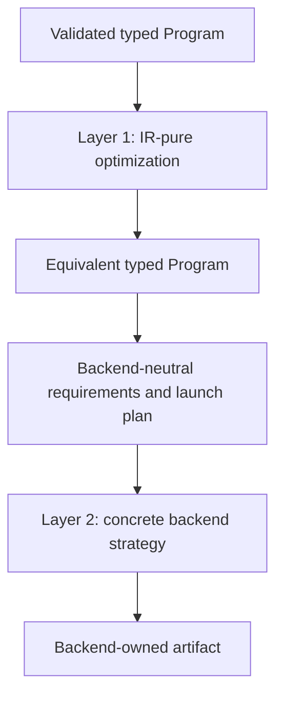

# Optimization architecture

Last verified: 2026-08-04

This guide describes optimization placement for Vyre 0.7.2. The canonical
control plane is [`optimization/README.md`](optimization/README.md). The root
`BACKLOG.md` is the only execution queue. Older plans and benchmark reports are
evidence, not ownership authorities.

## Two layers

Vyre separates semantic IR optimization from target lowering strategy.

### Layer 1: semantic IR optimization

Layer 1 changes `Expr`, `Node`, `Program`, or shared optimizer facts while
preserving semantics for every backend. It lives in
`vyre-foundation/src/optimizer/`.

Examples include constant folding, exact strength reduction, dead-code
elimination, common-subexpression elimination, loop transforms, FMA synthesis,
canonicalization, and fusion. A Layer 1 pass must not import a concrete driver
or emit a backend language.

Every pass declares its scheduling metadata. The optimizer derives the live
order from registered metadata and validates dependencies before execution.
Facts and caches are invalidated deliberately when a rewrite changes the
program.

### Layer 2: concrete lowering strategy

Layer 2 preserves the optimized program's meaning and changes how one target
lowers or schedules it. It lives in the concrete driver or emitter that owns the
target.

Examples include native multiply-high selection, tensor-core lowering, PTX
instruction scheduling, Naga emission details, SPIR-V layout, device stream
handling, and backend module caches. Shared crates may expose neutral strategy
traits and capability records. They do not contain concrete API names, shader
dialects, or device types.

## Shared planning is not a third optimization layer

`vyre-driver` owns backend-neutral requirements, launch plans, capability
records, cache identities, routing state, and evidence types. It can choose
between eligible strategies using measured and persisted facts. It does not
change program semantics and it does not emit a concrete target.

`vyre-runtime` owns persistent scheduling, queue policy, resident execution,
replay, and IO coordination. Runtime scheduling is not permission to duplicate
IR rewrites or concrete backend code.

## Program composition

A composition joins typed programs and preserves buffer identity, effects,
shapes, launch requirements, output ranges, and region provenance. Composition
must operate on `Program` and `Node` contracts. It must not translate programs
into an untyped host or device opcode interpreter.

`vyre-lower` owns backend-neutral descriptors and verification used before
emission. `vyre-foundation` remains the owner of semantic rewrites. A concrete
driver consumes a validated plan and performs target lowering.

## Megakernel optimization boundary

Megakernel work has four owners. Do not collapse them. The living matrix is
[`megakernel-wiring.md`](megakernel-wiring.md).

- Artifact compiler: `vyre-megakernel` turns validated typed graphs into
  immutable `Artifact` values and versioned envelopes. It does not
  own admission, protocol, or device dispatch.
- Persistent runtime: `vyre-runtime/src/megakernel/` owns queue protocol,
  lifecycle planning, resident execution, and scheduling.
- Driver wave policy: `vyre-driver::{megakernel_execution, megakernel_barrier,
  megakernel_frontier}` own backend-neutral wave topology and memory admission.
- IR pre-dispatch fusion: `vyre-foundation/src/optimizer/megakernel` owns
  matroid subset, schedule oracle, and scratch-reuse helpers for the optimizer.

Concrete target emission and device execution remain in the owning driver.
CUDA `megakernel_*` modules stay thin telemetry adapters where possible. The
portable wgpu driver has no megakernel planner module; protocol and lifecycle
planning live only under `vyre-runtime/src/megakernel/`. This keeps compiler
output, runtime scheduling, and device dispatch independently replaceable.

## Backend and autoroute decisions

The release route is CUDA-first on an eligible NVIDIA system. WGPU is the
portable GPU route. SPIR-V is a registered dispatch route. Metal is active on
supported Apple targets. The executable state is recorded in
`release/evidence/backends/backend-matrix.json`.

Autoroute is a measured selector over eligible backends. The decision must name
the program class, configuration, host, device, backend, and evidence identity.
A missing, stale, or invalid decision is an error. It does not authorize a
fallback hierarchy.

## Proof contract

An optimization change carries the proof that applies to its layer:

1. Placement: identify Layer 1, Layer 2, shared planning, or runtime scheduling.
2. Correctness: prove semantic equivalence, validation behavior, or exact target
   contract.
3. Performance: measure device time, wall time, allocations, emitted code, or an
   asymptotic bound appropriate to the change.
4. Integration: exercise the real program through the changed owner boundary.
5. Matrix coherence: update `OP_MATRIX.toml` and benchmark targets when support
   or measured workload coverage changes.

A benchmark claim names its baseline class and preserves raw samples. A source
change invalidates fingerprinted benchmark evidence until the owning benchmark
command regenerates it.

## Authorities

Use these sources in order:

1. Root `BACKLOG.md` for active work.
2. [`optimization/README.md`](optimization/README.md) for control-plane rules.
3. [`optimization/OWNERSHIP.toml`](optimization/OWNERSHIP.toml) for lanes.
4. [`optimization/OP_MATRIX.toml`](optimization/OP_MATRIX.toml) for operation
   support.
5. [`optimization/BENCH_TARGETS.toml`](optimization/BENCH_TARGETS.toml) for
   benchmark targets.
6. [`CRATE_GRAPH.md`](CRATE_GRAPH.md) and
   [`CRATE_OWNERSHIP.toml`](CRATE_OWNERSHIP.toml) for package placement.

Generated artifacts are projections of these authorities. They do not create a
second architecture.
