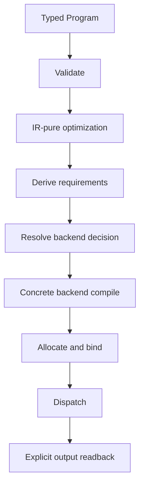

# Runtime pipeline

Last verified: 2026-08-04

This guide describes the current Vyre 0.7.2 execution path. It does not make
performance claims. Measured claims belong in fingerprinted benchmark evidence
under `release/evidence/benchmarks/`.

## Standard dispatch



### 1. Validate

`vyre-foundation` validates types, memory access, control flow, barriers, shapes,
effects, and output contracts. Invalid programs fail before lowering. The
runtime does not patch a malformed program into a runnable form.

### 2. Optimize

Registered passes in `vyre-foundation/src/optimizer/` transform the typed
program to an equivalent typed program. These are backend-neutral Layer 1
rewrites. The pass scheduler derives and validates the registered order.

### 3. Derive requirements

`vyre-driver` walks the optimized program to derive launch geometry, binding
requirements, output slots, device features, persistent-kernel requirements,
and cache identity. Relevant modules include `program_walks/`, `launch.rs`,
`binding.rs`, `output_slots.rs`, and `pipeline/`.

A requirement is a hard constraint. A backend that cannot honor it is not an
eligible route.

### 4. Resolve a backend

An explicit backend selection is diagnostic and reproducible. Autoroute uses a
valid measured decision for the exact workload and device identity. A missing,
stale, or incomplete decision is an error. It does not select a hidden CPU or
alternate GPU path.

The current release evidence is CUDA-first on the NVIDIA evidence host. WGPU is
the portable GPU route. SPIR-V is a registered dispatch route. Metal is active
on supported Apple targets. See
`release/evidence/backends/backend-matrix.json` for executable probe state.

### 5. Compile and cache

The selected concrete driver lowers the program and owns the compiled artifact.
Backend-neutral cache identity and policy live in `vyre-driver/src/pipeline/`.
Concrete module, pipeline, shader, stream, and device-object caches remain in
their concrete driver.

`vyre-runtime/src/pipeline_cache/` owns runtime cache stores and replay-facing
cache policy. Cache lookup validates all identity inputs. An invalid or stale
entry is a cache miss or an explicit error according to the owning contract. It
is not accepted because its key happens to exist.

### 6. Allocate, dispatch, and read back

The concrete driver validates device limits, allocates buffers, binds resources,
submits work, and reports errors with backend context. Outputs are explicit
pipeline live-outs with declared ranges. Readback does not infer success from a
non-empty buffer.

The reference driver and interpreter are correctness routes. They run only when
selected for reference execution or conformance.

## Persistent runtime path

`vyre-runtime/src/megakernel/` owns persistent runtime execution. The main
responsibilities are split by module:

| Responsibility | Current owner |
| --- | --- |
| Queue and slot protocol | `protocol.rs`, `protocol/`, `protocol_api.rs` |
| Runtime task model | `task.rs`, `descriptor.rs`, `rule_catalog.rs` |
| Scheduling and fairness | `scheduler.rs`, `policy.rs`, `planner/` |
| Program construction | `builder.rs`, `builder/` |
| Resident execution | `resident.rs`, `execution.rs`, `execution/` |
| Backend-neutral handlers | `handlers.rs`, `handlers/` |
| Readback and completion | `readback.rs`, `io/` |
| Telemetry and recovery | `telemetry.rs`, `telemetry/`, `recovery.rs` |
| Native IO integration | `vyre-runtime/src/uring/` |

The runtime protocol is shared. Concrete drivers adapt that protocol to their
device execution contracts. They do not maintain parallel queue semantics.

A persistent route follows the same fail-closed model as standard dispatch:

1. Validate the typed program and persistent requirements.
2. Build or load a compatible artifact.
3. Validate queue layout, capacity, identity, and tenant boundaries.
4. Publish work through the runtime protocol.
5. Observe an explicit completion or error state.
6. Read only declared output ranges.

A stalled, stale, unsupported, or malformed resident route surfaces an error. It
does not silently rerun through standard dispatch or the host interpreter.

## Megakernel compiler boundary

The current runtime builder and planner are execution infrastructure.
`vyre-megakernel` is a current workspace member and a separate compiler
boundary recorded in `docs/CRATE_OWNERSHIP.toml`. Its contract is typed program
graphs to canonical static and persistent megakernel artifacts. It does not own
backend dispatch or the queue protocol.

Packaged routes authenticate through `vyre-runtime::artifact_admission`.
`vyre-runtime` remains the owner of persistent scheduling and protocol
behavior. `vyre-aot` packages envelopes produced by the compiler. Concrete
drivers remain the owners of lowering and dispatch. See
[`megakernel-wiring.md`](megakernel-wiring.md).

## IO path

`vyre-runtime/src/uring/` owns Linux `io_uring` integration. Runtime operations
such as DMA and zero-copy mapping use canonical `OperationRegistration`
contracts. Their target support remains a concrete-driver facet recorded in
`docs/optimization/OP_MATRIX.toml` and the generated operation schema.
Experimental or unsupported rows remain explicit.

IO buffers retain identity and ownership across submission, device execution,
and completion. An IO failure cannot produce a successful dispatch result with
partial bytes.

## Evidence and observability

Runtime telemetry records decisions and failures without logging input secrets.
A performance claim must point to a current benchmark artifact whose source
fingerprint matches the intended release tree. Runtime source documentation does
not substitute for raw samples or suite digests.

Use these checks after changing the pipeline:

```text
cargo_full run --bin xtask -- backend-matrix
cargo_full run --bin xtask -- operation-schema --check
cargo_full run --bin xtask -- conformance-matrix --check
```

Long-running benchmark evidence is regenerated only after the intended release
source is frozen.
