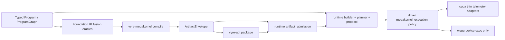
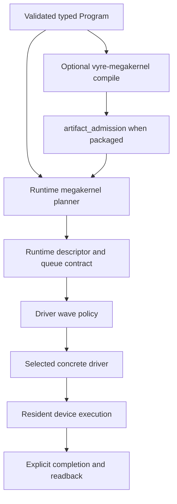

# Megakernel wiring

Last verified: 2026-08-12

This guide is the living ownership map for every surface named "megakernel" in
Vyre 0.7.2. The word is overloaded on purpose across four stages. Collapsing
them into one crate is a boundary failure.


## Four concepts, four owners

| # | Concept | Owner | Allowed inputs | Forbidden responsibilities | Primary consumers |
| --- | --- | --- | --- | --- | --- |
| 1 | **Artifact compiler** | `vyre-megakernel` | Validated typed `ProgramGraph`, `ExternalFacts`, `SearchBudget`, artifact byte bound | Protocol, resident execution, device topology, runtime retention policy, concrete backend policy, frontend adapters | `vyre-aot` (package), `vyre-runtime::artifact_admission` (admit) |
| 2 | **Persistent runtime** | `vyre-runtime/src/megakernel/**` | Validated `Program`, admitted envelopes, host telemetry | Canonical artifact schema authorship, concrete shader dialect emission | benches, conform, drivers (device exec only), product pipelines |
| 3 | **Backend-neutral wave policy** | `vyre-driver/src/megakernel_execution.rs` (plus `megakernel_barrier`, `megakernel_frontier`) | Graph shape, memory budgets, launch overhead, fusion pressure samples | Queue protocol, slot codecs, IR semantic rewrites, artifact freeze | concrete drivers (CUDA adapters today) |
| 4 | **IR pre-dispatch fusion** | `vyre-foundation/src/optimizer/megakernel/**` | Pass costs, exchange graphs, program facts | Runtime queues, device admission, envelope bytes | optimizer pass scheduler, later compile request construction |



### What `vyre-megakernel` is

The crate **exists** as a current workspace member. Ownership registry:
`docs/CRATE_OWNERSHIP.toml` row `vyre-megakernel`, layer `compiler-boundary`,
allowed dependency `vyre-foundation` only.

It owns:

- `compile` → immutable `Artifact` (nodes, geometry, resources, selected plan,
  ABI, provenance, and digests)
- `ArtifactEnvelope` + `TargetPayload` attach, validate, and round-trip
- stable diagnostic codes for compile and envelope failures

It does **not** own:

- queue protocol, slots, opcodes, tenant publication
- resident handles, readback, recovery, io_uring
- sparse/dense/hybrid topology selection from device telemetry
- matroid or homotopy algorithms used only as optimizer oracles
- C frontend workspace adapters

Fully building out this crate means completing the **artifact seam**: every
static and persistent package path freezes through `compile`, every load path
authenticates through admission, and no parallel private "plan blob" redefines
fusion/barrier/resource records. It does **not** mean moving runtime or driver
code into the crate.

### What `vyre-runtime/src/megakernel/**` is

Persistent runtime scheduling and protocol behavior for live and admitted work.

| Responsibility | Module boundary |
| --- | --- |
| Queue protocol and publication | `protocol.rs`, `protocol/`, `protocol_api.rs` |
| Work descriptors and rule catalog | `descriptor.rs`, `task.rs`, `rule_catalog.rs` |
| Lifecycle planning (geometry, grid, sizing, cross-pipeline, provenance) | `vyre-runtime/src/megakernel/planner/`, `policy.rs` |
| Runtime program construction | `builder.rs`, `builder/` |
| Scheduling and fairness | `scheduler.rs`, `scheduler/` |
| Resident execution and handles | `resident.rs`, `execution.rs`, `execution/` |
| Completion and readback | `readback.rs`, `io/` |
| Telemetry, recommendations, recovery | `telemetry.rs`, `telemetry/`, `recovery.rs` |
| Envelope authentication | `vyre-runtime/src/artifact_admission.rs` |
| Native Linux IO | `vyre-runtime/src/uring/` |

One backend-neutral protocol. Concrete drivers allocate, lower, submit, sync,
and read back. They do not define a second queue model.

### What driver `megakernel_*` modules are

Backend-neutral **wave** policy shared by concrete drivers:

- `megakernel_execution`: topology (sparse / dense / hybrid / fused) and memory
  plan from telemetry and graph shape
- `megakernel_barrier`: wave dependency groups
- `megakernel_frontier`: frontier pressure helpers

These answer "how should this device wave look given budgets?" They do not
publish slots or author envelope schema.

### What foundation `optimizer/megakernel/**` is

IR-time fusion support **before** dispatch and before artifact freeze:

- `matroid_subset::max_fusion_subset` — greedy exchange-compatible subset
- `schedule_oracle` — homotopy-weighted fusion weights for the pass scheduler
- `scratch_reuse` — escape-fact scratch pool plan

This is not the runtime planner and not the artifact compiler.

## Adapters and residue

| Surface | Status | Rule |
| --- | --- | --- |
| `vyre-driver-cuda/src/megakernel_*.rs` | Live | Keep as **thin telemetry adapters** over driver policy (`CudaX` aliases + sample mapping). Device-local caches/gates may stay CUDA-owned. No second topology policy. |
| Portable wgpu driver | **No megakernel planner** | There is no second wgpu megakernel planner. Protocol, lifecycle planning, and queue encoding live under `vyre-runtime/src/megakernel/` only. Do not recreate a driver-local planner. |
| `vyre-self-substrate` matroid / `scheduling/megakernel_schedule` | Live | Self-hosted algorithm implementations on Vyre primitives. Call into them from one stage owner; do not fork a fifth public fusion API. |
| benches / conform / xtask | Evidence | Must import protocol and artifact types from the owners above. |

## Fusion and subset selection (do not merge blindly)

Same vocabulary, different stages:

| Stage | Symbol home | Role |
| --- | --- | --- |
| IR / pass scheduling | `vyre-foundation::optimizer::megakernel::max_fusion_subset` | Bounded subset for optimizer fusion decisions |
| Runtime lifecycle planning | `vyre-runtime::megakernel::planner::select_fused_subset*` | Costed subset for resident/batch fusion |
| Continuous relaxation | `vyre-self-substrate::scheduling::megakernel_schedule` | Homotopy indicators before discrete rounding |
| Artifact freeze | `vyre-megakernel` `SelectedPlan` / `FusionRecord` | Immutable compiler-selected groups in the envelope |
| Device wave pressure | `vyre-driver/src/megakernel_execution.rs` fusion_pressure inputs | Topology bias, not subset ILP |

Dedup work collapses **duplicate implementations of the same stage**, not the
stage boundaries themselves.

## Start with a typed program

A persistent route starts from the same validated `Program` used by standard
dispatch. The route does not consume a general VIR bytecode interpreter.
Validation, effects, memory rules, output ranges, and backend requirements
remain in force.



## Protocol invariants

A queue slot has an explicit state transition. Publication initializes the full
slot before it becomes visible. Claiming establishes one owner. Completion makes
outputs visible before the slot can be reused.

The owning source defines exact words, codecs, and transition values. This guide
does not copy those constants. Tests under `protocol/tests/`,
`protocol_api/tests/`, `scheduler/tests/`, and `io/tests/` lock the current
contract.

Every transition is fail closed:

- A malformed or incompatible descriptor is rejected before publication.
- Capacity arithmetic and offsets are checked before a queue write.
- Tenant identity is validated before work can observe a resource.
- Unsupported backend requirements return an error.
- Timeout, recovery, or device failure produces an explicit terminal result.
- Readback uses declared output ranges and completion state.

## Planner boundary

Split by stage, not by "everything named plan":

| Plan kind | Owner |
| --- | --- |
| Semantic legality / IR facts | `vyre-foundation` |
| Frozen fusion, barrier, resource records | `vyre-megakernel` artifact |
| Resident geometry, grid, sizing, cross-pipeline batching | `vyre-runtime/src/megakernel/planner/` |
| Device topology and memory envelope from telemetry | `vyre-driver::megakernel_execution` |
| Target instruction selection and concrete limits | selected concrete driver |

Target instruction selection and concrete device limits belong in the selected
driver. IR-semantic rewrites belong in `vyre-foundation/src/optimizer/`.

## Artifact seam (current wiring)

| Path | Role |
| --- | --- |
| `vyre_megakernel::compile` | Neutral artifact from validated graph |
| `vyre-aot::compile` | Neutral compile + target payload + package |
| `vyre_runtime::artifact_admission::admit_artifact` | Decode, authenticate, select exact payload |
| Runtime builder / live planner | Still may construct live programs without an envelope; closing bypasses is remaining work, not permission to grow forbidden responsibilities into `vyre-megakernel` |

## Backend support

CUDA is the preferred release route on the NVIDIA evidence host. WGPU is the
portable GPU route. SPIR-V is a registered dispatch route. Metal is active on
supported Apple targets. A persistent route is eligible only when its backend
capabilities and operation rows say so.

Use `release/evidence/backends/backend-matrix.json` for live backend probes and
`docs/optimization/OP_MATRIX.toml` for operation support. Missing or stale
evidence does not authorize a fallback.

## Verification

Use focused runtime, aot, megakernel, and driver suites for the changed
boundary. Then run the structural gates:

```text
cargo_full run --bin xtask -- check-tier-deps
cargo_full run --bin xtask -- operation-schema --check
cargo_full run --bin xtask -- conformance-matrix --check
```

A performance claim additionally requires current raw benchmark samples and a
matching source fingerprint. Historical speedup estimates are not architecture
contracts.

## Historical design

[`rfcs/0005-persistent-megakernel.md`](rfcs/0005-persistent-megakernel.md)
records the earlier device-bytecode-interpreter proposal and why persistent
submission was pursued. That interpreter design is superseded. Current work
preserves typed program contracts and the four-owner split above.
